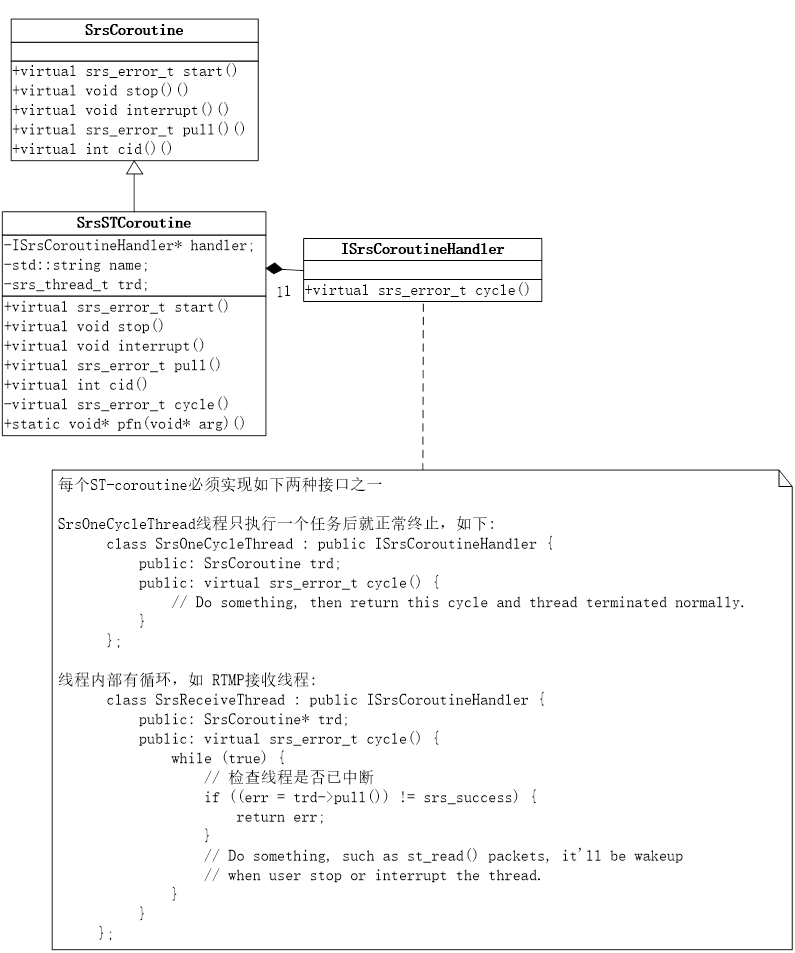
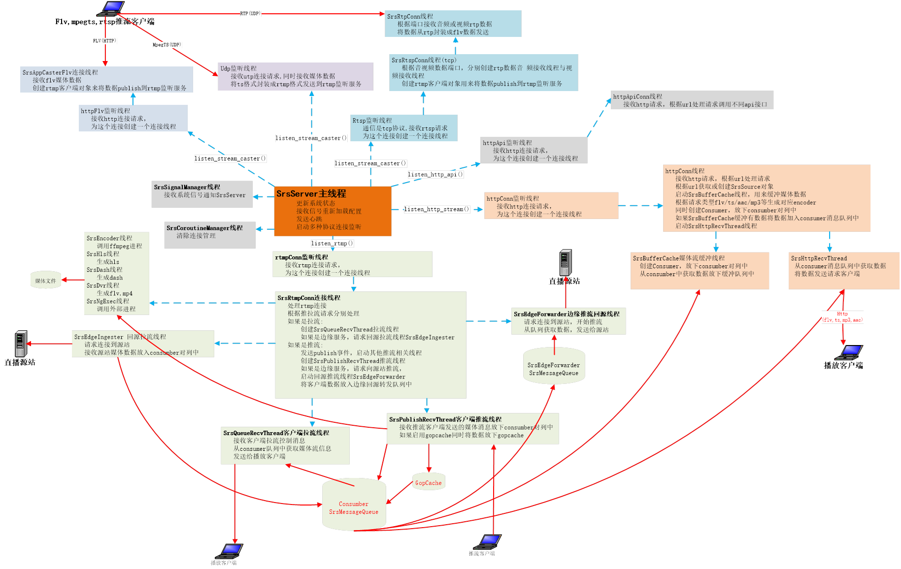
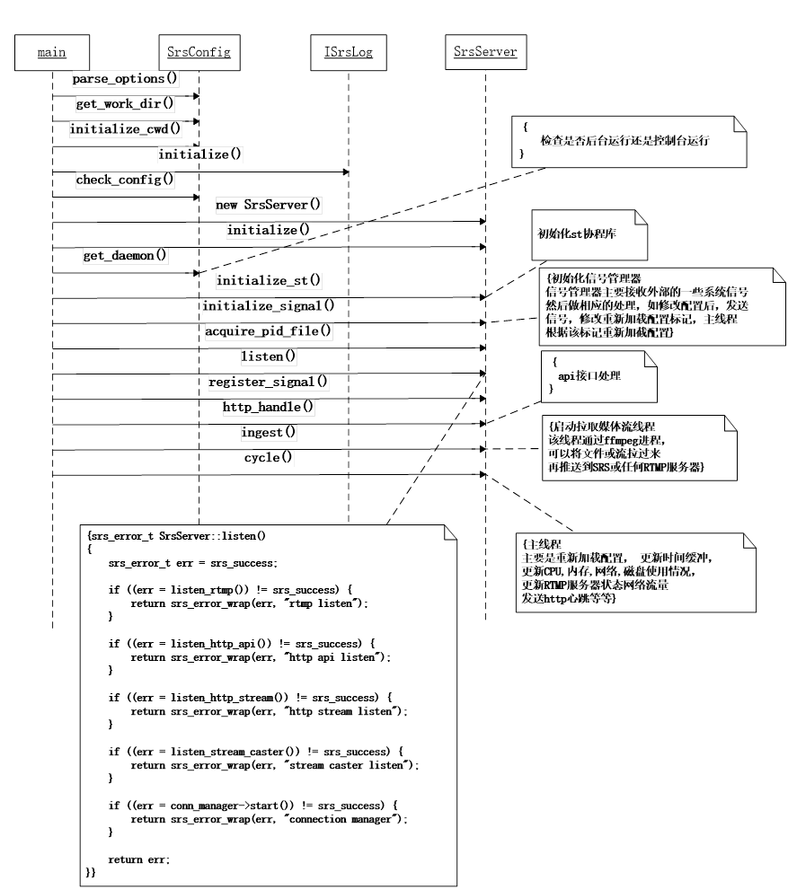
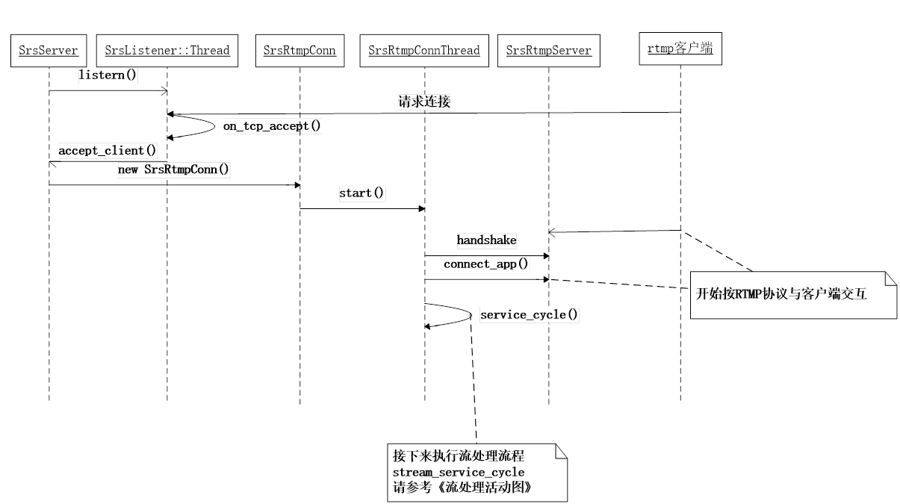
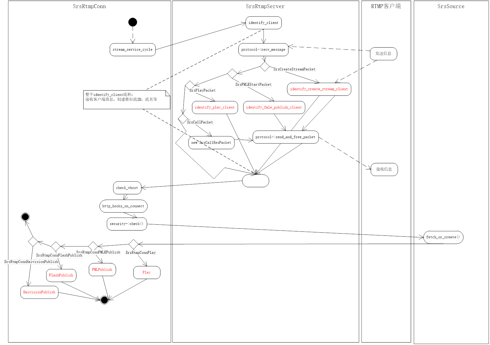
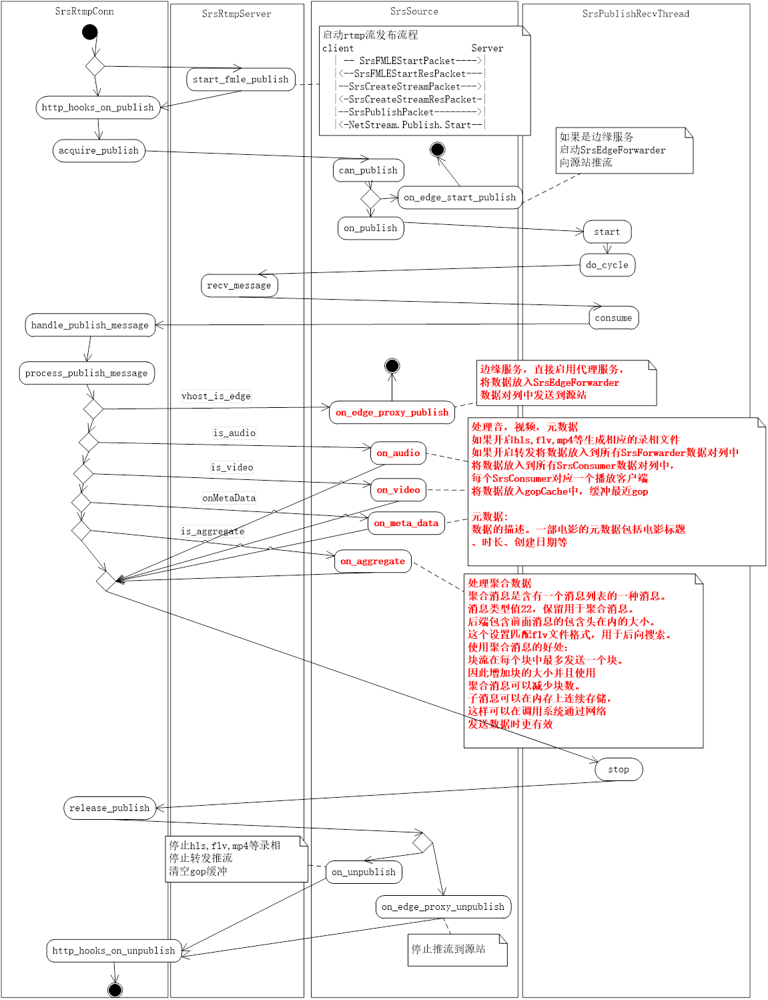
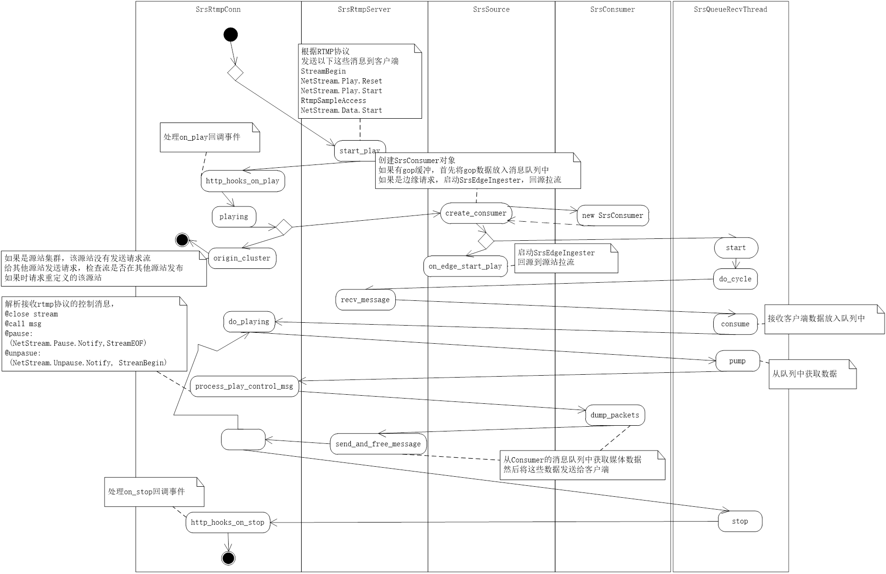

# SRS 源码分析

## SRS 媒体流与类的关系

srs 启动之后，客户端推拉流时，需要调用下面这些主要类来相互协作完成推拉流功能， 该流程描述媒体在 srs 主要类之间的静态流程。

1. 客户端发送 rtmp 连接请求，**SrsListener** 收到 connect 请求后，创建一个 **SrsConnection**，每个 **SrsConnection** 会启动一个线程来完成相应任务

2. **SrsRtmpConn** 首先按 rtmp 协议流程交互成功之后，根据请求 url 创建流名流类型等标启，同时调用 fetch_or_create 生成一个处理音视频源的 **SrsSource**

如果是推流：

创建 **SrsPublishRecvThread** 线程，接收客户端发送过来 rtmp 数据包，数据包由 **SrsRtmpServer** 来处理，如果是音视频数据，由 process_publish_message 来处理，它会通过 **SrsSource** 对媒体流的进行处理

* 如果该服务是边缘服务， **SrsSource** 直接将媒体 proxy publish 到源站服务，

* 否则 **SrsSource** 会将 publish 流放入到每个 **SrsConsumer** 的媒体数据对列中,一个 **SrsConsumer** 就是一个播放客户端。同时调用 **SrsOriginHub** 将媒体流根据配置来生成 flv, hls, mp4 录相文件，以及是否将发布流转发到其他 rtmp 服务器等;最后检查如果启用 **GopCache** 会将媒体流写入 **GopCache** 队列中。用于当一个新的播放请求来时，保证首先能获取一个 gop 数据，以防播放开始时不黑屏或花屏

如果拉流：

* 如果是源站拉流同时启用源站集群，如果流不是该源站发布，则根据配置的发送 api 请求到其他源站，检查是否在其他源站发布了流，如果是，则发送一个 redirect，要求拉流客户端重定向指定服务器拉流。注意 rtmp 重定向信令，如果客户端直接请求的源站，要求 rtmp 客户端支持 redirect，如果 srs 边缘回源到源站后再重定向，那是没有问题的，因为 srs 边缘支持 redirect

* 如果不走第 1 步，则创建一个 **SrsConsumer** 与 **SrsQueueRecvThread** 线程, 创建 **SrsConsumer** 时，如果启用 **GopCache**，首先会将 **GopCache** 媒体数据插入 **SrsConsumer** 的数据队列中。如果是边缘拉流，则使用 **SrsPlayEdge** 回源拉流。将回源拉的媒体流数据插入 **SrsConsumer** 的数据队列中

* **SrsQueueRecvThread** 线程负责将 **SrsConsumer** 的数据队列中的媒体数据发送给客户端。**SrsConsumer** 队列中数据来源于 **GopCache**，源站 publish 的数据，以及回源拉流的数据

## SRS 线程架构

### SRS 通用线程模型

srs线程内部是使用协程库(State Threads)实现，

srs线程模型如下

  
 

### SRS 内部线程结构

  
 

## SRS 程序流程

### SRS 启动流程

  
 

1. 首先检查解析启动命令参数，初始日志接口，检查配置文件是否正确

2. 创建 SrsServer 服务，初始化一些变量

3. 检查是否后台运行还是控制台运行

4. 初始化 st 协程库，信息号管理器

5. 如果后台运行写进程 pid 到文件

6. 监听连接：

* listen_rtmp: rtmp 推流或拉流连接

* listen_http_api: api 请求连接

* listen_http_stream: http 拉流连接, http-flv, http-ts, http-aac, http-mp3

* listen_stream_caster: 接收 MpegTSOverUdp 流请求，rtsp 推流请求，http-flv 推流请求

7. 初始化 http_api 接口处理

8. 启动 ingest 协程，使用 ffmpeg, 拉取文件或流转发到本服务

9. 启动主线程

## RTMP 监听与连接流程

  
 

1. SerServer 调用 listern 启动 rtmp 监听线程

2. 客户端发送连接请求，监听线程收到请求后，发送 on_tcp_accetpt() 事件

3. SrsrServer 处理 accetp_client() 创建一个新的 SrsRtmpConn, 同时启动 SrsRtmpConnThread 连接线程

4. SrsRtmpConnThread 收到客户端 rtmp 握手，同时根据 rtmp 连接流程创建一个 rtmp 连接

5. 连接成功之后,调用 stream_service_cycle 对 rtmp 媒体流处理

## RTMP 媒体流处理流程

  
 

1. identify_client 根据客户端请求类型创建流名，流 Id，流类型（推拉流）等客户端标识信息

2. check_vhost 根据配置检查域名是否合法

3. http_hooks_on_connect 发送 on_connect 事件

4. check 检测根据配置检查是否允许推拉流

5. 根据请求创建或获取 SrsSource 对象

6. 根据流类型调用对应的推或拉流流程

## RTMP 推流流程

  
 

1. 接收客户端发布流交互消息，start_fmle_publish 完成发布流交互

2. 发送 on_pulibsh 事件

3. SrsSource::can_publish 检查 SrsSource 流的是否已发布，如果是返回，不再发布

4. 检查是否边缘推流，如果是启动 SrsEdgeForwarder 线程，将流推向源站

5. SrsSource::on_publish，如果配置 flv, hls, mp4 等，则开始录相，如配置转发，则启动转发线程

6. 启动 SrsPublishRecvThread 线程，接收客户端数据，调用 SrsRtmpConn::handle_publish_message 处理数据

7. SrsRtmpConn:::process_publish_message 处理推流数据

8. 如果是边缘推流，将数据 SrsEdgeForwarder 队列，将数据发送到源站

9. 如是不是边缘推流，调用 SrsSource 相关方法处理音视频数据. 对 hls, mp4, flv 录相，转发，gopCache，以其放到 SrsConsumber 的消息队列中，

每个 SrsConsumber 是一个播放客户端

10. 如果停止推流， SrsPublishRecvThread 将 stop 退出线程，

11. 调用 on_edge_proxy_unpublish 停止边缘推流线程

12. SrsSource::on_unpublish 停止 hls, mp4, flv, 转发，清空 gopCache

13. http_hook_on_unpublish 发送 on_unpublish 事件

## RTMP 拉流流程

  
 

1. SrsRtmpServer::start_play 根据 rtmp 协议 完成 play 流程

2. SrsRtmpConn::http_hook_on_play 发送 on_play 事件，

3. playing 检查是否开启源站集群，如果是，且流没有在该源站发布，向其他源站发送请求，检查流在哪个源站发布，如果找到，重定向到该源站

4. 如是不是源站集群，create_consumer 创建 consumer，同时将 gop 缓冲数据放入 consumer 消息队列中，如果是边缘拉流，启动 SrsEdgeIngester 回源拉流

5. recv_messae 接收客户端信息,放入 consumer 消息队列中， pump 从队列获取消息，process_play_control_msg 处理 rtmp 控制消息

6. dump_packets 从 consumber 的消息队列中获取媒体数据， send_and_free_message 发送给给客户端

7. stop 停止播， http_hook_on_stop 发送 on_stop 事件
