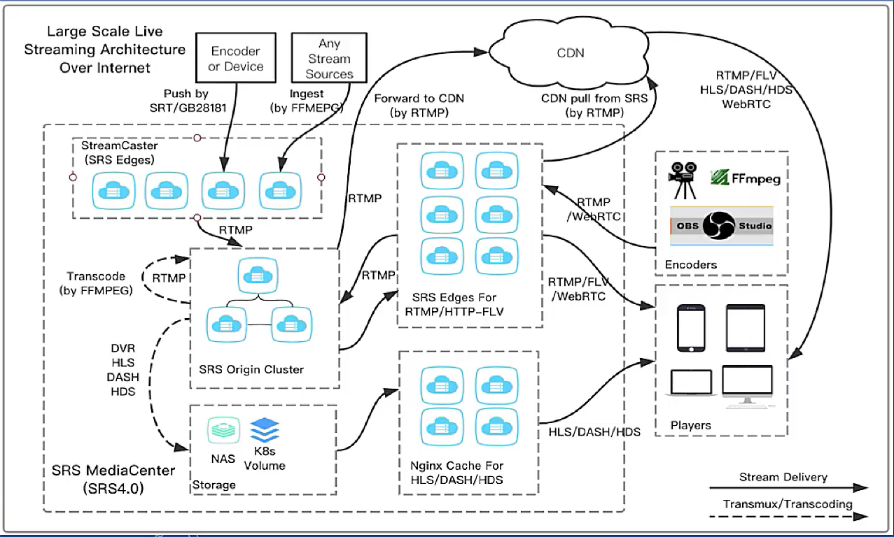
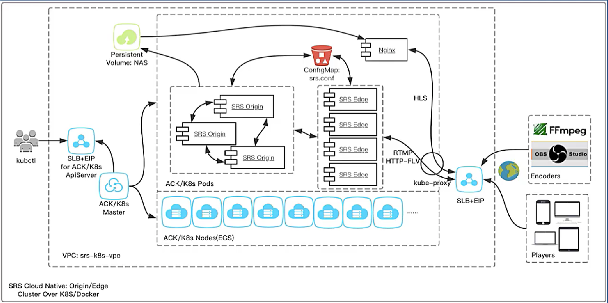

# [01 课 11.11](https://www.bilibili.com/video/BV1M54y1z7jo?from=search&seid=4271973255692090161)

## Scenario:互联网直播和连麦

<table><thead><tr>
<th> Domain </th><th> Tech </th><th> OpenSource </th><th> Commercial </th>
</tr></thead><tbody><tr>
<td><b> Camera </b></td><td><b> Camera </b></td><td colspan="2"><b> Camera, Mobile Phone </b></td>
</tr><tr>
<td><b> Video Codec </b></td><td><b> H.264 </b></td><td><b> x264, openh264, FFmpeg </b></td><td><b> Hardware </b></td>
</tr><tr>
<td><b> Audio Codec </b></td><td><b> AAC </b></td><td><b> fdkaac, FFmpeg </b></td><td><b> Hardware </b></td>
</tr><tr>
<td><b> Encoder </b></td><td><b> System </b></td><td><b> OBS, FFmpeg </b></td><td><b> Haivision </b></td>
</tr><tr>
<td><b> Transport </b></td><td><b> RTMP, FLV, HLS </b></td><td><b> NGINX-RTMP, SRS </b></td><td><b> Wowza, AMS </b></td>
</tr><tr>
<td><b> Player </b></td><td><b> System </b></td><td colspan="2"><b> Mobile Phone, Chrome, Safari, Edge </b></td>
</tr><tr>
<td><b> Interactive </b></td><td><b> RTC </b></td><td colspan="2"><b> WebRTC </b></td>
</tr></tbody><table>

>Tips: There are many live streaming platforms and solutions over internet, such as taobao, bilibili, kuaishou, huya, momo, youku, tencent, cctv, youtube, twitch

## Scenario：互联网实时通信

<table><thead><tr>
<th> Domain </th><th> Tech </th><th> OpenSource </th><th> Commercial </th>
</tr></thead><tbody><tr>
<td><b> Camera </b></td><td><b> Camera </b></td><td colspan="2"><b> Camera, Mobile Phone </b></td>
</tr><tr>
<td><b> Video Codec </b></td><td><b> H.264 </b></td><td><b> x264, openh264, FFmpeg </b></td><td><b> Hardware </b></td>
</tr><tr>
<td><b> Audio Codec </b></td><td><b> Opus </b></td><td colspan="2"><b> libopus </b></td>
</tr><tr>
<td><b> Encoder/Player </b></td><td><b> 3A, CC, SVC </b></td><td colspan="2"><b> WebRTC </b></td>
</tr><tr>
<td><b> Transport </b></td><td><b> RTP, RTCP, SRTP </b></td><td colspan="2"><b> Janus, Mediasoup, OWT, SRS </b></td>
</tr><tr>
<td><b> PSTN </b></td><td><b> SIR, RTP </b></td><td colspan="2"><b> Freeswitch </b></td>
</tr></tbody><table>

>Tips: There are many RTC platforms and solutions over internet

## Scenario：互联网媒体中心

<table><thead><tr>
<th> Domain </th><th> Tech </th><th> OpenSource </th><th> Commercial </th>
</tr></thead><tbody><tr>
<td><b> SRT </b></td><td><b> UDP, CC </b></td><td colspan="2"><b> Libsrt, FFmpeg, OBS, SRS </b></td>
</tr><tr>
<td><b> GB28181 </b></td><td><b> SIP, RTP </b></td><td colspan="2"><b> SRS, Camera </b></td>
</tr><tr>
<td><b> DVR </b></td><td><b> FLV, MP4, HLS </b></td><td colspan="2"><b> FFmpeg, NGINX-RTMP, SRS </b></td>
</tr><tr>
<td><b> Transcoding </b></td><td><b> H.264, AAC </b></td><td colspan="2"><b> FFmpeg, x264, fdkaac </b></td>
</tr><tr>
<td><b> Security </b></td><td><b> HTTP Callback </b></td><td colspan="2"><b>  SRS </b></td>
</tr><tr>
<td><b> Management </b></td><td><b> HTTP API </b></td><td colspan="2"><b> SRS </b></td>
</tr><tr>
<td><b> Cluster </b></td><td><b> System </b></td><td colspan="2"><b> SRS Edge/Origin Cluster </b></td>
</tr></tbody><table>

>Tips: We may need to transform a variety of protocols, such as SRT for TV, GB28181 for IOT. We may also need to analysis content by AI before delivering to CDN

* 实现开源的流媒体服务器，需要考虑的关键约束和能力

  * 可扩展性

    * CDN 支持了 HTTP-FLV 和 HLS，现在也开始支持 webrtc，可大规模应用

  * 延迟

    * TCP 协议（RTMP/HTTP-FLV/HLS）延迟 3-5s ，webrtc < 1s

  * 易用性

    * 必须是集群，容易用 K8S 和 docker 部署，支持转码，DVR，协议（SRT/GB28181）接入等核心能力

## Scalability：基于 Cloud 或对接 CDN

* 同城可以基于边缘节点来进行传输，跨度较大可以经过 origin

* 也可以将流推到 CDN

  
 

> For a small bussiness, we can directly provide live streaming services by SRS MediaCenter. While we can switch to CDN networks when your business grow large and rapidly.

## Simple：Cloud Native

  
 

>Tips: K8S/Docker is new and absolutely revolutionary tech for live streaming.It enable us to create service easily, upgrade with canary and zero downtime.
