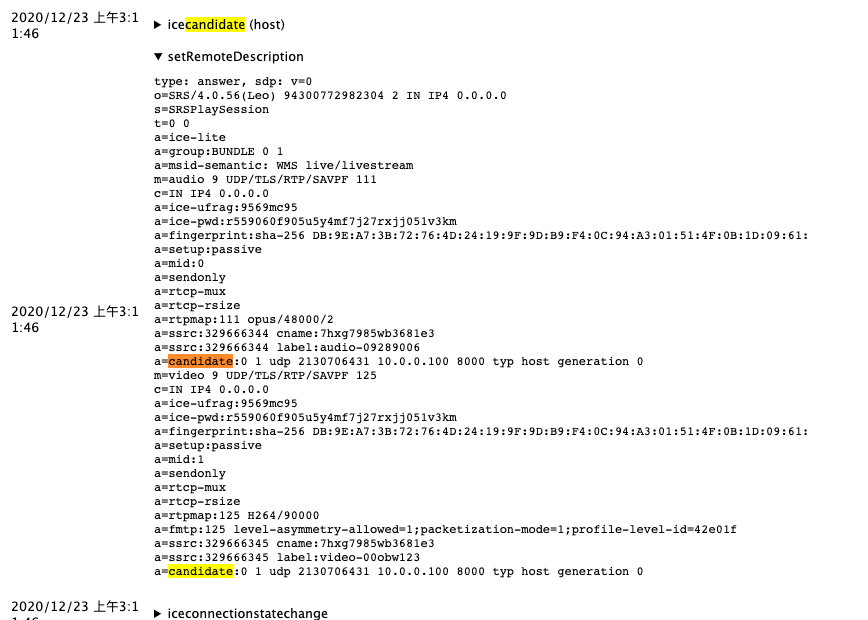
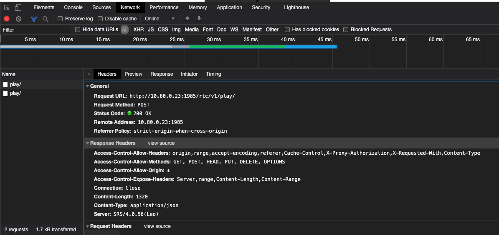
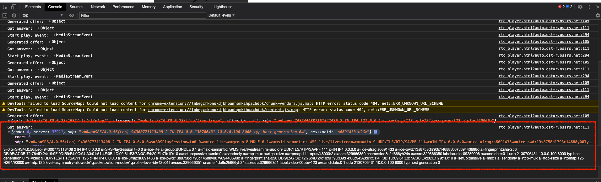
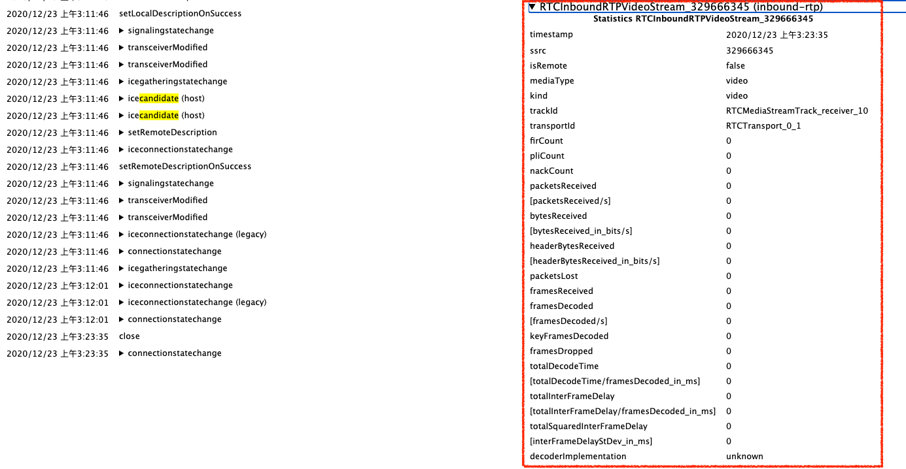

# [06 课 12.22](https://www.bilibili.com/video/BV1r54y1S77q)

# SRS 开发

## RTC

### DEMO:开发环境

```Shell
# 编译
git checkout 4.0release 只有 4.0 和 dev 分之支持
./configure && make -j16

# 修改配置环境
vim conf/rtc.conf
# 在 srs_log_file        ./objs/srs.log; 上添加这一行
srs_log_tank        console;

# 运行
./objs/srs -c conf/rtc.conf

# 推流
ffmpeg -re -i doc/source.200kbps.768x320.flv -c copy -f flv -y rtmp://localhost/live/livestream

# 打开 web 端 rtc 播放器
http://ossrs.net/srs.release/trunk/research/players/rtc_player.html?autostart=true&server=r.ossrs.net&vhost=r.ossrs.net

# 输入地址播放，10.80.0.23 是我的服务器地址，需要修改成自己的
webrtc://10.80.0.23/live/livestream

# web 端 rtmp 播放器也可以播放
rtmp://10.80.0.23/live/livestream
```

### Docker：开发和运行


### 为什么黑屏

```Shell
# 制造黑屏
$ vim conf/rtc.conf
line 29 before     candidate       $CANDIDATE;
line 29 after      candidate       10.0.0.100;
# run srs
$ ./objs/srs -c conf/rtc.conf
# 推流
$ ffmpeg -re -i doc/source.200kbps.768x320.flv -c copy -f flv -y rtmp://10.80.0.23/live/livestream
# 分析
chrome 打开 chrome://webrtc-internals/ 页面，找到对应播放页面的 setRemoteDescription 属性查看，可以看到我们刚才设置的 candidate 地址，这个地址是错误的，所以拉不到流出现了黑屏
```

<div align="center">  </div><br>

但是为什么没有报错？因为交换这些信息的 1985 端口是正常的，到 rtc [播放器界面](http://ossrs.net/srs.release/trunk/research/players/rtc_player.html ) F12 查看更多信息

* network

重新点击播放，查看 Headers 的 General ，可以看到 1985 的端口是正常的，也可以看到下方 Request payload 中的 sdp

<div align="center">  </div><br>

查看 Preview 和 Response 中的 sdp 可以看到刚刚我们设置的 candidate

* console

点击 console 查看 Got answer 可以看到我们刚才设置的 candidate

<div align="center">  </div><br>

* 我们再回到 chrome://webrtc-internals/ 查看 RTCInboundRTPVideoStream_329666345 (inbound-rtp) 可以看到没有收到包

<div align="center">  </div><br>

* candidate 的几种设置方式

```Shell
$ vim conf/full.conf
# The exposed candidate IPs, response in SDP candidate line. It can be:
    #       *           Retrieve server IP automatically, from all network interfaces.
    #       eth0        Retrieve server IP by specified network interface name. # TODO: Implements it.
    #       $CANDIDATE  Read the IP from ENV variable, use * if not set, see https://github.com/ossrs/srs/issues/307#issuecomment-599028124
    #       x.x.x.x     A specified IP address or DNS name, which can be access by client such as Chrome.
    # You can specific more than one interface name:
    #       eth0 eth1   Use network interface eth0 and eth1. # TODO: Implements it.
    # Also by IP or DNS names:
    #       192.168.1.3 10.1.2.3 rtc.me # TODO: Implements it.
    # And by multiple ENV variables:
    #       $CANDIDATE $EIP # TODO: Implements it.
    # @remark For Firefox, the candidate MUST be IP, MUST NOT be DNS name, see also https://github.com/ossrs/srs/pull/1998#issuecomment-726442999
    # default: *
    candidate       *;
```

我们还可以手动指定 candidate ，可以在 rtc 播放器播放地址最后加上 ?eip=10.80.0.23 就可以指定，此时可以正常播放（在 chrome 地址栏加也可以 10.80.0.23:8080/players/rtc_player.html?eip=10.80.0.23 开头得是服务器地址:8080 ）可以按之前的方式查看 sdp 。服务器日志中我们也可以看到 candidate 用的是什么

也可以通过环境变量的方式来设定

```Shell
export CANDIDATE=10.80.0.23
env | grep CANDIDATE
```

### 代码结构


11126491
