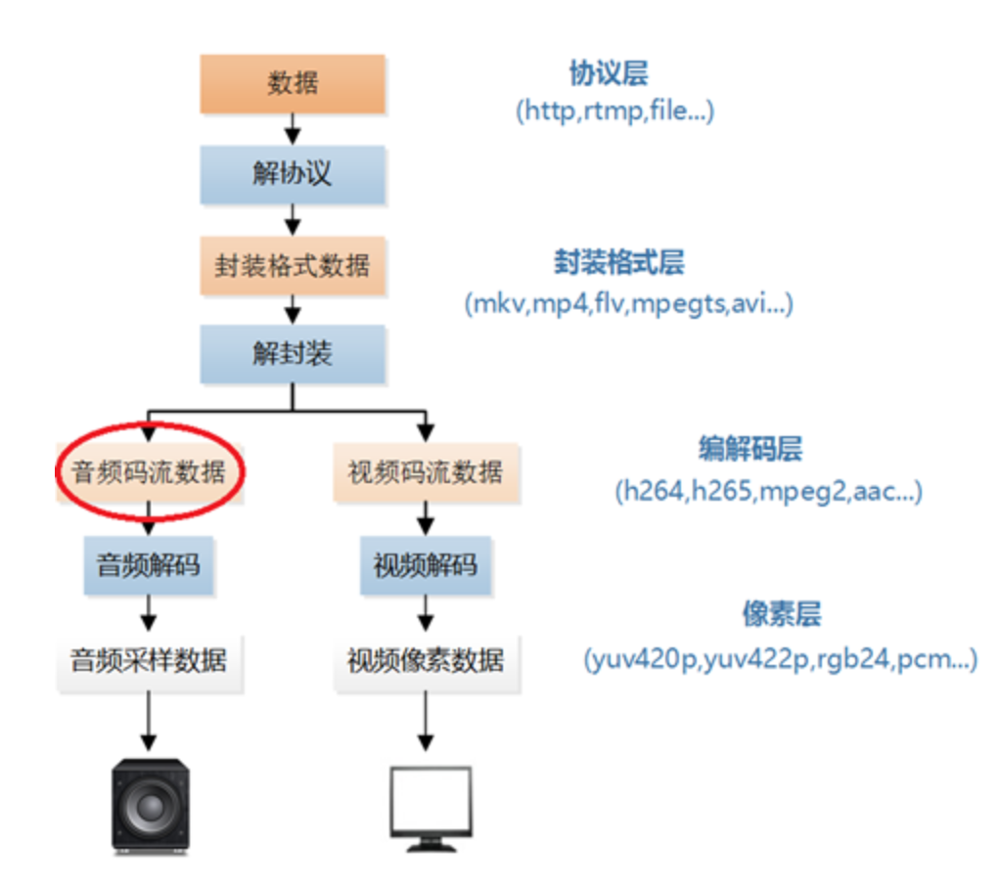
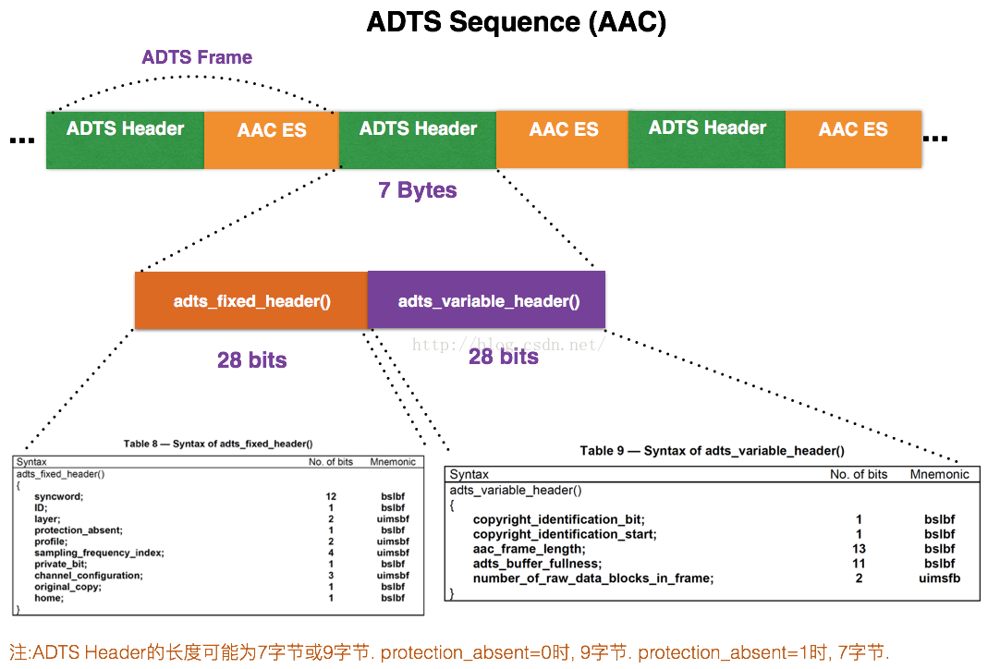
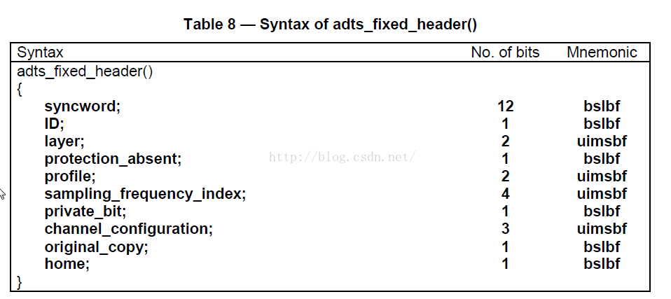
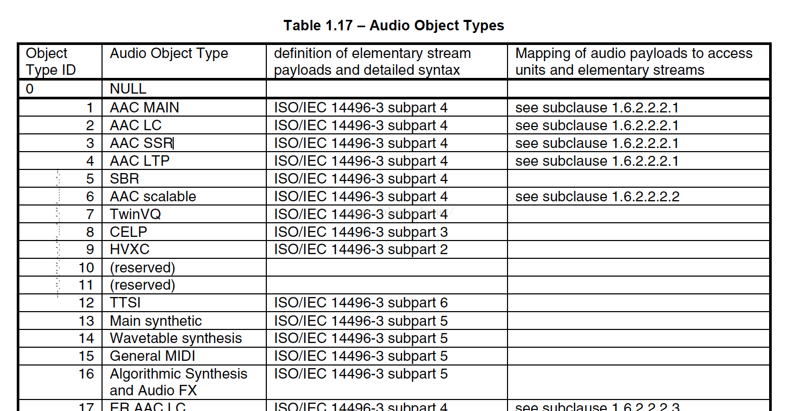
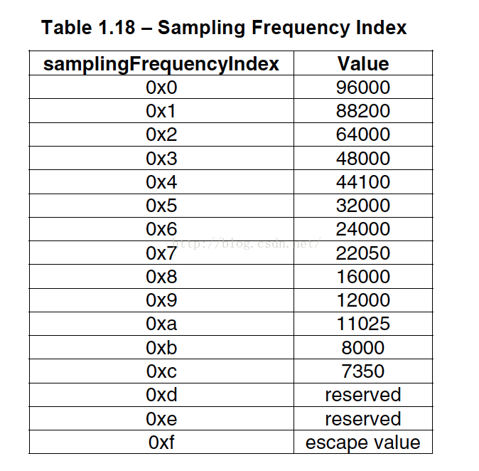
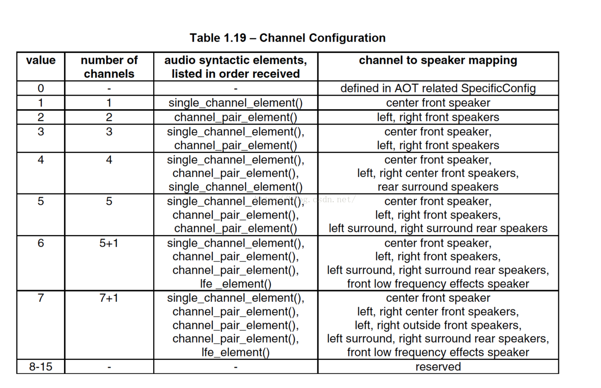
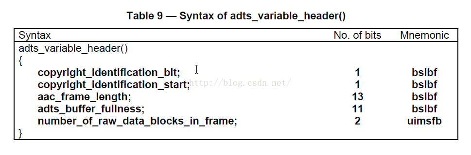

# ADTS 解析

音频码流视频播放器中的位置如下所示。

<div align="center">  </div><br>

## AAC 的 ADTS 头文件信息介绍

>ADTS 是 Audio Data Transport Stream 的简称。

是 AAC 音频文件常见的传输格式。
有的时候当你编码 AAC 裸流的时候，会遇到写出来的 AAC 文件并不能在 PC 和手机上播放，很大的可能就是 AAC 文件的每一帧里缺少了 ADTS 头信息文件的包装拼接。只需要加入头文件 ADTS 即可。 一个 AAC 原始数据块长度是可变的，对原始帧加上 ADTS 头进行 ADTS 的封装，就形成了 ADTS 帧。

下面分析下 ADTS 头文件结构和信息：
AAC 音频文件的每一帧由 ADTS Header 和 AAC Audio Data 组成。

<div align="center">  </div><br>

每一帧的 ADTS 的头文件都包含了音频的采样率，声道，帧长度等信息，这样解码器才能解析读取。

一般情况下 ADTS 的头信息都是 7 个字节，分为 2 部分：

```cpp
adts_fixed_header();

adts_variable_header();
```

#### 先来看：adts_fixed_header();

  <div align="center">  </div><br>

* syncword ：总是 0xFFF, 代表一个 ADTS 帧的开始, 用于同步.
解码器可通过 0xFFF 确定每个 ADTS 的开始位置.
因为它的存在，解码可以在这个流中任何位置开始, 即可以在任意帧解码。

* ID：MPEG Version: 0 for MPEG-4，1 for MPEG-2

* Layer：always: '00'

* protection_absent：Warning, set to 1 if there is no CRC and 0 if there is CRC

* profile：表示使用哪个级别的 AAC，如 01 Low Complexity(LC) -- AAC LC

  profile 的值等于 Audio Object Type 的值减 1. profile = MPEG-4 Audio Object Type - 1

  <div align="center">  </div><br>

* sampling_frequency_index：表示使用的采样率下标，通过这个下标在 Sampling Frequencies[ ] 数组中查找得知采样率的值。

  <div align="center">  </div><br>

* channel_configuration：声道数，比如 2 表示立体声双声道

  <div align="center">  </div><br>

#### 接下来看下 adts_variable_header();

<div align="center">  </div><br>

* aac_frame_length：一个 ADTS 帧的长度包括 ADTS 头和 AAC 原始流。frame length, this value must include 7 or 9 bytes of header length:

  aac_frame_length = (protection_absent == 1 ? 7 : 9) + size(AACFrame)

  protection_absent = 0 时, header length = 9 bytes

  protection_absent = 1 时, header length = 7 bytes

* adts_buffer_fullness：0x7FF 说明是码率可变的码流。

* number_of_raw_data_blocks_in_frame：表示 ADTS 帧中有 number_of_raw_data_blocks_in_frame + 1 个 AAC 原始帧。
所以说 number_of_raw_data_blocks_in_frame == 0 表示说 ADTS 帧中有一个 AAC 数据块。
(一个 AAC 原始帧包含一段时间内 1024 个采样及相关数据)

## 将AAC打包成ADTS格式

如果是通过嵌入式高清解码芯片做产品的话，一般情况的解码工作都是由硬件来完成的。所以大部分的工作是把 AAC 原始流打包成 ADTS 的格式，然后丢给硬件就行了。

通过对 ADTS 格式的了解，很容易就能把 AAC 打包成 ADTS。我们只需得到封装格式里面关于音频采样率、声道数、元数据长度、AAC 格式类型等信息。然后在每个 AAC 原始流前面加上个 ADTS 头就 OK 了。


下面是 FFMPEG 添加 ADTS 头的代码
```c
int ff_adts_write_frame_header(ADTSContext *ctx,  
                               uint8_t *buf, int size, int pce_size)  
{  
    PutBitContext pb;  

    init_put_bits(&pb, buf, ADTS_HEADER_SIZE);  

    /* adts_fixed_header */  
    put_bits(&pb, 12, 0xfff);   /* syncword */  
    put_bits(&pb, 1, 0);        /* ID */  
    put_bits(&pb, 2, 0);        /* layer */  
    put_bits(&pb, 1, 1);        /* protection_absent */  
    put_bits(&pb, 2, ctx->objecttype); /* profile_objecttype */  
    put_bits(&pb, 4, ctx->sample_rate_index);  
    put_bits(&pb, 1, 0);        /* private_bit */  
    put_bits(&pb, 3, ctx->channel_conf); /* channel_configuration */  
    put_bits(&pb, 1, 0);        /* original_copy */  
    put_bits(&pb, 1, 0);        /* home */  

    /* adts_variable_header */  
    put_bits(&pb, 1, 0);        /* copyright_identification_bit */  
    put_bits(&pb, 1, 0);        /* copyright_identification_start */  
    put_bits(&pb, 13, ADTS_HEADER_SIZE + size + pce_size); /* aac_frame_length */  
    put_bits(&pb, 11, 0x7ff);   /* adts_buffer_fullness */  
    put_bits(&pb, 2, 0);        /* number_of_raw_data_blocks_in_frame */  

    flush_put_bits(&pb);  

    return 0;  
}  
```

注：
```c
// AAC 规格

AAC共有9种规格，以适应不同的场合的需要：

MPEG-2 AAC LC 低复杂度规格（Low Complexity）--比较简单，没有增益控制，但提高了 编码效率，在中等码率的编码效率以及音质方面，都能找到平衡点

MPEG-2 AAC Main 主规格

MPEG-2 AAC SSR 可变采样率规格（Scaleable Sample Rate）

MPEG-4 AAC LC 低复杂度规格（Low Complexity）------现在的手机比较常见的MP4文件中的音频部份就包括了该规格音频文件

MPEG-4 AAC Main 主规格 ------包含了除增益控制之外的全部功能，其音质最好

MPEG-4 AAC SSR 可变采样率规格（Scaleable Sample Rate）

MPEG-4 AAC LTP 长时期预测规格（Long Term Predicition）

MPEG-4 AAC LD 低延迟规格（Low Delay）

MPEG-4 AAC HE 高效率规格（High Efficiency）-----这种规格适合用于低码率编码，有 Nero ACC 编码器支持

// 元素信息解码

目前使用最多的是 LC 和 HE (适合低码率)。流行的 Nero AAC 编码程序只支持 LC，HE，HEv2 这三种规格，编码后的 AAC 音频，规格显示都是 LC。HE 其实就是 AAC（LC）+SBR 技术，HEv2 就是 AAC（LC）+SBR+PS 技术；

在AAC中，原始数据块的组成可能有六种不同的元素。它们分别是

SCE: Single Channel Element单通道元素。单通道元素基本上只由一个ICS组成。一个原始数据块最可能由16个SCE组成。

CPE: Channel Pair Element 双通道元素，由两个可能共享边信息的ICS和一些联合立体声编码信息组成。一个原始数据块最多可能由16个SCE组成。

CCE: Coupling Channel Element 藕合通道元素。代表一个块的多通道联合立体声信息或者多语种程序的对话信息。

LFE: Low Frequency Element 低频元素。包含了一个加强低采样频率的通道。

DSE: Data Stream Element 数据流元素，包含了一些并不属于音频的附加信息。

PCE: Program Config Element 程序配置元素。包含了声道的配置信息。它可能出现在ADIF 头部信息中。

FIL: Fill Element 填充元素。包含了一些扩展信息。如SBR，动态范围控制信息等。

```
