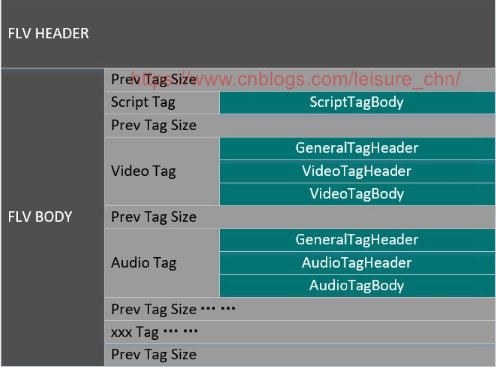

# FLV文件格式分析

FLV (Flash Video) 是由 Adobe 公司推出的一种封装格式，主要用于流媒体系统。FLV 封装的媒体文件具有体积轻巧、封装播放简单等特点，很适合网络应用。目前各浏览器普遍使用 Flash Player 作为网页播放器，使得安装有浏览器的计算机终端不需要另外安装播放器，这也是 FLV 格式广为流行的原因之一。

FLV 封装格式的文件扩展名为 .flv。FLV 文件主要由一个 Header 加上由多个 Tag 组成的 Body 构成。如下所述：

## 1.FLV Header

所有 FLV 格式文件都以 FLV Header 开头。FLV Header 类型是 FLVHEADER，FLVHEADER 定义如下：

|字段|类型|说明|
|---|---|---|
|Signature|UI8|'F' (0x46)|
|Signature|UI8|'L' (0x4C)|
|Signature|UI8|'V' (0x56)|
|Version|UI8|FLV 版本。例如，0x01 表示 FLV 版本 1|
|TypeFlags|UI8|b[0] 是否存在视频流 b[2] 是否存在音频流其他字段保留，值为 0|
|DataOffset|UI32|FLV Header 长度(字节)|

在 FLV 版本 1 中，“数据偏移”字段值为 9。在 FLV 未来版本中，此字段可兼容更大尺寸的 FLV Header。

```shell
typedef struct {
    UI8 Signature;
    UI8 Signature;
    UI8 Signature;
    UI8 Version;
    UI8 TypeFlags;
    UI32 DataOffset;
}   FLVHEADER;
```

## 2. FLV Body

一个 FLV 文件，除开头的 FLV Header 外，剩余部分就是 FLV Body。FLV Body 由一系列 back-pointer 和 tag 交织构成。back-pointer 表示前一 tag 大小。FLV Body 类型是 FLVBODY，FLVBODY 定义如下：

|字段|类型|说明|
|---|---|---|
|PreviousTagSize0|UI32|值总为 0|
|Tag1|FLVTAG|第一个 Tag|
|PreviousTagSize1|UI32|前一 Tag 大小，单位字节。FLV 版本 1 中, 此值等于前一 Tag 的 DataSize + 11|
|Tag2|FLVTAG|第二个 Tag|
|...|...|...|
|PreviousTagSizeN-1|UI32|倒数第二个 Tag 大小，单位字节|
|TagN|FLVTAG|最后一个 Tag|
|PreviousTagSizeN|UI32|最后一个 Tag 的大小，单位字节|

```shell
typedef struct {
    UI32 PreviousTagSize0;
    FLVTAG Tag1;
    UI32 PreviousTagSize1;
    FLVTAG Tag2;
    ...
    UI32 PreviousTagSizeN-1;
    FLVTAG TagN;
    UI32 PreviousTagSizeN;
}   FLVBODY;
```

## 3. FLV Tag

FLV Tag 包含音频、视频或脚本元数据、可选的加密元数据和 payload。FLV Tag 类型是 FLVTAG，FLVTAG 定义如下：

|字段|类型|说明|
|---|---|---|
|Reserved|UB [2]|用于 FMS 的保留字段, 值为 0|
|Filter|UB [1]|指示 packet 是否需要预处理。0 = 不需要预处理。1 = packet 在渲染前需要预处理(例如解密)。未加密文件中此值为0，加密文件中此值为1。|
|TagType|UB [5]|8 = 音频 / 9 = 视频 / 18 = 脚本数据|
|DataSize|UI24|Tag 中除通用头外的长度，即 Header + Data 字段的长度 (等于 Tag 总长度 – 11)|
|Timestamp|UI24|当前 Tag 的解码时间戳 (DTS)，单位是毫秒。FLV 文件中第一个 Tag 的 DTS 总为 0|
|TimestampExtended|UI8|和 Timestamp 字段一起构成一个 32 位值, 此字段为高 8 位。单位毫秒|
|StreamID|UI24|总为 0|
|Header|IF TagType == 8　AudioTagHeaderIF TagType == 9　VideoTagHeader|音频或视频 TagHeader，注意脚本没有 TagHeader|
|Data|IF TagType == 8　AUDIODATAIF TagType == 9　VIDEODATAIF TagType == 18　SCRIPTDATA|音频、视频或脚本 TagBody|

```shell
typedef struct {
    UB[2] Reserved;
    UB[1] Filter;
    UB[5] TagType;
    UI24 DataSize;
    UI24 Timestamp;
    UI8 TimestampExtended;
    UI24 StreamID;
  IF TagType == 8
    AudioTagHeader Header;
  IF TagType == 9
    VideoTagHeader Header;
  IF TagType == 8
    AUDIODATA Data;
  IF TagType == 9
    VIDEODATA Data;
  IF TagType == 18
    SCRIPTDATA Data;
}   FLVTAG;
```

一个 FLVTAG 中，前 11 个字节是通用 TagHeader，后面紧跟跟着音频 Tag、视频 Tag 或脚本 Tag，其中音频 Tag 和视频 Tag 都包含 TagHeader 和 TagBody 两部分，脚本 Tag 只有 TagBody 部分。

**上面 Timestamp 和 TimestampExtended 两个字段拼成一个 32 位的时间戳，是当前 Tag 的解码时间戳 (DTS)。对于音频帧来说，PTS 和 DTS 相同。对于视频帧来说，若含 B 帧，则 PTS 和 DTS 不同，H264 视频帧 PTS = DTS + CTS，CTS 就是 CompositionTime 字段，参考 3.2.1 节 CompositionTime 字段的定义。**

## 3.1 Audio Tag

Audio Tag 包括 AudioTagHeader 和 AudioTagBody 两部分。

### 3.1.1 AudioTagHeader

AudioTagHeader 定义如下：

|字段|类型|说明|
|---|---|---|
|SoundFormat|UB [4]|声音格式：0 = Linear PCM, platform endian1 = ADPCM2 = MP33 = Linear PCM, little endian4 = Nellymoser 16-kHz mono5 = Nellymoser 8-kHz mono6 = Nellymoser7 = G.711 A-law logarithmic PCM8 = G.711 mu-law logarithmic PCM 9 = reserved10 = AAC11 = Speex14 = MP3 8-Khz15 = Device-specific sound|
|SoundRate|UB [2]|采样率：AAC: 总为3 0 = 5.5 kHz 1 = 11 kHz 2 = 22 kHz 3 = 44 kHz|
|SoundSize|UB [1]|采样位深。此参数仅适用未压缩格式，压缩格式总在内部被解码为16位。0 = 8位1 = 16位|
|SoundType|UB [1]|0 = 单声道1 = 立体声|
|IF SoundFormat == 10　AACPacketType|UI8|AAC帧类型。仅当声音格式为 10 时，存在此字段0 = AAC sequence header1 = AAC raw|

格式 3，linear PCM，存储原始 PCM 采样点。如果采样位深为 8，采样点数据为无符号型。如果采样位深为 16，采样点数据为小端存储的带符号型。如果是立体声，左右声道采样点交织存放：左-右-左-右-...

格式 0 与格式 3 的不同之处只有一点：格式 0 存储 16 位采样数据，采用的大小端顺序是创建 FLV 文件的平台所使用的大小端顺序。因此，不应使用格式 0，而应使用格式 3。

格式 4 (Nellymoser 16-kHz mono) 和格式 5 (Nellymoser 8 kHz mono)，是两种特殊情况, 因为采样率字段无法表示 8 kHz 和 16 kHz。当采样格式是格式 4 或格式 5 时，Flash 播放器会忽略采样率和声音类型两个字段。对于其他采样率的 Nellymoser 格式, 即格式 6，则正常使用采样率和声音类型两个字段。

格式 10，AAC，声音类型应为 1 (立体声) 且采样率应为 3 (44 kHz)。这并不表示 FLV 中的 AAC 音频总是立体声、44 kHz的数据。实际上，Flash 播放器会忽略这两个值，而从已编码的 AAC 位流中提取出声道数和采样率信息。

格式 11，Speex，音频以 16 kHz采样率压缩为单声道，采样率字段值应为 0，采样位深字段值应为 1，声音类型字段值应为 0。

格式 7，8，14 和 15 保留。

```shell
typedef struct {
    UB [4] SoundFormat;
    UB [2] SoundRate;
    UB [1] SoundSize;
    UB [1] SoundType;
  IF SoundFormat == 10
    UI8 AACPacketType;
}
```

### 3.1.2 AudioTagBody/AUDIODATA

AUDIODATA 定义如下：

|字段|类型|说明|
|---|---|---|
|Body|IF Encrypted　EncryptedBodyELSE　AudioTagBody|类型分加密与非加密两种|

```shell
typedef struct {
  IF Encrypted
    EncryptedBody Body
  else
    AudioTagBody Body;
}   AUDIODATA;
```

AUDIODATA 包含 Body 字段。如果采用了加密，Body 的类型是 EncryptedBody，可参考规范文档“附件 F. FLV 加密”章节获得详细信息，此处略。如果未采用加密，则 Body 的类型是 AudioTagBody，下面详述。

AudioTagBody 定义如下：

|字段|类型|说明|
|---|---|---|
|SoundData|IF SoundFormat == 10　AACAUDIODATAELSE　Varies by format|字段类型根据声音格式确定|

```shell
typedef struct {
  IF SoundFormat == 10
    AACAUDIODATA SoundData;
  ELSE
    Varies by format
}   AudioTagBody;
```

### 3.1.3 AACAUDIODATA

Flash 播放器 9.0.115.0 及以上版本支持 AAC 格式。AACAUDIODATA 定义如下：

|字段|类型|说明|
|---|---|---|
|Data|IF AACPacketType == 0　AudioSpecificConfigELSE IF AACPacketType == 1　Raw AAC frame data in UI8 []|AudioSpecificConfig 在 ISO 14496-3 中定义|

## 3.2 Video Tag

Video Tag 包含 VideoTagHeader 和 VideoTagBody 两部分。

### 3.2.1 VideoTagHeader

|字段|类型|说明|
|---|---|---|
|FrameType|UB [4]|帧类型：1: keyframe (for AVC, a seekable frame) 2: inter frame (for AVC, a non-seekable frame) 3: disposable inter frame (H.263 only) 4: generated keyframe (reserved for server use only) 5: video info/command frame|
|CodecID|UB [4]|编解码器标识：1: JPEG (currently unused) 2: Sorenson H.263 3: Screen video 4: On2 VP6 5: On2 VP6 with alpha channel 6: Screen video version 2 7: AVC|
|IF CodecID == 7　AVCPacketType|UI8|AVC帧类型：0 = AVC sequence header 1 = AVC NALU 2 = AVC end of sequence (lower level NALU sequence ender is not required or supported)|
|IF CodecID == 7　CompositionTime|UI24|PTS 与 DTS 的时间偏移值，单位 ms，记作 CTS。参考 "ISO 14496-12, 8.15.3"|

H.264 的命名遵循了 ITU-T 的命名约定，它是 VCEG 视频编码标准 H.26x 线中的一员；MPEG-4 AVC 的命名来自 ISO/IEC MPEG 的命名约定，它是 ISO/IEC 14496 的第 10 部分，该协议族被称为 MPEG-4。

### 3.2.2 VideoTagBody/VIDEODATA

VIDEODATA 定义如下：

|字段|类型|说明|
|---|---|---|
|Body|IF Encrypted　EncryptedBodyELSE　VideoTagBody|类型分加密与非加密两种|

```shell
typedef struct {
  IF Encrypted
    EncryptedBody Body
  else
    VideoTagBody Body;
}   VIDEODATA;
```

VIDEODATA 包含 Body 字段。如果采用了加密，Body 的类型是 EncryptedBody，可参考规范文档“附件 F. FLV 加密”章节获得详细信息，此处略。如果未采用加密，则 Body 的类型是 VideoTagBody，下面详述。

VideoTagBody 包含视频帧净荷数据。VideoTagBody 定义如下：

|字段|类型|说明|
|---|---|---|
|VideoData|IF FrameType == 5　UI8ELSE (IF CodecID == 2　H263VIDEOPACKETIF CodecID == 3　SCREENVIDEOPACKETIF CodecID == 4　VP6FLVVIDEOPACKETIF CodecID == 5　VP6FLVALPHAVIDEOPACKETIF CodecID == 6　SCREENV2VIDEOPACKETIF CodecID == 7　AVCVIDEOPACKET)|视频帧净荷数据或视频帧信息除 AVCVIDEOPACKET 外的所有格式都可以参考 SWF 文件格式规范|

```shell
typedef struct {
  IF FrameType == 5
    UI8 VideoData;
  ELSE (
  IF CodecID == 2
    H263VIDEOPACKET VideoData;
  IF CodecID == 3
    SCREENVIDEOPACKET VideoData;
  IF CodecID == 4
    VP6FLVVIDEOPACKET VideoData;
  IF CodecID == 5
    VP6FLVALPHAVIDEOPACKET VideoData;
  IF CodecID == 6
    SCREENV2VIDEOPACKET VideoData;
  IF CodecID == 7
    AVCVIDEOPACKET VideoData;
  )  
}   VideoTagBody;
```

### 3.2.3 AVCVIDEOPACKET

AVCVIDEOPACKET 包含 AVC(H264) 视频净荷数据。AVCVIDEOPACKET 定义如下：

|字段|类型|说明|
|---|---|---|
|Data|IF AVCPacketType == 0　AVCDecoderConfigurationRecordIF AVCPacketType == 1　One or more NALUs (Full frames are required)|参考 ISO 14496-15, 5.2.4.1 中对 AVCDecoderConfigurationRecord 的描述|

```shell
typedef struct {
  IF AVCPacketType == 0
    AVCDecoderConfigurationRecord Data;
  IF AVCPacketType == 1
    One or more NALUs
}   AVCVIDEOPACKET;
```

## 3.3 Data Tag

数据 Tag 封装了单一方法，此方法通常在 Flash 播放器中的网络流对象上被调用。数据 Tag 包含方法名和一组参数。

### 3.3.1 ScriptTagBody/SCRIPTDATA

SCRIPTDATA 定义如下：

|字段|类型|说明|
|---|---|---|
|Body|IF Encrypted　EncryptedBodyELSE　ScriptTagBody|类型分加密与非加密两种|

```shell
typedef struct {
  IF Encrypted
    EncryptedBody Body
  else
    ScriptTagBody Body;
}   SCRIPTDATA;
```

SCRIPTDATA 包含 Body 字段。如果采用了加密，Body 的类型是 EncryptedBody，可参考规范文档“附件 F. FLV 加密”章节获得详细信息，此处略。如果未采用加密，则 Body 的类型是 ScriptTagBody，下面详述。

ScriptTagBody 包含以 AMF(Action Message Format) 编码的 SCRIPTDATA。AMF 是一种紧凑二进制格式，用于序列化 ActionScript 对象图。ScriptTagBody 定义如下：

|字段|类型|说明|
|---|---|---|
|Name|SCRIPTDATAVALUE|方法名或对象名|
|Value|SCRIPTDATAVALUE|AMF 参数或对象属性|

这里的 Name 就是上面提到的数据 Tag 中的方法名，Value 是此方法的一组参数。

```shell
typedef struct {
    SCRIPTDATAVALUE Name;
    SCRIPTDATAVALUE Value;
}   ScriptTagBody;
```

### 3.3.2 SCRIPTDATAVALUE

一个 SCRIPTDATAVALUE 记录包含一个特定类型的 ActionScript 值。

SCRIPTDATAVALUE 定义如下：

|字段|类型|说明|
|---|---|---|
|Type|UI8|ScriptDataValue 的类型：0 = Number1 = Boolean2 = String3 = Object4 = MovieClip (保留，不支持)5 = Null6 = Undefined7 = Reference8 = ECMA array9 = Object end marker10 = Strict array11 = Date12 = Long string|
|ScriptDataValue|Type 字段值 -> 本字段类型：0 -> DOUBLE1 -> UI82 -> SCRIPTDATASTRING3 -> SCRIPTDATAOBJECT7 -> UI168 -> SCRIPTDATAECMAARRAY10 -> SCRIPTDATASTRICTARRAY11 -> SCRIPTDATADATE12 -> SCRIPTDATALONGSTRING|脚本数据值|

SCRIPTDATAVALUE 的两个字段，Type 是类型，ScriptDataValue 是值。Type 的值确定 ScriptDataValue 的类型。因为 ScriptDataValue 的类型是动态的，由运行时解析得到的 Type 的值确定，所以这里类型和值用了两个字段。如果是静态类型，显然只用一个字段就可以了。

```shell
typedef struct {
    UI8 Type;
  IF Type == 0
    DOUBLE ScriptDataValue;
  IF Type == 1
    UI8 ScriptDataValue;
  IF Type == 2
    SCRIPTDATASTRING ScriptDataValue;
  IF Type == 3
    SCRIPTDATAOBJECT ScriptDataValue;
  IF Type == 7
    UI16 ScriptDataValue;
  IF Type == 8
    SCRIPTDATAECMAARRAY ScriptDataValue;
  IF Type == 10
    SCRIPTDATASTRICTARRAY ScriptDataValue;
  IF Type == 11
    SCRIPTDATADATE ScriptDataValue;
  IF Type == 12
    SCRIPTDATALONGSTRING ScriptDataValue;
}   SCRIPTDATAVALUE;
```

3.3.1 节中 Name 字段和 Value 字段的类型都是SCRIPTDATAVALUE。Name 表示方法名，实际类型通常是SCRIPTDATASTRING。Value 字段表示方法的一组参数，实际类型通常是SCRIPTDATAECMAARRAY。后文将介绍 SCRIPTDATASTRING 和 SCRIPTDATAECMAARRAY 两种类型。其他类型略，详情可参考 FLV 规范文档。

### 3.3.3 SCRIPTDATASTRING

SCRIPTDATASTRING 和 SCRIPTDATALONGSTRING 两种类型用于存储字符串，二者可存储字符串长度不同，SCRIPTDATASTRING 用于存储不超过 65535 个字符的字符串。

SCRIPTDATASTRING 定义如下：

|字段|类型|说明|
|---|---|---|
|StringLength|UI16|StringData 字段的长度，单位字节。|
|StringData|STRING|字符串实际数据，注意不带结束符 NUL。|

```shell
typedef struct {
    UI16 StringLength;
    STRING StringData;
}   SCRIPTDATASTRING;
```

### 3.3.4 SCRIPTDATAECMAARRAY

SCRIPTDATAECMAARRAY 记录存储 ECMA 数组(下表中的 Variables 字段)。ECMA 数组是一个关联数组，应在 ActionScript 数组包含无序索引时使用。所有索引(无序或有序)都是字符串而不是整数。出于序列化的目的，SCRIPTDATAECMAARRAY 类型与匿名 ActionScript 对象非常相似。

SCRIPTDATAECMAARRAY 定义如下：

|字段|类型|说明|
|---|---|---|
|ECMAArrayLength|UI32|ECMA 数组元素数量(近似)|
|Variables|SCRIPTDATAOBJECTPROPERTY[]|变量名和变量值的列表，即 ECMA 数组|
|ListTerminator|SCRIPTDATAOBJECTEND|列表终止符|

```shell
typedef struct {
    UI32 ECMAArrayLength;
    SCRIPTDATAOBJECTPROPERTY[] Variables;
    SCRIPTDATAOBJECTEND ListTerminator;
}   SCRIPTDATAECMAARRAY;
```

其中，SCRIPTDATAOBJECTPROPERTY 类型定义了 ActionScript 对象或关联数组变量的对象属性。

SCRIPTDATAOBJECTPROPERTY 定义如下：

|字段|类型|说明|
|---|---|---|
|PropertyName|SCRIPTDATASTRING|对象属性或变量的名称|
|PropertyData|SCRIPTDATAVALUE|对象属性或变量的值和类型|

```shell
typedef struct {
    SCRIPTDATASTRING PropertyName;
    SCRIPTDATAVALUE PropertyData;
}   SCRIPTDATAOBJECTPROPERTY;
```

### 3.3.5 实例：onMetaData 对象

FLV 元数据对象应在名为 onMetadata 的 SCRIPTDATA 标签中携带。各种属性对通过 NetStream.onMetaData 属性运行的 ActionScript 程序有效。可用的属性根据创建 FLV 文件的软件而有所不同。典型属性包括：

|字段|类型|说明|
|---|---|---|
|audiocodecid|Number|音频编解码器 ID|
|audiodatarate|Number|音频码率，单位 kbps|
|audiodelay|Number|由音频编解码器引入的延时，单位秒|
|audiosamplerate|Number|音频采样率|
|audiosamplesize|Number|音频采样点尺寸|
|canSeekToEnd|Boolean|指示最后一个视频帧是否是关键帧|
|creationdate|String|创建日期与时间|
|duration|Number|文件总时长，单位秒|
|filesize|Number|文件总长度，单位字节|
|framerate|Number|视频帧率|
|height|Number|视频高度，单位像素|
|stereo|Boolean|音频立体声标志|
|videocodecid|Number|视频编解码器 ID|
|videodatarate|Number|视频码率，单位 kbps|
|width|Number|视频宽度，单位像素|

onMetaData 标签通常会成为 FLV Body 中的第一个标签，紧跟在 FLV Header 之后。onMetaData 标签中存储的是一些视频、音频及文件相关的元数据信息：如视频帧率，音频采样率、文件长度等。

结合 3.3.1 节，onMetaData 标签的 Name 字段主要就是存储 “onMetaData” 字符串。具体为：第 1 个字节值是 0x02，表示 Name 字段是字符串类型。第 2-3 个字节为 UI16 类型值，标识字符串的长度，值为 0x000A (“onMetaData” 这个字符串的长度)。后面跟着的数据为具体的字符串，值为 “onMetaData”。

onMetaData 标签的 Value 字段存储上表所示的各属性键值对。具体为：第 1 个字节值是 0x08，表示 Value 字段是数组类型。第 2-5 个字节为UI32类型值，表示数组元素个数。后面紧跟着数组，数组元素为属性名称和值组成的对(键值对)。最后是数组的结束符。

```shell
ScriptTagBody onMetaData;

onMetaData.Name.Type == 0x02
onMetaData.Name.ScriptDataValue.StringLength == 0x000A
onMetaData.Name.ScriptDataValue.StringData == "onMetaData"

onMetaData.Value.Type == 0x08
onMetaData.Value.ScriptDataValue.ECMAArrayLength ==
onMetaData.Value.ScriptDataValue.Variables[0].PropertyName == {0x0005, "width"}   // SCRIPTDATASTRING 类型
onMetaData.Value.ScriptDataValue.Variables[0].PropertyData == {0x00, 1280.0}      // SCRIPTDATAVALUE 类型
onMetaData.Value.ScriptDataValue.Variables[1].PropertyName == {0x0005, "height"}  // SCRIPTDATASTRING 类型
onMetaData.Value.ScriptDataValue.Variables[1].PropertyData == {0x00, 720.0}       // SCRIPTDATAVALUE 类型
...
```

## 4. 总结

FLV 结构如下图所示：

<div align="center">  </div><br>

在 C 语言中定义 FLV 文件结构，一目了然：

```C
/*
 * @brief flv file header 9 bytes
 */
typedef struct flv_header {
    uint8_t signature[3];
    uint8_t version;
    uint8_t type_flags;
    uint32_t data_offset; // header size, always 9
} __attribute__((__packed__)) flv_header_t;

/*
 * @brief flv tag general header 11 bytes
 */
typedef struct flv_tag {
    uint8_t tag_type;
    uint32_t data_size;
    uint32_t timestamp;
    uint8_t timestamp_ext;
    uint32_t stream_id;
    void *data; // will point to an audio_tag or video_tag
}   flv_tag_t;

typedef struct audio_tag {
    uint8_t sound_format; // 0 - raw, 1 - ADPCM, 2 - MP3, 4 - Nellymoser 16 KHz mono, 5 - Nellymoser 8 KHz mono, 10 - AAC, 11 - Speex
    uint8_t sound_rate; // 0 - 5.5 KHz, 1 - 11 KHz, 2 - 22 KHz, 3 - 44 KHz
    uint8_t sound_size; // 0 - 8 bit, 1 - 16 bit
    uint8_t sound_type; // 0 - mono, 1 - stereo
    void *data;
}   audio_tag_t;

typedef struct video_tag {
    uint8_t frame_type;
    uint8_t codec_id;
    void *data;
}   video_tag_t;

typedef struct avc_video_tag {
    uint8_t avc_packet_type; // 0x00 - AVC sequence header, 0x01 - AVC NALU
    uint32_t composition_time;
    uint32_t nalu_len;
    void *data;
}   avc_video_tag_t;
```
