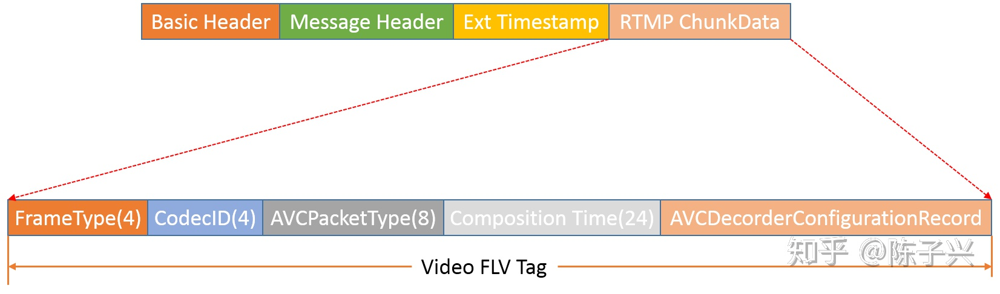
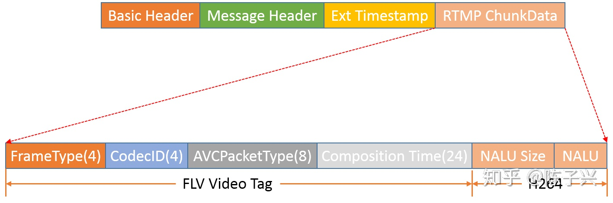
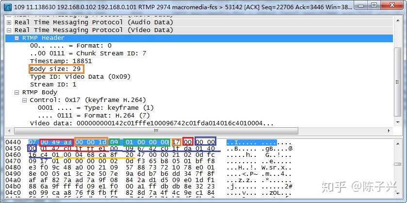
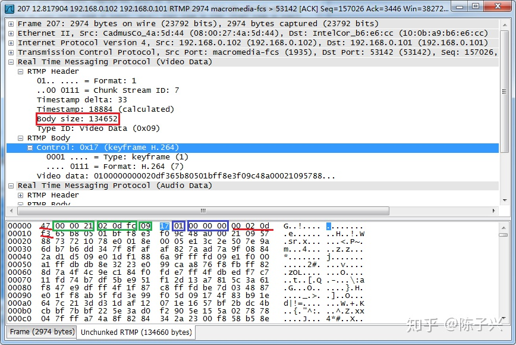
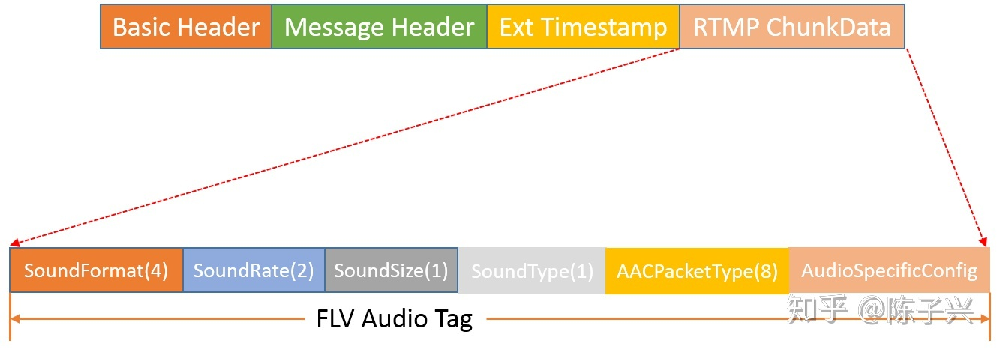
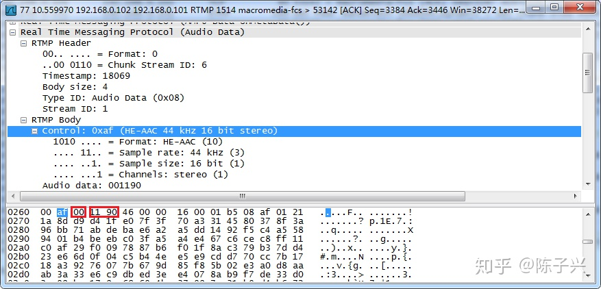
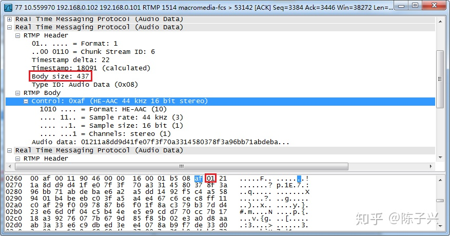

# RTMP 基础概念

## RTMP 连接建立过程

RTMP 协议是基于可靠传输 TCP 协议的，所以首先离不开创建 TCP 连接。RTMP 流建立过程大概要经历三个阶段：

* 第一阶段是 TCP 连接建立过程，这个是很基础的知识了。

* 第二阶段是 RTMP HandShake 过程，本人理解主要是为了连接探测，因为 tcp 连接 ok ，不代表可以正常通信。比如，某个实验小程序占用了 1935 端口，connect 能成功，但是 RTMP 通信肯定不行，因为不支持此协议啊，所以需要探测这一步。

c0，c1，c2 是客户端要发送的消息，s0，s1，s2 是服务端要发送的消息。rtmp 1.0 规范中的例子是每一个包都是单发的，顺序是 c0->s0->c1->s1->c2->s2。然而，具体实现都是如下图所以，目的是为了减少交互过程，加快连接过程。

握手大概过程：

```Shell
Client                   Server
   |                       |
   |        C0, C1         |
   |---------------------->|
   |                       |
   |       S0,S1,S2        |
   |<----------------------|
   |                       |
   |          C2           |
   |---------------------->|
```
* 第三阶段是逻辑流通道建立过程，对于 play 和 publish 过程稍有不同，我们展示一下 play 过程。

```Shell
Client                                      Server
   |                                           |
   |        connect(app,tcUrl, codecs)         |
   |------------------------------------------>|
   |                                           |
   |       Window Acknowledgement Size         |
   |<------------------------------------------|
   |                                           |
   |       Set Peer Bandwidth (0x06)           |
   |<------------------------------------------|
   |                                           |
   |       -result(response connect)           |
   |<------------------------------------------|
   |                                           |
   |       Window Acknowledgement Size         |
   |------------------------------------------>|
   |                                           |
   |      createStream                         |
   |------------------------------------------>|
   |                                           |
   |      _result(response createStream)       |
   |<------------------------------------------|
   |                                           |
   |      getStreamLength()                    |
   |------------------------------------------>|
   |                                           |
   |      play(stream name)                    |
   |------------------------------------------>|
   |                                           |
   |  User Control Message set buffer length   |
   |------------------------------------------>|
   |                                           |
   |         Stream Begin                      |
   |<------------------------------------------|
   |                                           |
   | onStatus | RtmpSampleAccess | onMetaData  |
   |<------------------------------------------|
   |                                           |
   |          Media Data                       |
   |<------------------------------------------|
   |                                           |
```

上面每一个过程，都是单独的 RTMP message，有可能几个包在一起发送的。这些消息含义、消息结构，在 [《rtmp_specification_1.0》](http://wwwimages.adobe.com/www.adobe.com/content/dam/acom/en/devnet/rtmp/pdf/rtmp_specification_1.0.pdf) 中有详细介绍，可以参考。

## RTMP 消息格式分析

本节参考 rtmp 1.0 规范中的格式定义做一个说明。

```Shell
+--------------+----------------+--------------------+--------------+
| Basic Header | Message Header | Extended Timestamp | Chunk Data   |
+--------------+----------------+--------------------+--------------+
|                                                    |
|<------------------- Chunk Header ----------------->|
```

* Basic Header：基础头，是可变长的，可以是 1 字节、2 字节、3 字节长。

* Message Header: 消息头，是可变长的。可以是 11字节、7 字节、3 字节、0 字节长。

* Extended Timestamp：扩展时间戳。可以是 0 字节、4 字节。Message Header 中的时间戳是 3 字节，只有当 3 字节都被用完，才启用这个扩展时间戳字段。

### Basic Header

怎么区分基础头的长度到底是 1 字节、2 字节还是 3 字节呢？其实不管咋样，至少得一个字节吧，那他是在第一个字节做文章的。第一字节分了 fmt（2 bit), cs id(6 bit) 两部分，如下展示的三种基本头格式所示。第一个字节的高 2 位都是一样的，低 6 位是有不同解释的。

```Shell
0 1 2 3 4 5 6 7
+-+-+-+-+-+-+-+-+
|fmt| cs id     |
+-+-+-+-+-+-+-+-+
   一字节头

 0 1 2 3 4 5 6 7 8 9 0 1 2 3 4 5
+-+-+-+-+-+-+-+-+-+-+-+-+-+-+-+-+
|fmt|     0     | cs id - 64    |
+-+-+-+-+-+-+-+-+-+-+-+-+-+-+-+-+
             两字节头

 0 1 2 3 4 5 6 7 8 9 0 1 2 3 4 5 6 7 8 9 0 1 2 3
+-+-+-+-+-+-+-+-+-+-+-+-+-+-+-+-+-+-+-+-+-+-+-+-+
|fmt|     1     |         cs id - 64            |
+-+-+-+-+-+-+-+-+-+-+-+-+-+-+-+-+-+-+-+-+-+-+-+-+
              三字节头
```

fmt: 占用 2 个 bit ，可以表示 0、1、2、3 四个数字，分别表示了 Message Header 的四种格式。

cs id: 占用 6 个 bit ， 叫做 chunk stream ID，这里做了一个规定：

* 如果 cs id 的值是 2-63 那么表示是 1 字节的头。

* 如果 cs id 得值等于 0，那么就是 2 字节头。取值范围是 64-319（255+64）。

* 如果 cs id 值等于 1，那么是 3 字节头。取值范围是 64-65599(65535+64)。注意，图里面示意 cs id 是 1，不要理解成每一个 bit 都是 1，而是 cs id 的值是 1。我就理解成这样了，但愿只有我一个人这样。

有没有发现，64-319 既可以用 2 字节表示，也可以用 3 字节表示呢？那当然了，你要乐意这样，也没错。但是规范又建议了，这样压缩为了节省带宽，所以 64-319 尽量用 2 字节表示。

### Message Header

前面基础消息头 fmt 字段设计了 4 中消息类型，我们就分别看一下：

消息类型 0， fmt=0，字节长度=11：

```shell
0 1 2 3 4 5 6 7 8 9 0 1 2 3 4 5 6 7 8 9 0 1 2 3 4 5 6 7 8 9 0 1
+-+-+-+-+-+-+-+-+-+-+-+-+-+-+-+-+-+-+-+-+-+-+-+-+-+-+-+-+-+-+-+-+
|                   timestamp                   |message length |
+-+-+-+-+-+-+-+-+-+-+-+-+-+-+-+-+-+-+-+-+-+-+-+-+-+-+-+-+-+-+-+-+
|     message length (cont)     |message type id| msg stream id |
+-+-+-+-+-+-+-+-+-+-+-+-+-+-+-+-+-+-+-+-+-+-+-+-+-+-+-+-+-+-+-+-+
|           message stream id (cont)            |
+-+-+-+-+-+-+-+-+-+-+-+-+-+-+-+-+-+-+-+-+-+-+-+-+
```

消息类型 1， fmt=1，字节长度=7:

```Shell
0 1 2 3 4 5 6 7 8 9 0 1 2 3 4 5 6 7 8 9 0 1 2 3 4 5 6 7 8 9 0 1
+-+-+-+-+-+-+-+-+-+-+-+-+-+-+-+-+-+-+-+-+-+-+-+-+-+-+-+-+-+-+-+-+
|                   timestamp delta             |message length |
+-+-+-+-+-+-+-+-+-+-+-+-+-+-+-+-+-+-+-+-+-+-+-+-+-+-+-+-+-+-+-+-+
|     message length (cont)     |message type id|
+-+-+-+-+-+-+-+-+-+-+-+-+-+-+-+-+-+-+-+-+-+-+-+-+
```

消息类型 2， fmt=2，字节长度=3:

```Shell
0 1 2 3 4 5 6 7 8 9 0 1 2 3 4 5 6 7 8 9 0 1 2 3
+-+-+-+-+-+-+-+-+-+-+-+-+-+-+-+-+-+-+-+-+-+-+-+-+
|                   timestamp delta             |
+-+-+-+-+-+-+-+-+-+-+-+-+-+-+-+-+-+-+-+-+-+-+-+-+
```

消息类型 3， fmt=3，字节长度=0:

```Shell
没有消息头，消息头长度是 0
```

仔细观察这四种消息头，我们发现消息头的长度是越来越小，其目的就是为了节省空间，节省带宽。具体使用场景，rtmp 1.0 规范描述的很详细，可以详查。

## 藏在 RTMP 消息中的 flv/H264/AAC

通过 ffmpeg 推送 rtmp 流的命令：

```Shell
ffmpeg -re -i test.mp4 -c copy -f flv rtmp://192.168.0.103:1935/live/test
```

这是通过 ffmpeg 将一个 mp4 文件以流的形式推送给 rtmp 服务器，其中有一个选项是 -f flv，这意味着 rtmp 流里面是带有 flv 标签吗？那让我们以 h264/AAC 为例，一探究竟。

## RTMP 中的 Video FLV Tag

我们首先通过两张图展示一下，H264 在 RTMP 消息中是怎么携带 FLV 头的。

图一：
<div align="center">  </div><br>

图二：
<div align="center">  </div><br>

这个图是一个 RTMP Chunk 消息，消息体是一个 Video FLV Tag，字段名称后面的数字表示长度，单位是 bit。这几个字段消息描述，可以参考[《FLV 文件格式分析》](https://github.com/believeszw/CS-Notes/blob/master/notes/流媒体/流媒体服务器/FLV文件格式分析.md)一文。

* FrameType 是 4 个 bit。取值 1：keyframe，2：inter frame

* CodecID 是 4 个 bit。取值 7，表示 AVC/H264

* AVCPacketType 是 8 个 bit。取值 0：表示 Composition Time 后面的数据是 AVCDecorderConfigurationRecord 结构，如图一所示；取值 1：表示 Composition Time 后面的数据是 H264 NALU 格式，如图二所示。

* Composition Time 是 24 个 bit。表示时间，暂且不用关注。

AVCDecorderConfigurationRecord 结构的详细说明，参考[《FLV 文件格式分析》](https://github.com/believeszw/CS-Notes/blob/master/notes/流媒体/流媒体服务器/FLV文件格式分析.md)一文。AVCDecorderConfigurationRecord 结构中包含了 H264 SPS/PPS 信息。

现在我们通过 Wireshark 抓包来分析一下图一和图二中所展示的数据格式。

图三：
<div align="center">  </div><br>

从图中三可以看出，RTMP Basic Header 是 1 个字节长度，流 id 是 7。fmt 是 0，说明 Message Header 是 11 字节长度。

RTMP body 是从 0440 行，内容为 0x17 的数值开始的。0x17 的高 4个 bit 等于 1，表示 keyFrame，低 4 个 bit 等于 7，表示是 H264 codec。

0x17 后面的一个字节 0x00 表示 AVCPacketType。紧接 AVCPacketType 着后面的三个字节是 CompositionTime。由于 AVCPacketType 等于 0，所以 CompositionTime 后面的内容是 AVCDecorderConfigurationRecord 结构，这个结构需要参考 [《FLV 文件格式分析》](https://github.com/believeszw/CS-Notes/blob/master/notes/流媒体/流媒体服务器/FLV文件格式分析.md)一文。

其中 SPS 是 0450 行，0x67 开头的 9 个字节的内容。PPS 的内容是 0460 行，0x68 开头的 4 个字节的内容。

图四：
<div align="center">  </div><br>

从图中四可以看出，RTMP Basic Header 是 1 个字节长度，流 id 是 7。fmt 是 1，说明 Message Header 是 7 字节长度。

RTMP body 是从 00000 行，内容为 0x17 的数值开始的。0x17 的高 4个 bit 等于 1，表示 keyFrame，低 4 个 bit 等于 7，表示是 H264 codec。

0x17 后面的一个字节 0x01 表示 AVCPacketType。紧接 AVCPacketType 着后面的三个字节是 CompositionTime。由于 AVCPacketType 等于 1，所以 CompositionTime 后面的内容是 H264 NALU 格式。

其中 0x00020df3 表示 NALU 的长度，其十进制是 134643。RTMP header 中记录的 body size 是 134652。134652 - 134643 = 9，这 9 个字节刚好是 video flv 头的 5 字节和表示 NALU 长度的 4 字节。

NALU 是从 00010 行的 0x65 开始的，0x65 二进制是 01101001，后面 5 个 bit 01001b=5 ，是一个视频的 IDR 帧。

到此为止，就该分析 H264 帧格式了。

## RTMP 中的 Audio FLV Tag

我们分析一下 AAC 在 RTMP 中是如何携带 FLV 头的。

图一
<div align="center">  </div><br>

其实，audio flv tag 和 video flv tag 类似，只是格式不一样，分析方法都一样。

* SoundFormat: 4 个 bit。取值 10，表示 AAC codec。

* SoundRate: 2 个 bit。取值 3，表示 44k 的采用频率。

* SoundSize: 1 个 bit。取值 1，表示音频样本用 16 bit 表示。

* SoundType: 1 个 bit。取值 1，表示立体声。

* AACPacketType: 8 个 bit。取值 0，表示 AACPacketType 后面内容是 AudioSpecificConfig 格式；取值 1，表示 AACPacketType 后面内容是 AAC 编码格式。

AudioSpecificConfig 格式可以参考[《FLV 文件格式分析》](https://github.com/believeszw/CS-Notes/blob/master/notes/流媒体/流媒体服务器/FLV文件格式分析.md)一文。

下面，我们通过 Wireshark 抓包来分析一下，AAC FLV 两种格式。

图二：
<div align="center">  </div><br>

图二中 0260 行，红框里的 0x00 就是 AACPacketType，取值 0，表示后面的 0x11 0x90 两个字节是 AudioSpecificConfig 结构。这个结构解析，不再重复了。

图三：
<div align="center">  </div><br>

图三中 0260 行，红框里的 0x01 就是 AACPacketType，取值 1，表示后面的内容是 AAC 格式。AAC 格式的分析，后面文章会继续。

# 后记

本文讲述RTMP 消息格式。最后，结合 Wireshark 抓包，分析了 RTMP 中是如何 AAC/AVC FLV tag 头的。
