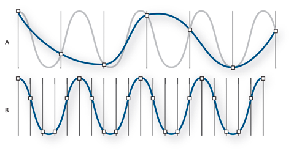
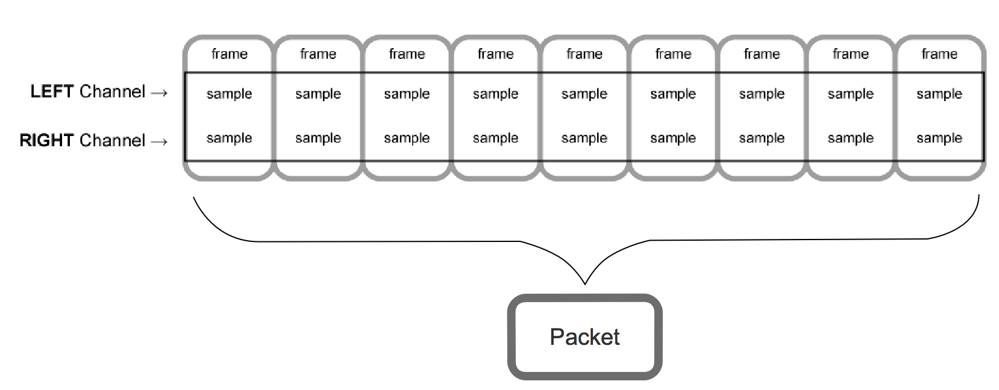

# 音频基本概念

在做小视频和 sdk 互通时，由于 rtmp 推的流音频是 aac 的，需要做解析或解码，顾整理一下相关知识点

## 声音原理

声音的频率一般会以 赫兹(Hz) 表示，指每秒周期性震动的次数

* 频率：音调越高，频率越大；音调越低，频率越小。

* 波长：音调越高，波长越短；音调越低，波长越长。（频率高波长短）

* 振幅：音量（响度）越大，振幅越大；音量越小，振幅越小。

> 人耳可以感知到 20Hz ～ 20,000HZ 频率的声音，标准状况下的空气中，上述音波对应的波长 17m ～ 17mm

## 基本概念

### PCM

> In signal processing, sampling is the reduction of a continuous-time signal to a discrete-time signal.\
> pcm 是脉冲编码调制，简单说就是在录制音频是对连续音频信号抽样，以 0 和 1 的数字形式记录，所以 PCM 不是连续音频；

* **Sample**

信号处理中，指将连续时间的信号减少成离散时间的信号

数码音频系统是通过将声波波形转换成一连串的二进制数据来再现原始声音，和我们的视频一样，视频其实就是用图片不断的采样组合而成。

* **Sample Rate**

> Sample Rate is the number of samples of audio carried per second.\
> 采样率就是每秒对音频采样的次数。

采样率表示音频信号每秒的数字快照数。该速率决定了音频文件的频率范围。采样率越高，数字波形的形状越接近原始模拟波形。低采样率会限制可录制的频率范围，这可导致录音表现原始声音的效果不佳。

<div align="center">  </div><br>

* **Channel**

> 声道数（ 1-8 ）声道的个数可以理解为有多少个采样点采样，采样点越多表示越多的表达方式

单声道在声音处理过程中只有单数据流，而立体声则需要左、右声道的两个数据流。显然，立体声的效果要好，但相应的数据量要比单声道的数据量加倍。

* **Audio bit depth**

> In digital audio using pulse-code modulation (PCM), bit depth is the number of bits of information in each sample, and it directly corresponds to the resolution of each sample.\
在使用脉冲编码调制（PCM）的数字音频中，bit depth 是每个 Sample (采样)点占用的位数，并且它直接对应于每个采样的分辨率。

Audio bit depth 一般为 16 位，即采样时用 16 位来表示一个音频采样点.
```Cpp
enum AVSampleFormat {
        AV_SAMPLE_FMT_NONE = -1,
        AV_SAMPLE_FMT_U8,          ///< unsigned 8 bits
        AV_SAMPLE_FMT_S16,         ///< signed 16 bits
        AV_SAMPLE_FMT_S32,         ///< signed 32 bits
        AV_SAMPLE_FMT_FLT,         ///< float
        AV_SAMPLE_FMT_DBL,         ///< double

        AV_SAMPLE_FMT_U8P,         ///< unsigned 8 bits, planar
        AV_SAMPLE_FMT_S16P,        ///< signed 16 bits, planar
        AV_SAMPLE_FMT_S32P,        ///< signed 32 bits, planar
        AV_SAMPLE_FMT_FLTP,        ///< float, planar
        AV_SAMPLE_FMT_DBLP,        ///< double, planar
        AV_SAMPLE_FMT_S64,         ///< signed 64 bits
        AV_SAMPLE_FMT_S64P,        ///< signed 64 bits, planar

        AV_SAMPLE_FMT_NB           ///< Number of sample formats. DO NOT USE if linking dynamically
};
```

* **Bit Rate**

> 比特率是指每秒传送的比特 (bit) 数。单位为 bps(Bit Per Second)，比特率越高，传送数据速度越快。声音中的比特率是指将模拟声音信号转换成数字声音信号后，单位时间内的二进制数据量，是间接衡量音频质量的一个指标

Bit Rate(bps) = Sample Rate × Audio bit depth × Channels
即 比特率 (bps) = 采样频率 × 采样位数 × 声道数

* **Frame**

> A frame is a collection of time-coincident samples. For instance, a linear PCM stereo sound file has two samples per frame, one for the left channel and one for the right channel.\
frame 是离散采样的集合，例如，一个 linear PCM stereo sound 文件中每个 frame 有两个采样，分别来自左声道和右声道。

frame 是最小单位时间点包含的一个或多个声音采样，最小单位时间点取决于声音采样设备，是一个时间点多个采样的集合。

* **Packet**

> A packet is a collection of one or more contiguous frames. A packet defines the smallest meaningful set of frames for a given audio data format, and is the smallest data unit for which time can be measured. In linear PCM audio, a packet holds a single frame. In compressed formats, it typically holds more; in some formats, the number of frames per packet varies.\
Packet 是一个或者多个连续 frame 的集合。对于一个给定的音频数据格式，Packet 定义了定义了最小有意义的 frame 集合，并且是最小的可测量时间单位。

下图展示了 Packet、Frame 和 Sample 的关系。

<div align="center">  </div><br>

在未压缩的音频中，一个 Packet 只有一个 frame ;
在压缩的音频中，一个 Packet 是不可再分割的压缩数据块，例如在一个 AAC 格式的 Packet 中就包含了 1024 个采样帧；


## PCM格式数据分析

FFmpeg 中音视频数据基本上都有 Packed 和 Planar 两种存储方式，对于双声道音频来说，Packed 方式为两个声道的数据交错存储，交织在一起；Planar 方式为两个声道分开存储，也就是平铺分开。假设一个 L/R 为一个采样点的话（一个采样点可能是 8 位 16 位 32 位等），可以这么表示
Packed: L R L R L R L R   Planar: L L L L R R R R


FFmpeg 音频解码后的数据是存放在 AVFrame frame 结构中的，如果是 Packed 格式的话，所有的音频数据都放在 frame.data[0] 结构中；如果是 Planar 格式的话，不同声道的数据分别放在 frame.data[0]和 frame.data[1] 中。

不同的格式的输入音频编码后输出的音频采样格式不是固定的，最常见的音频格式有 AAC 和 MP3 两种，我测试中，其中 AAC 编码输出的数据为浮点型的 AV_SAMPLE_FMT_FLTP 格式，MP3 编码输出的数据为 AV_SAMPLE_FMT_S16P 格式（使用的 mp3 文件为 16 位深）。具体采样格式可以查看编码后的 AVFrame 中的 format 成员或解码器的 AVCodecContext 中的 sample_fmt 成员。

这里 AAC 和 MP3 音频解码后的数据都是 Planar 模式的，两个声道的声音数据分别存在 frame.data[0] 和 frame.data[1] 中，多声道音频可能还会使用 data[2] data[3] 等。需要注意的是： 我们刚分析的 Planar 和 Packed 模式是 ffmpeg 内部存储模式，我们实际使用的音频文件都是 LRLR 左右声道交替存储的，设想如果音频文件 3MB 大小的话，不可能前面 1.5MB 存左声道，后面 1.5MB 存右声道。

Planar 或者 Packed 模式直接影响到保存文件时写文件的操作，所以操作数据的时候一定要先检测音频采样格式。下面以 Planar 格式来演示如何保存音频文件。

## 保存PCM格式数据到文件

```cpp
// 前面代码读音频文件，初始化FFmpeg并打开了AVCodecContext
// 下面代码进行解码和保存文件
bool AudioDecoder::readFrameProc()
{
    FILE *fd = fopen("out.pcm", "wb");
    AVPacket packet;    
    //av_init_packet(&packet);

    AVFrame *frame = av_frame_alloc();

    // 读取一个帧packet的音频数据
    while (int num = av_read_frame(mFormatCtx, &packet) >= 0) {

        // 解码（发送一个packet,获取到的frame就是解码后的数据了），这是FFmpeg 3的新解码函数
        avcodec_send_packet(mCodecCtx, &packet);
        int ret = avcodec_receive_frame(mCodecCtx, frame);
        if (!ret) {

        // 获取一个采样点字节数，比如16位采样点值为2字节
        int data_size = av_get_bytes_per_sample(mCodecCtx->sample_fmt);

        // frame->nb_samples为这个frame中一个声道的采样点的个数
        for (int i = 0; i < frame->nb_samples; i++)
            for (int ch = 0; ch < mCodecCtx->channels; ch++)
                fwrite(frame->data[ch] + data_size*i, 1, data_size, fd);
        }
        av_packet_unref(&packet);
    }

    av_frame_free(&frame);
    fclose(fd);
    return false;
}
```

上面这段代码 frame 为解码后的数据，因为是 Planar 模式的数据，所以写文件的时候，存储每采样点的时候两个声道 LRLRLR 这样交错写入文件，相当于把 AV_SAMPLE_FMT_S16P 采样格式保存为 不带字母 P的 AV_SAMPLE_FMT_S16 采样格式，。

举个例子，假如这个 frame 中有 20 个采样点（nb_samples=20），每个采样点为 2 字节（ 16 位深，每个声道的一个采样点 2 字节）。左声道数据为 data[0][40] 数组，右声道数据为 data[1][40] 数组。写文件的时候依次写入 data[0][0], data[0][1] – data[1][0], data[1][1] – data[0][2], data[0][3] – data[1][2]-data[1][3]。

## 附录

在数字音频领域，常用的采样率有：

|Sample Rate|Use|
|---|----|
|8,000 Hz|电话所用采样率，对于人的说话已经足够|
|22,050 Hz|无线电广播所用采样率|
|32,000 Hz|miniDV数码视频camcorder、DAT（LP mode）所用采样率|
|44,100 Hz|音频CD,也常用于MPEG-1音频（VCD, SVCD, MP3）所用采样率|
|47,250 Hz|Nippon Columbia（Denon）开发的世界上第一个商用PCM录音机所用采样率|
|48,000 Hz|miniDV、数字电视、DVD、DAT、电影和专业音频所用的数字声音所用采样率|
|50,000 Hz|二十世纪七十年代后期出现的3M和Soundstream开发的第一款商用数字录音机所用采样率|
|50,400 Hz|三菱X-80数字录音机所用所用采样率|
|96,000 or 192,000 Hz|DVD-Audio、一些LPCM DVD音轨、Blu-ray Disc（蓝光碟）音轨、和HD-DVD（高清晰度DVD）音轨所用所用采样率|
|2.8224 MHz|SACD、索尼和飞利浦联合开发的称为Direct Stream Digital的1位sigma-delta modulation过程所用采样率。|
