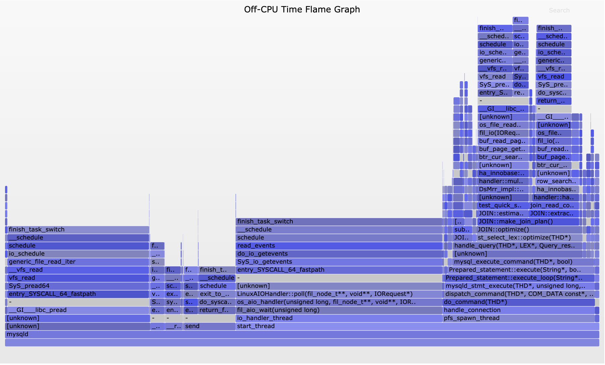

# Off-CPU 分析

性能问题可以分为以下两种类型之一：

* On-CPU：线程花时间在 CPU 上运行

* CPU 外：在 I/O，锁，计时器，分页/交换等被阻塞时所花费的时间。

CPU 外分析是一种性能方法，其中测量和研究 **CPU 外时间以及堆栈跟踪等上下文**。它与 CPU 分析不同，后者 **仅检查线程是否在 CPU 上执行**。在这里，目标是处于 **阻塞状态且处于非 CPU 状态的线程状态**，如下面的蓝色所示。

<div align="center">  </div><br>

CPU 外分析是对 CPU 分析的补充，因此可以理解 100％ 的线程时间。此方法也不同于 **通常检测应用程序功能阻塞的跟踪技术**，因为该方法的目标是 **内核调度程序的阻塞概念**，这是一种方便的方法。

线程可能会出于多种原因离开 CPU，包括 **I/O和锁，还有一些与当前线程的执行无关的原因，包括由于对 CPU 资源的高需求而导致的非自愿上下文切换和中断**。不管是什么原因，如果在工作负载请求（同步代码路径）期间发生这种情况，那么它将引入延迟。

在此页面上，将介绍 CPU 外时间作为度量标准，并概述 CPU 外分析的技术。作为非 CPU 分析的示例实现，我将其应用于 Linux，然后在后面的部分中总结其他操作系统。

## 先决条件

CPU 外分析要求跟踪器可以使用堆栈跟踪，您可能需要首先对其进行修复。许多应用程序都使用 -fomit-frame-pointer gcc 选项进行编译，从而中断了基于帧指针的堆栈遍历。VM 运行时（如 Java）会即时编译方法，并且在没有其他帮助的情况下跟踪程序可能找不到其符号信息，从而导致堆栈跟踪仅是十六进制的。还有其他陷阱。请参阅我以前有关为 perf 修复[堆栈跟踪](http://www.brendangregg.com/perf.html#StackTraces)和 [JIT 符号](http://www.brendangregg.com/perf.html#JIT_Symbols)的文章.

## 介绍

为了解释 CPU 外分析的作用，我将首先汇总 CPU 采样和跟踪以进行比较。然后，我将总结两种 CPU 外分析方法：跟踪和采样。它不是一种广泛使用的方法，部分原因是生产 Linux 环境中缺少测量它的工具。现在，随着 eBPF 和更新的 Linux 内核（4.8+）发生了变化。

### 采样（Sampling）

* CPU 采样

许多传统的分析工具都使用定时采样所有 CPU 的活动，以一定的时间间隔或速率（例如 99 赫兹）收集当前指令地址（程序计数器）或整个堆栈反向跟踪的快照。这将给出正在运行的功能或堆栈跟踪的计数，从而可以对 CPU 周期花费的位置进行合理的估算。在 Linux 上，处于采样模式的 perf 工具（例如-F 99 ）会定时进行 CPU 采样。

考虑应用程序函数A（）调用函数B（），该函数进行了阻塞的系统调用：

```CPP
  CPU Sampling ----------------------------------------------->
     |  |  |  |  |  |  |                      |  |  |  |  |         
     A  A  A  A  B  B  B                      B  A  A  A  A         
    A(---------.                                .----------)        
               |                                |                   
               B(--------.                   .--)                   
                         |                   |         user-land    
   - - - - - - - - - - syscall - - - - - - - - - - - - - - - - -    
                         |                   |         kernel       
                         X     Off-CPU       |                      
                       block . . . . . interrupt     
```

尽管这对于研究CPU上的问题（包括热代码路径和自适应互斥锁旋转）非常有效，但当应用程序阻塞并正在等待CPU以外时，它不会收集数据。

* CPU 外采样

```CPP
  Off-CPU Sampling ------------------------------------------->
                        |  |  |  |  |  |  |                       
                        O  O  O  O  O  O  O                       
  A(---------.                                .----------)        
             |                                |                   
             B(--------.                   .--)                   
                       |                   |         user-land    
  - - - - - - - - - - syscall - - - - - - - - - - - - - - - - -    
                       |                   |         kernel       
                       X     Off-CPU       |                      
                     block . . . . . interrupt                    
```

这种方法使用定时采样来捕获未在CPU上运行的线程的阻塞堆栈跟踪。它也可以由挂墙时间探查器完成：该探查器始终对所有线程进行采样，无论它们是在CPU上还是在CPU外。然后可以过滤墙时配置文件的输出，以仅查找CPU外堆栈。

系统分析器很少使用CPU外采样。采样通常是按CPU计时器中断实现的，然后检查当前正在中断的进程：生成CPU上的配置文件。CPU外采样器必须以不同的方式工作：要么在每个应用程序线程中设置计时器以唤醒它们并捕获堆栈，要么让内核每隔一定的间隔遍历所有线程并捕获其堆栈。

### 跟踪（Tracing）

* 应用程序跟踪

```CPP
  App Tracing ------------------------------------------------>
  |          |                                |          |        
  A(         B(                               B)         A)       

  A(---------.                                .----------)        
             |                                |                   
             B(--------.                   .--)                   
                       |                   |         user-land    
  - - - - - - - - - - syscall - - - - - - - - - - - - - - - - -    
                       |                   |         kernel       
                       X     Off-CPU       |                      
                     block . . . . . interrupt                    
```
在这里对函数进行检测，以便在它们开始于“（”和结束“）”时收集时间戳，以便可以计算出花费在函数上的时间。如果时间戳包括经过的时间和CPU时间（例如，使用times（2）或getrusage（2）），则还可以计算哪些功能在CPU上运行较慢，而哪些功能由于在CPU外被阻止而运行较慢。与采样不同，这些时间戳可以具有非常高的分辨率（纳秒）。

尽管这样做有效，但缺点是您要么跟踪所有应用程序功能，这可能会对性能产生重大影响（并影响您要衡量的性能），要么选择可能阻塞的功能，并希望您没有这样做。不要错过任何一个。

* CPU外跟踪

我将在这里对此进行总结，然后在下一部分中对其进行详细说明。

```CPP
  Off-CPU Tracing -------------------------------------------->
                       |                   |                   
                       B                   B                   
                       A                   A                   
  A(---------.                                .----------)        
             |                                |                   
             B(--------.                   .--)                   
                       |                   |         user-land    
  - - - - - - - - - - syscall - - - - - - - - - - - - - - - - -    
                       |                   |         kernel       
                       X     Off-CPU       |                      
                     block . . . . . interrupt     
```

使用这种方法，仅跟踪将线程关闭CPU的内核功能，以及时间戳和用户态堆栈跟踪。这着重于CPU外事件，而无需跟踪所有应用程序功能，也无需知道应用程序是什么。这种方法适用于任何阻塞事件，适用于任何应用程序：MySQL，Apache，Java等。

>CPU外跟踪捕获任何应用程序的所有等待事件。

在本页面的稍后部分，我将跟踪内核的CPU外事件，并包括一些应用程序级别的工具以过滤掉异步等待时间（例如，等待工作的线程）。与应用程序级工具不同，我不需要寻找可能阻塞CPU之外的每个位置；我只需要确定该应用程序在时间敏感的代码路径中即可（例如，在MySQL查询期间），以便将延迟与工作负载同步。

CPU外跟踪是我用于CPU外分析的主要方法。但是也有抽样。

## 总结

警告：使用CPU外跟踪时，请注意，调度程序事件可能非常频繁-在极端情况下，每秒发生数百万个事件-尽管跟踪器可能只会为每个事件添加少量开销，因为事件的发生率可以加起来变得很重要 CPU外采样也存在开销问题，因为系统可能有成千上万的线程必须不断进行采样，这比仅在CPU数量上的CPU采样要高几个数量级。

要使用CPU以外的分析，您将需要注意每一步的开销。将每个事件都转储到用户空间以进行后期处理的跟踪器很容易成为禁止对象，每分钟会创建GB的跟踪数据。该数据必须写入文件系统和存储设备并进行后处理，这会占用更多CPU。这就是为什么可以执行内核内摘要的跟踪程序（如Linux eBPF）对于减少开销和使CPU外分析变得切实可行如此重要。也要注意反馈循环：跟踪器跟踪由自身引起的事件。

如果我不知道如何使用新的调度程序跟踪器，那么首先要跟踪十分之一秒（0.1s），然后从那里开始跟踪，同时仔细测量对系统CPU利用率的影响，应用程序请求率和应用程序延迟。我还将考虑上下文切换的速率（例如，通过vmstat中的“ cs”列测量），并在速率较高的服务器上更加小心。

为了让您对开销有一些了解，我测试了一个运行Linux 4.15的8 CPU系统，其中MySQL负载很重，导致每秒102k上下文切换。服务器故意以CPU饱和（0％空闲）运行，因此任何跟踪器开销都会导致应用程序性能显着下降。然后，我将通过调度程序跟踪进行的CPU外分析与Linux perf和eBPF进行了比较，展示了不同的方法：用于事件转储的perf和用于内核内汇总的eBPF：

使用perf跟踪每个调度程序事件会使跟踪时的吞吐量下降9％，而在将perf.data捕获文件刷新到磁盘时偶尔会下降12％。该文件结束了224 MB的跟踪时间，为10秒。然后，通过运行perf脚本对文件进行后期处理，以进行符号转换，这会导致35秒的性能下降13％（损失1个CPU）。您可以通过说10秒的性能跟踪在45秒钟内花费9-13％的开销来概括这一点。
使用eBPF在内核上下文中对堆栈进行计数会在10秒跟踪期间导致6％的吞吐量下降，这在初始化eBPF时首先下降13％持续1秒，然后进行6秒的后处理（符号解析）已经总结的堆栈数量减少了13％。因此，10秒钟的跟踪在17秒钟内花费了6-13％的开销。好多了。
跟踪持续时间增加时会发生什么？对于eBPF，它仅捕获和转换唯一的堆栈，而堆栈不会随跟踪持续时间线性增长。我通过将跟踪从10秒增加到60秒进行了测试，这仅将eBPF后处理从6秒增加到了7秒。与perf相同的是，其后处理从35秒增加到212秒，因为它需要处理6倍的数据量。为了完全理解这一点，值得注意的是，后处理是用户级别的活动，可以对其进行调整以减少对生产工作负载的干扰，例如通过使用不同的调度程序优先级。想象一下，将这项活动的CPU上限设置为一个CPU的10％：性能损失可以忽略不计，然后eBPF后处理阶段可能需要70秒-不太糟。但是，性能脚本时间可能需要2120秒（35分钟），这将使调查停滞。性能的开销不仅仅是CPU，还是磁盘I / O。

这个MySQL示例与生产工作负载相比如何？它每秒执行102k上下文切换，这是相对较高的：我现在看到的许多生产系统都在20-50k / s的范围内。这表明此处描述的间接费用比我在这些生产系统上看到的要高大约2倍。但是，MySQL堆栈的深度相对较小，通常只有20-40帧，而生产应用程序可以超过100帧。这也很重要，并且可能意味着我的MySQL堆栈遍历开销可能只是我在生产中看到的一半。因此，这可能会平衡我的生产系统。

## CPU 外时间

这是线程花费在等待CPU外（阻塞时间）而不在CPU上运行的时间。可以将其测量为持续时间的总和（已由/ proc统计信息提供），也可以针对每个阻塞事件进行测量（通常需要跟踪器）。

首先，我将显示您可能已经熟悉的工具的CPU停止时间总计。time（1）命令。例如，时间tar（1）：

```shell
$ time tar cf archive.tar linux-4.15-rc2

real	0m50.798s
user	0m1.048s
sys	0m11.627s
```

tar需要大约一分钟的时间来运行，但是time命令显示它仅花费了1.0秒的用户模式CPU时间和11.6秒的内核模式CPU时间，总共花费了50.8秒的时间。我们缺少38.2秒！这是tar命令在CPU之外被阻止的时间，毫无疑问，存储I / O是其归档生成的一部分。

要更详细地检查CPU时间，可以使用内核调度程序功能的动态跟踪或使用调度的跟踪点的静态跟踪。bcc / eBPF项目包括由Sasha Goldshtein开发的执行此操作的cpudist，它具有-O模式，用于测量CPU外部时间。这需要Linux 4.4或更高版本。测量tar的非CPU时间：

```shell
# /usr/share/bcc/tools/cpudist -O -p `pgrep -nx tar`
Tracing off-CPU time... Hit Ctrl-C to end.
^C
     usecs               : count     distribution
         0 -> 1          : 3        |                                        |
         2 -> 3          : 50       |                                        |
         4 -> 7          : 289      |                                        |
         8 -> 15         : 342      |                                        |
        16 -> 31         : 517      |                                        |
        32 -> 63         : 5862     |***                                     |
        64 -> 127        : 30135    |****************                        |
       128 -> 255        : 71618    |****************************************|
       256 -> 511        : 37862    |*********************                   |
       512 -> 1023       : 2351     |*                                       |
      1024 -> 2047       : 167      |                                        |
      2048 -> 4095       : 134      |                                        |
      4096 -> 8191       : 178      |                                        |
      8192 -> 16383      : 214      |                                        |
     16384 -> 32767      : 33       |                                        |
     32768 -> 65535      : 8        |                                        |
     65536 -> 131071     : 9        |                                        |
```

这表明大多数阻塞事件都在64到511微秒之间，这与闪存I / O延迟（这是基于闪存的系统）一致。跟踪时，最慢的阻塞事件达到65到131毫秒的范围（此直方图中的最后一个存储桶）。

此非CPU时间由什么组成？从线程阻塞到再次开始运行的所有时间，包括调度程序延迟。

在撰写本文时，cpudist使用kprobes（内核动态跟踪）来检测finish_task_switch（）内核函数。（出于API稳定性的原因，它应使用sched跟踪点，但第一次尝试未成功，目前已恢复。）

finish_task_switch（）的原型为：

```shell
static struct rq *finish_task_switch(struct task_struct *prev)
```

让您大致了解此工具的工作原理：在下一个运行线程的上下文中调用finish_task_switch（）函数。eBPF程序可以使用kprobes来检测该函数和参数，获取当前PID（通过bpf_get_current_pid_tgid（）），还可以获取高分辨率时间戳（bpf_ktime_get_ns（））。以上就是上述摘要所需要的全部信息，这些摘要使用eBPF映射在内核上下文中有效存储直方图存储桶。这是cpudist的完整资料。

eBPF并不是Linux上唯一用于测量CPU外时间的工具。所述PERF工具提供在其一个“等待时间”列PERF SCHED timehist输出，这不包括调度时间，因为它是在相邻列中单独示出。该输出显示每个调度程序事件的等待时间，并且比eBPF直方图摘要花费更多的开销来衡量。

用直方图来衡量CPU外时间是有用的，但不是很多。我们真正想知道的是上下文– 为什么线程阻塞并离开CPU。这是CPU外分析的重点。

## CPU外分析

CPU外分析是一种分析CPU外时间以及堆栈跟踪以识别线程阻塞原因的方法。由于以下原理，CPU外跟踪分析技术可以轻松实现：

>在CPU之外时，应用程序堆栈跟踪不会更改。

这意味着我们只需要在非CPU周期的开始或结束时测量一次堆栈跟踪。结束通常比较容易，因为无论如何您都在记录时间间隔。这是用于使用堆栈跟踪来测量CPU外时间的跟踪伪代码：

```shell
on context switch finish:
	sleeptime[prev_thread_id] = timestamp
	if !sleeptime[thread_id]
		return
	delta = timestamp - sleeptime[thread_id]
	totaltime[pid, execname, user stack, kernel stack] += delta
	sleeptime[thread_id] = 0

on tracer exit:
	for each key in totaltime:
		print key
		print totaltime[key]
```

关于此的一些注释：所有测量都从一个检测点开始，即上下文切换例程的末尾，即在下一个线程的上下文中（例如，Linux finish_task_switch（）函数）。这样，我们可以通过简单地获取当前上下文（pid，execname，用户堆栈，内核堆栈）来在获取该持续时间的上下文的同时计算CPU外的持续时间，这使跟踪程序变得容易。

这是我的offcputime bcc / eBPF程序所做的，至少需要Linux 4.8才能运行。我将演示如何使用bcc / eBPF offcputime测量tar程序的阻塞堆栈。我将其限制为仅以（-K）开头的内核堆栈：

```shell
# /usr/share/bcc/tools/offcputime -K -p `pgrep -nx tar`
Tracing off-CPU time (us) of PID 15342 by kernel stack... Hit Ctrl-C to end.
^C
[...]

    finish_task_switch
    __schedule
    schedule
    schedule_timeout
    __down
    down
    xfs_buf_lock
    _xfs_buf_find
    xfs_buf_get_map
    xfs_buf_read_map
    xfs_trans_read_buf_map
    xfs_da_read_buf
    xfs_dir3_block_read
    xfs_dir2_block_getdents
    xfs_readdir
    iterate_dir
    SyS_getdents
    entry_SYSCALL_64_fastpath
    -                tar (18235)
        203075

    finish_task_switch
    __schedule
    schedule
    schedule_timeout
    wait_for_completion
    xfs_buf_submit_wait
    xfs_buf_read_map
    xfs_trans_read_buf_map
    xfs_imap_to_bp
    xfs_iread
    xfs_iget
    xfs_lookup
    xfs_vn_lookup
    lookup_slow
    walk_component
    path_lookupat
    filename_lookup
    vfs_statx
    SYSC_newfstatat
    entry_SYSCALL_64_fastpath
    -                tar (18235)
        661626

    finish_task_switch
    __schedule
    schedule
    io_schedule
    generic_file_read_iter
    xfs_file_buffered_aio_read
    xfs_file_read_iter
    __vfs_read
    vfs_read
    SyS_read
    entry_SYSCALL_64_fastpath
    -                tar (18235)
        18413238
```

我已将输出截断为最后三个堆栈。最后一个显示的是关闭CPU的时间总计为18.4秒，位于读取的syscall路径中，该路径以io_schedule（）结尾–这是tar读取文件内容并阻塞磁盘I / O的过程。它上方的堆栈在stat syscall中显示662毫秒，这最终也通过xfs_buf_submit_wait（）等待存储I / O。最上面的堆栈（总共203毫秒）似乎在执行getdents syscall（目录列表）时显示tar在锁上阻塞。

解释这些堆栈跟踪对源代码有点熟悉，这取决于应用程序的复杂程度及其语言。您做得越多，您就会越快，因为您将认识到相同的功能和堆栈。

现在，我将包括用户级堆栈：

```shell
# /usr/share/bcc/tools/offcputime -p `pgrep -nx tar`
Tracing off-CPU time (us) of PID 18311 by user + kernel stack... Hit Ctrl-C to end.
[...]

    finish_task_switch
    __schedule
    schedule
    io_schedule
    generic_file_read_iter
    xfs_file_buffered_aio_read
    xfs_file_read_iter
    __vfs_read
    vfs_read
    SyS_read
    entry_SYSCALL_64_fastpath
    [unknown]
    -                tar.orig (30899)
        9125783
```

这是行不通的：用户级堆栈只是“ [未知]”。原因是tar的默认版本是在没有框架指针的情况下编译的，而此版本的bcc / eBPF需要它们遍历堆栈跟踪。我想展示一下这个陷阱，以防您碰到它。

我确实修复了tar的堆栈（请参阅前面的先决条件），以查看它们的外观：

```shell
# /usr/share/bcc/tools/offcputime -p `pgrep -nx tar`
Tracing off-CPU time (us) of PID 18375 by user + kernel stack... Hit Ctrl-C to end.
[...]

    finish_task_switch
    __schedule
    schedule
    io_schedule
    generic_file_read_iter
    xfs_file_buffered_aio_read
    xfs_file_read_iter
    __vfs_read
    vfs_read
    SyS_read
    entry_SYSCALL_64_fastpath
    __read_nocancel
    dump_file0
    dump_file
    dump_dir0
    dump_dir
    dump_file0
    dump_file
    dump_dir0
    dump_dir
    dump_file0
    dump_file
    dump_dir0
    dump_dir
    dump_file0
    dump_file
    create_archive
    main
    __libc_start_main
    [unknown]
    -                tar (15113)
        426525
[...]
```

好的，因此tar似乎具有文件系统树的递归遍历算法。

这些堆栈跟踪非常有用–它说明了为什么应用程序阻塞并等待CPU以外的时间，以及等待时间。这正是我通常在寻找的信息。但是，阻止堆栈跟踪并不总是那么有趣，因为有时您需要查找请求同步上下文。

## 请求同步上下文

等待工作的应用程序（例如，具有在套接字上等待线程池的Web服务器）对CPU以外的分析提出了挑战：通常，大多数阻塞时间都在堆栈中等待工作，而不是在做工作。这会用不是很有趣的堆栈充斥输出。

作为此现象的一个示例，以下是无所作为的MySQL服务器进程的CPU外堆栈。每秒零请求：

```shell
# /usr/share/bcc/tools/offcputime -p `pgrep -nx mysqld`
Tracing off-CPU time (us) of PID 29887 by user + kernel stack... Hit Ctrl-C to end.
^C
[...]

  finish_task_switch
    __schedule
    schedule
    do_nanosleep
    hrtimer_nanosleep
    sys_nanosleep
    entry_SYSCALL_64_fastpath
    __GI___nanosleep
    srv_master_thread
    start_thread
    -                mysqld (29908)
        3000333

    finish_task_switch
    __schedule
    schedule
    futex_wait_queue_me
    futex_wait
    do_futex
    sys_futex
    entry_SYSCALL_64_fastpath
    pthread_cond_timedwait@@GLIBC_2.3.2
    os_event::wait_time_low(unsigned long, long)
    srv_error_monitor_thread
    start_thread
    -                mysqld (29906)
        3000342

    finish_task_switch
    __schedule
    schedule
    read_events
    do_io_getevents
    SyS_io_getevents
    entry_SYSCALL_64_fastpath
    [unknown]
    LinuxAIOHandler::poll(fil_node_t**, void**, IORequest*)
    os_aio_handler(unsigned long, fil_node_t**, void**, IORequest*)
    fil_aio_wait(unsigned long)
    io_handler_thread
    start_thread
    -                mysqld (29896)
        3500863
[...]
```

各种线程正在轮询工作和其他后台任务。这些后台堆栈可以控制输出，即使对于繁忙的MySQL服务器也是如此。我通常要查找的是数据库查询或命令期间的CPU时间。那是重要的时间–伤害最终客户的时间。要在输出中找到那些，我需要在查询上下文中四处寻找堆栈。

例如，现在从繁忙的MySQL服务器：

```shell
# /usr/share/bcc/tools/offcputime -p `pgrep -nx mysqld`
Tracing off-CPU time (us) of PID 29887 by user + kernel stack... Hit Ctrl-C to end.
^C
[...]

   finish_task_switch
    __schedule
    schedule
    io_schedule
    wait_on_page_bit_common
    __filemap_fdatawait_range
    file_write_and_wait_range
    ext4_sync_file
    do_fsync
    SyS_fsync
    entry_SYSCALL_64_fastpath
    fsync
    log_write_up_to(unsigned long, bool)
    trx_commit_complete_for_mysql(trx_t*)
    [unknown]
    ha_commit_low(THD*, bool, bool)
    TC_LOG_DUMMY::commit(THD*, bool)
    ha_commit_trans(THD*, bool, bool)
    trans_commit_stmt(THD*)
    mysql_execute_command(THD*, bool)
    mysql_parse(THD*, Parser_state*)
    dispatch_command(THD*, COM_DATA const*, enum_server_command)
    do_command(THD*)
    handle_connection
    pfs_spawn_thread
    start_thread
    -                mysqld (13735)
        1086119

[...]
```

该堆栈标识查询期间的一些时间（延迟）。do_command（）-> mysql_execute_command（）代码路径是一个赠品。之所以知道这一点，是因为我熟悉该协议栈所有部分的代码：MySQL和内核内部。

您可以想象编写一个简单的文本后处理程序，该处理程序基于某些特定于应用程序的模式匹配来抽出感兴趣的堆栈。那可能很好用。还有另一种方法，虽然它还需要特定于应用程序，但效率更高一些：扩展跟踪程序​​以同时检测应用程序请求（在此MySQL服务器示例中为do_command（）函数），然后仅在以下情况下记录CPU时间：它在申请请求期间发生。我以前做过，可以帮上忙。

### 注意事项

最大的警告是CPU外部分析的开销，如先前在开销部分中所述，其次是使堆栈跟踪起作用，我在较早的前提条件部分中对此进行了总结。还有一些调度器延迟和非自愿上下文切换要注意，我将在这里进行总结，唤醒唤醒栈将在下一节中进行讨论。

* 调度程序延迟

这些堆栈中缺少的内容是，如果非CPU时间包括等待CPU运行队列所花费的时间。此时间称为调度程序延迟，运行队列延迟或调度程序队列延迟。如果CPU处于饱和运行状态，则在线程阻塞的任何时间，它都可能需要额外的时间才能被唤醒。该时间将包含在非CPU时间中。

您可以使用额外的跟踪事件来将CPU外时间分解为阻塞时间与调度程序延迟之间的时间，但是在实践中，CPU饱和非常容易发现，因此当您遇到CPU饱和时，您不太可能花费大量时间来研究CPU外时间。已知的CPU饱和问题需要处理。

* 非自愿上下文切换

如果您看到没有意义的用户级堆栈跟踪-没有显示阻塞和离开CPU的理由-可能是由于非自愿上下文切换引起的。当CPU饱和时，通常会发生这种情况，并且内核CPU调度程序会给线程打开CPU，然后在达到其时间范围时将其启动。线程可以随时启动，例如在CPU繁重的代码路径中间，因此产生的CPU外堆栈跟踪没有任何意义。

这是来自offcputime的示例堆栈，可能是非自愿的上下文切换：

```shell
# /usr/share/bcc/tools/offcputime -p `pgrep -nx mysqld`
Tracing off-CPU time (us) of PID 29887 by user + kernel stack... Hit Ctrl-C to end.
[...]

    finish_task_switch
    __schedule
    schedule
    exit_to_usermode_loop
    prepare_exit_to_usermode
    swapgs_restore_regs_and_return_to_usermode
    Item_func::type() const
    JOIN::make_join_plan()
    JOIN::optimize()
    st_select_lex::optimize(THD*)
    handle_query(THD*, LEX*, Query_result*, unsigned long long, unsigned long long)
    [unknown]
    mysql_execute_command(THD*, bool)
    Prepared_statement::execute(String*, bool)
    Prepared_statement::execute_loop(String*, bool, unsigned char*, unsigned char*)
    mysqld_stmt_execute(THD*, unsigned long, unsigned long, unsigned char*, unsigned long)
    dispatch_command(THD*, COM_DATA const*, enum_server_command)
    do_command(THD*)
    handle_connection
    pfs_spawn_thread
    start_thread
    -                mysqld (30022)
        13

[...]
```

尚不清楚（基于函数名称）此线程为何在Item_func :: type（）中阻塞。我怀疑这是一个非自愿的上下文切换，因为服务器的CPU饱和。

offcputime的一种解决方法是对TASK_UNINTERRUPTIBLE状态（2）进行过滤：

```shell
# /usr/share/bcc/tools/offcputime -p `pgrep -nx mysqld` --state 2
```

在Linux上，状态TASK_RUNNING（0）会发生非强制上下文切换，而我们通常感兴趣的阻塞事件是TASK_INTERRUPTIBLE（1）或TASK_UNINTERRUPTIBLE（2），offcputime可以在使用--state时进行匹配。我在Linux平均负载：解决神秘问题中使用了此功能。

## 火焰图

火焰图是剖析堆栈跟踪的可视化，对于快速理解可以由CPU外部分析生成的数百页堆栈跟踪输出非常有用。Zhang Yichun首先使用SystemTap创建了非CPU时间火焰图。

offcputime工具具有-f选项，用于以“折叠格式”发出堆栈跟踪：用分号分隔的一行，后跟度量。这是我的FlameGraph软件作为输入的格式。

例如，为mysqld创建一个CPU外的火焰图：

```shell
# /usr/share/bcc/tools/offcputime -df -p `pgrep -nx mysqld` 30 > out.stacks
[...copy out.stacks to your local system if desired...]
# git clone https://github.com/brendangregg/FlameGraph
# cd FlameGraph
# ./flamegraph.pl --color=io --title="Off-CPU Time Flame Graph" --countname=us < out.stacks > out.svg
```

然后在网络浏览器中打开out.svg。看起来像这样（SVG，PNG）：

<div align="center">  </div><br>

更好的是：这显示了所有CPU外堆栈跟踪，并且堆栈深度在y轴上，并且宽度对应于每个堆栈中的总时间。从左到右的顺序没有任何意义。内核和用户堆栈之间有定界符框架“-”，它们是由offcputime的-d选项插入的。

您可以单击以放大。例如，单击右底部的“ do_command（THD *）”框，以放大查询期间发生的阻塞路径。您可能想要生成仅显示这些路径的火焰图，可以像grep一样简单，因为折叠格式是每叠一行：

```shell
# grep do_command < out.stacks | ./flamegraph.pl --color=io --title="Off-CPU Time Flame Graph" --countname=us > out.svg
```

## 备注

可能会发现许多CPU外堆栈显示了阻止路径，但没有显示阻止路径的完整原因。原因和代码路径与另一个线程有关，该线程在被阻塞的线程上调用唤醒。这事儿常常发生。
