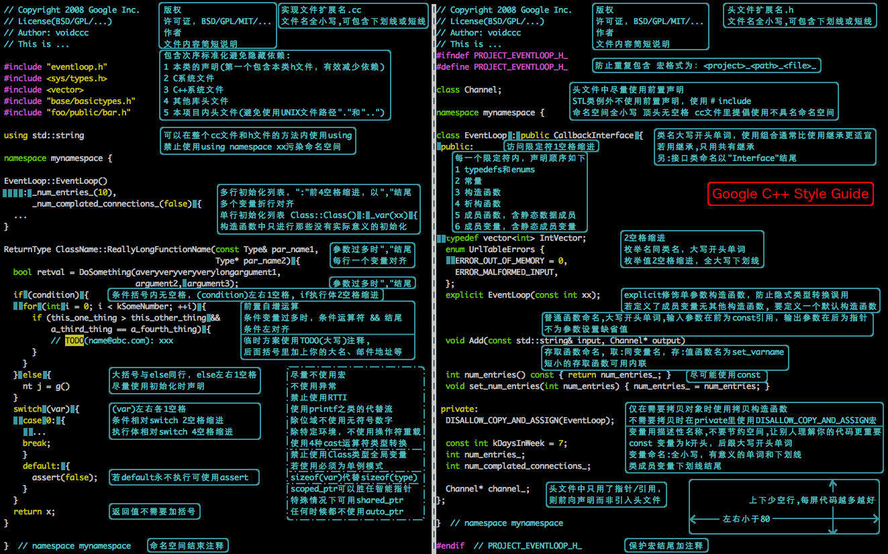

<!-- GFM-TOC -->
<!-- GFM-TOC -->

- [Twitter Java Style Guide](https://github.com/twitter/commons/blob/master/src/java/com/twitter/common/styleguide.md)
- [Google Java Style Guide](http://google.github.io/styleguide/javaguide.html)
- [阿里巴巴Java开发手册](https://github.com/alibaba/p3c)
- [C++编码规范](https://zh-google-styleguide.readthedocs.io/en/latest/google-cpp-styleguide/)

  
 
