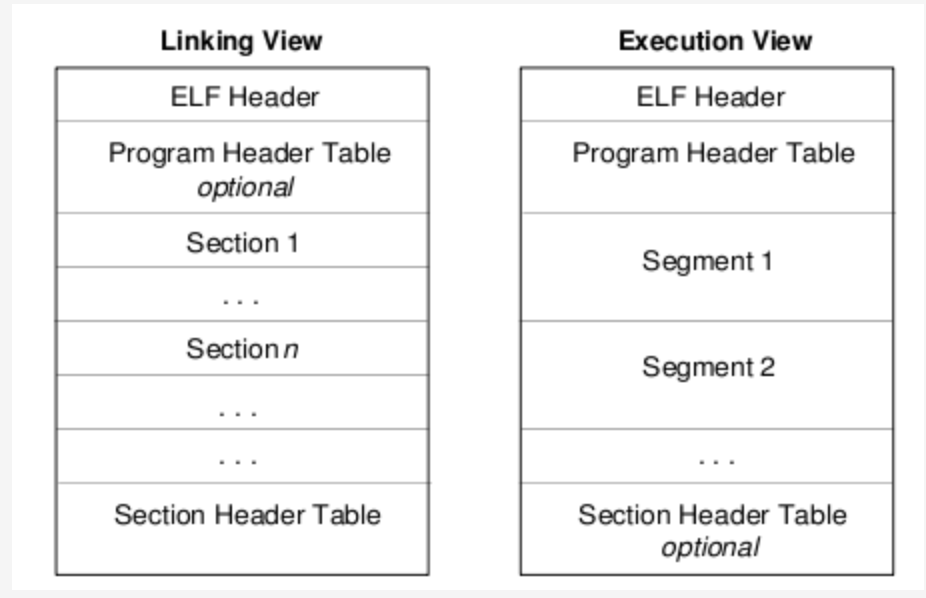
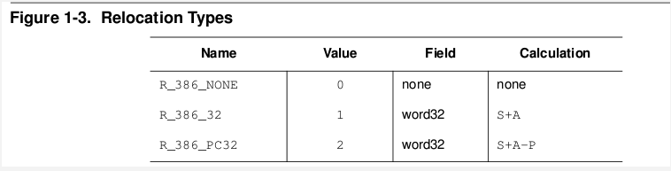

# 实例分析 ELF 文件静态链接

## elf 文件格式分析
这个工具和 objdump 命令提供的功能类似，但是它显示的信息更为具体，并且它不依赖 BFD库 ( BFD 库是一个 GNU 项目，它的目标就是希望通过一种统一的接口来处理不同的目标文件）；

### ELF 文件类型
ELF(Executable and Linking Format) 是一种对象文件的格式，用于定义不同类型的对象文件 (Object files) 中都放了什么东西、以及都以什么样的格式去放这些东西。它自最早在 System V 系统上出现后，被 xNIX 世界所广泛接受，作为缺省的二进制文件格式来使用。可以说， ELF 是构成众多 xNIX 系统的基础之一。

### ELF 文件有三种类型：
1. 可重定位的对象文件 (Relocatable file)  ----  由汇编器汇编生成的 .o 文件

2. 可执行的对象文件 (Executable file)  ----  可执行应用程序

3. 可被共享的对象文件 (Shared object file)  ----  动态库文件，也即 .so 文件

* .text section 里装载了可执行代码；
* .data section 里面装载了被初始化的数据；
* .bss section 里面装载了未被初始化的数据；
* 以 .rec 打头的 sections 里面装载了重定位条目；
* .symtab 或者 .dynsym section 里面装载了符号信息；
* .strtab 或者 .dynstr section 里面装载了字符串信息；

### ELF文件格式概貌
<div align="center">  </div><br>

readelf -h 查看 ELF 文件头部信息可以看到 Type 的值有三种： REL，EXEC，DYN。

REL 文件是只被编译没有被链接过的文件，其格式属于左边一种， 如图由 ELF Header + Section1, 2, 3 ... + Section Header Table，每个 Section 对应一个 Section Header Table Entry， Section Header Table 为各个 Section 提供索引。没有被链接过的文件没有 Program Header，不能被加载到内存中运行，readelf -l 会提示 ” There are no program headers in this file” 。

EXEC 和 DYN 文件属于被链接过的文件，其格式属于右边一种，由 Elf Header + Program header Table + segment1, 2, 3 ... + Section Header Table。每个 Segment 对应一个 Program Header Table Entry， Program Header Table 为各个 Segment 提供索引。 EXEC 和 DYN 文件有 program Headers ，可以被加载到内存中运行， readelf -l 可以看到一个 Segment 是由一个或多个 Section 构成，Type 为 LOAD 的 Segment 可以被加载到内存中运行，其他类型的 Segment 提供辅助信息。

## 实例分析
### 创建文件
* 创建文件 common.c

```Cpp
int val = 1;

int func(void)
{
    return (val+10);
}
```

* 创建文件 test.c

```Cpp
extern int val;
extern int func(void);

int main()
{
    val = 10;
    func();
    return 0;
}
```

### 编译
编译两个.c文件

`gcc -c test.c`

`gcc -c common.c`

生成的 test.o 和 common.o 属于 REL 类型

来分析一下编译后生成的 REL 文件

#### 先看看 test.o:

` readelf -s test.o ` 查看 test.o 的符号表
```Cpp
believe@believe:readelf -s test.o

Symbol table '.symtab' contains 11 entries:
   Num:    Value          Size Type    Bind   Vis      Ndx Name
     0: 0000000000000000     0 NOTYPE  LOCAL  DEFAULT  UND
     1: 0000000000000000     0 FILE    LOCAL  DEFAULT  ABS test.c
     2: 0000000000000000     0 SECTION LOCAL  DEFAULT    1
     3: 0000000000000000     0 SECTION LOCAL  DEFAULT    3
     4: 0000000000000000     0 SECTION LOCAL  DEFAULT    4
     5: 0000000000000000     0 SECTION LOCAL  DEFAULT    6
     6: 0000000000000000     0 SECTION LOCAL  DEFAULT    7
     7: 0000000000000000     0 SECTION LOCAL  DEFAULT    5
     8: 0000000000000000    26 FUNC    GLOBAL DEFAULT    1 main
     9: 0000000000000000     0 NOTYPE  GLOBAL DEFAULT  UND val
    10: 0000000000000000     0 NOTYPE  GLOBAL DEFAULT  UND func
```
因为 val 和 func 不是在 test.c 中定义的，所以这两个符号的 Ndx (符号所在 section 的 index ) 为 UND 。为了能让程序顺利执行，我们希望在未来链接的过程中可以从其他文件中找到 val 和 func 这两个符号，并确定这两个符号的地址，确定未定义符号的地址的过程即是“重定位” (relocation) 。

`readelf -S test.o` 可以看到 test.o 的 section header table
```Cpp
believe@believe:readelf test.o -S
There are 12 section headers, starting at offset 0x128:

Section Headers:
  [Nr] Name              Type             Address           Offset
       Size              EntSize          Flags  Link  Info  Align
  [ 0]                   NULL             0000000000000000  00000000
       0000000000000000  0000000000000000           0     0     0
  [ 1] .text             PROGBITS         0000000000000000  00000040
       000000000000001a  0000000000000000  AX       0     0     4
  [ 2] .rela.text        RELA             0000000000000000  00000548
       0000000000000030  0000000000000018          10     1     8
  [ 3] .data             PROGBITS         0000000000000000  0000005c
       0000000000000000  0000000000000000  WA       0     0     4
  [ 4] .bss              NOBITS           0000000000000000  0000005c
       0000000000000000  0000000000000000  WA       0     0     4
  [ 5] .comment          PROGBITS         0000000000000000  0000005c
       000000000000002d  0000000000000001  MS       0     0     1
  [ 6] .note.GNU-stack   PROGBITS         0000000000000000  00000089
       0000000000000000  0000000000000000           0     0     1
  [ 7] .eh_frame         PROGBITS         0000000000000000  00000090
       0000000000000038  0000000000000000   A       0     0     8
  [ 8] .rela.eh_frame    RELA             0000000000000000  00000578
       0000000000000018  0000000000000018          10     7     8
  [ 9] .shstrtab         STRTAB           0000000000000000  000000c8
       0000000000000059  0000000000000000           0     0     1
  [10] .symtab           SYMTAB           0000000000000000  00000428
       0000000000000108  0000000000000018          11     8     8
  [11] .strtab           STRTAB           0000000000000000  00000530
       0000000000000016  0000000000000000           0     0     1
Key to Flags:
  W (write), A (alloc), X (execute), M (merge), S (strings)
  I (info), L (link order), G (group), x (unknown)
  O (extra OS processing required) o (OS specific), p (processor specific)
```
我们重点关注 rela section。

可以看到 rela.text entry 的描述中，link=10，info=1，link 表示被重定位的符号所在的符号表的 section index，info 表示需要被重定位的 section 的 index ，通俗点讲就是，将来有朝一日我知道了该符号的地址，我该把这个地址写到哪个 section 里面去，这里是 .text。

`readelf -r test.o` 可以看到 rel section 里的详细信息。
```Cpp
believe@believe:readelf test.o -r

Relocation section '.rela.text' at offset 0x548 contains 2 entries:
  Offset          Info           Type           Sym. Value    Sym. Name + Addend
000000000006  000900000002 R_X86_64_PC32     0000000000000000 val - 8
00000000000f  000a00000002 R_X86_64_PC32     0000000000000000 func - 4

Relocation section '.rela.eh_frame' at offset 0x578 contains 1 entries:
  Offset          Info           Type           Sym. Value    Sym. Name + Addend
000000000020  000200000002 R_X86_64_PC32     0000000000000000 .text + 0
```
offset 表示该符号在被重定位的 section 中的偏移，info 的高 4 个字节表示该符号在 .symtab 中的 index ，低 4 字节表示重定位的类型，不同的类型计算目标地址的方法不一样。

综上所述，我们可以得出符号 val 和 func 的种种信息：

val 的重定位地址是在 .text 的偏移为 6 处，将来的链接过程中，连接器要将 val 的地址写到这个位置上来， val 在 .symtab 中的 index 为 9 。

func 的重定位地址是在 .text 的偏移为 f 处，将来的链接过程中，连接器要将 func 的地址写到这个位置上来， func 在 .symtab 中的为 a 。

关于重定位的类型，《ELF V1.2》的第 57 和 93
页有详细说明。

<div align="center">  </div><br>

这里两个符号的类型 R_X86_64_PC32 ，重定位地址的计算方法为 S+A-P ，即符号地址和下条指令间的偏移量。

`objdump -S test.o` 查看汇编文件
```Cpp
believe@believe:objdump -S test.o

test.o:     file format elf64-x86-64


Disassembly of section .text:

0000000000000000 <main>:
   0:    55                       push   %rbp
   1:    48 89 e5                 mov    %rsp,%rbp
   4:    c7 05 00 00 00 00 0a     movl   $0xa,0x0(%rip)        # e <main+0xe>
   b:    00 00 00
   e:    e8 00 00 00 00           callq  13 <main+0x13>
  13:    b8 00 00 00 00           mov    $0x0,%eax
  18:    c9                       leaveq
  19:    c3                       retq   
```
可以看到 .text 中偏移 6 处四个字节( val 的地址)为全 0，偏移 f 处四个字节 (func的地址) 为全 0 。

#### 再来看看common.o:
`readelf -s` 查看 common.o 的符号表
```cpp
......
     8: 0000000000000000     4 OBJECT  GLOBAL DEFAULT    3 val
     9: 0000000000000000    15 FUNC    GLOBAL DEFAULT    1 func
```
可以看到 val 定义在 index 为 3 的 .data 里， func 定义在 index 为 1 的 .text 里，这两个符号都是在 common.c 文件内部定义的。

`readelf -S` 查看 common.o 的 section header table
```Cpp
......
[ 2] .rela.text        RELA             0000000000000000  00000528
       0000000000000018  0000000000000018          10     1     8
......
```
`readelf -r` 查看 common.o 的重定位详细信息
```Cpp
Relocation section '.rela.text' at offset 0x528 contains 1 entries:
  Offset          Info           Type           Sym. Value    Sym. Name + Addend
000000000006  000800000002 R_X86_64_PC32     0000000000000000 val – 4
......
```
以上信息可以得出，需要被重定位的符号是 val ，它在 .symtab 中的 index 为 8 ，需要被重定位的地址是在 .text 中偏移为 6 处，重定位类型为  R_X86_64_PC32 ，即 .text 偏移为 6 处的地址是 val 地址和下一条指令间的偏移。

`Objdump -S` 查看 common.o 的汇编文件：
```Cpp
......
0000000000000000 <func>:
   0:    55                       push   %rbp
   1:    48 89 e5                 mov    %rsp,%rbp
   4:    8b 05 00 00 00 00        mov    0x0(%rip),%eax        # a <func+0xa>
   a:    83 c0 0a                 add    $0xa,%eax
   d:    c9                       leaveq
   e:    c3                       retq
```
可以看到偏移为 6 处的四个字节( val 的地址)全为 0 ，需要在链接的时候写入 val 的地址。

### 链接
* 将两个 .o 文件链接 `gcc -o test test.o common.o`

生成的 test 为 EXEC 类型

静态链接的过程引用《程序员的自我修养》第 101 页的概述：

**第一步：空间与地址分配**

扫描所有的输入目标文件，获得它们的各个段的长度、属性和位置，并且将输入目标文件中的符号表中所有的符号定义和符号引用收集起来，统一放到一个全局符号表。这一步中，连接器将能获得所有输入目标文件的段长度，并且将它们合并，计算出输出文件中各个段合并后的长度与位置，并建立映射关系。

**第二步：符号解析与重定位**

使用上面第一步中收集到的所有信息，读取输入文件中段的数据、重定位信息，并且进行符号解析与重定位、调整代码中的地址等。事实上第二步是链接过程的核心，特别是重定位的过程。

>提取关键字可以是:合并段，全局符号表，重定位

来看看重定位之后的 test 文件

`readelf -l` 查看 test 进程在内存中的映像分布
```Cpp
......
LOAD           0x0000000000000000 0x0000000000400000 0x0000000000400000
                 0x0000000000000664 0x0000000000000664  R E    200000
LOAD           0x0000000000000668 0x0000000000600668 0x0000000000600668
                 0x00000000000001e8 0x00000000000001f8  RW     200000
......
```
可以看到 text segment 被映射到虚拟地址 0x400000 处， data segment 被映射到虚拟地址 0x600668 处。

`readelf test -s` 查看 test 的符号表
```Cpp
......
54: 000000000060084c     4 OBJECT  GLOBAL DEFAULT   24 val
......
57: 0000000000400490    15 FUNC    GLOBAL DEFAULT   13 func
......
64: 0000000000400474    26 FUNC    GLOBAL DEFAULT   13 main
......
```

反汇编

`objdump -S test > test.S`

```Cpp
......
 0000000000400474 <main>:
114   400474:       55                      push   %rbp
115   400475:       48 89 e5                mov    %rsp,%rbp
116   400478:       c7 05 ca 03 20 00 0a    movl   $0xa,0x2003ca(%rip)        # 60084c <val>
117   40047f:       00 00 00
118   400482:       e8 09 00 00 00          callq  400490 <func>
119    :       b8 00 00 00 00          mov    $0x0,%eax
120   40048c:       c9                      leaveq
121   40048d:       c3                      retq
122   40048e:       90                      nop
123   40048f:       90                      nop
124
125 0000000000400490 <func>:
126   400490:       55                      push   %rbp
127   400491:       48 89 e5                mov    %rsp,%rbp
128   400494:       8b 05 b2 03 20 00       mov    0x2003b2(%rip),%eax        # 60084c <val>
129   40049a:       83 c0 0a                add    $0xa,%eax
130   40049d:       c9                      leaveq
131   40049e:       c3                      retq
132   40049f:       90                      nop
......
```
**main 函数中**

* 地址 0x400478 处：

`400478: c7 05 ca 03 20 00 0a movl $0xa,0x2003ca(%rip) # 60084c <val>`

`%rip+0x2003ca=0x400482+0x2003ca=0x60084c=val` 的地址

* 地址0x400482处：

`118 400482: e8 09 00 00 00 callq 400490 <func>`

该条指令的下一条指令地址为 0x400487 ， 0x400487+0x09=0x400490=func 的地址

**func中**

* 地址0x 400494处：

`128 400494: 8b 05 b2 03 20 00 mov 0x2003b2(%rip),%eax # 60084c <val>`

`%rip+ 0x2003b2= 0x40049a+0x2003b2=0x60084c=val` 的地址

由此可见这三处重定位的地址都为符号地址与下条指令间的偏移，符合上面分析的重定位类型。　　
