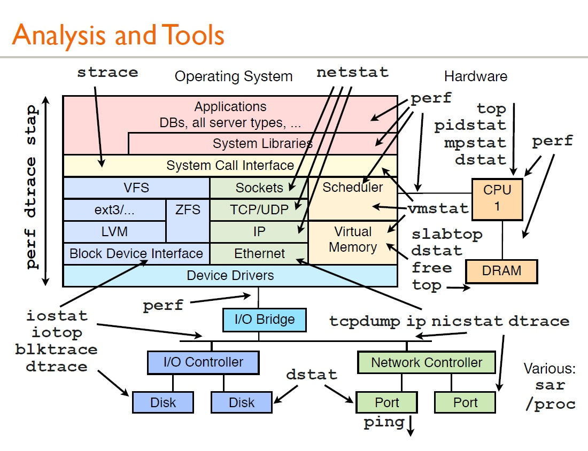
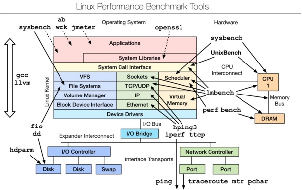
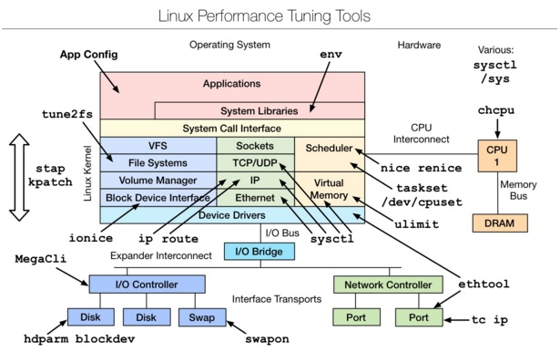
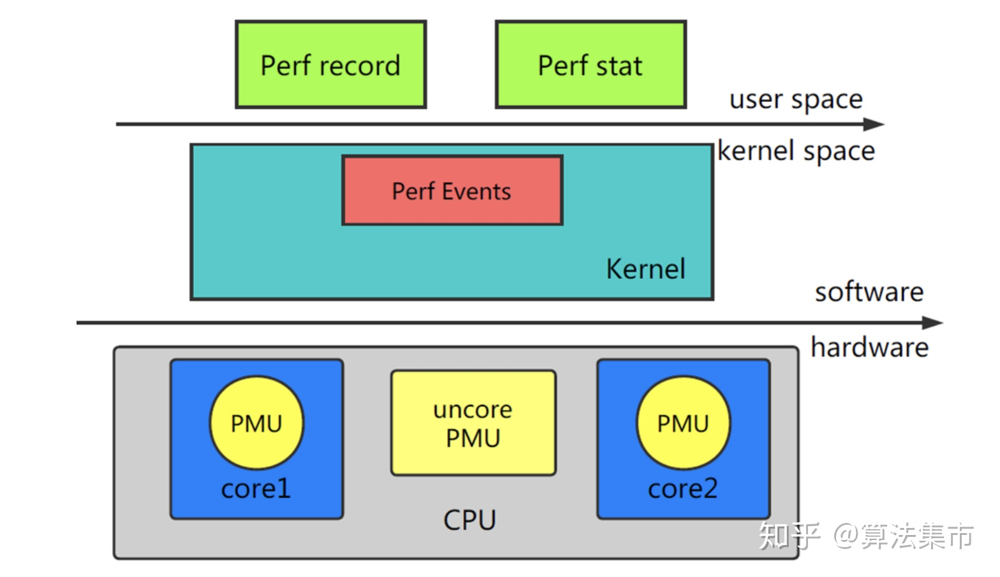
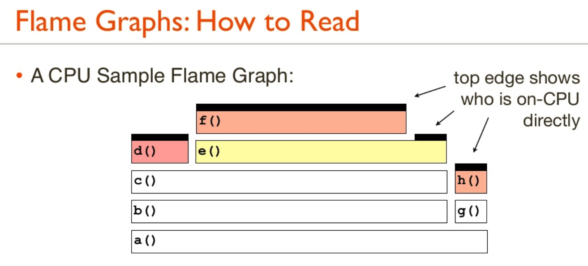

# 程序性能优化

## 火焰图

* 每一列代表一个调用栈，每一个格子代表一个函数

* 纵轴展示了栈的深度，按照调用关系从下到上排列。最顶上格子代表采样时，正在占用 cpu 的函数。

* 横轴的意义是指：火焰图将采集的多个调用栈信息，通过按字母横向排序的方式将众多信息聚合在一起。需要注意的是它并不代表时间。

* 横轴格子的宽度代表其在采样中出现频率，所以一个格子的宽度越大，说明它是瓶颈原因的可能性就越大。

* 火焰图格子的颜色是随机的暖色调，方便区分各个调用信息。

* 其他的采样方式也可以使用火焰图， on-cpu 火焰图横轴是指 cpu 占用时间，off-cpu 火焰图横轴则代表阻塞时间。

* 采样可以是单线程、多线程、多进程甚至是多 host，进阶用法可以参考附录进阶阅读

| 火焰图的类型  | 横轴的含义| 纵轴的含义  | 解决问题| 采样方式 |
| ---------- | -----------| ---------- | -----------| ---------- |
| on-cpu | cpu 占用时间 | 调用栈 | 找出 cpu 占用高的问题函数；分析代码热路径 | 固定频率采样 cpu 调用栈 |
| off-cpu | 阻塞时间 | 调用栈 | i/o、网络等阻塞场景导致的性能下降；锁竞争、死锁导致的性能下降 | 固定频率采样 阻塞事件调用栈 |
| 内存火焰图 | 内存申请/释放函数、调用次数 | 调用栈 | 内存泄漏问题；内存占用过高的对象/申请内存多的函数；虚拟内存或物理内存泄漏问题 | 跟踪 malloc/free；跟踪 brk；跟踪 mmap；跟踪页错误 |
| Hot/Cold 火焰图 | on/off-cpu 综合展示 | 调用栈 | 需要结合 cpu 占用以及阻塞分析的场景；off-cpu 火焰图无法直观判断问题的场景 | on/off-cpu 相结合 |

##火焰图类型横轴含义纵轴含义解决问题采样方式cpu

火焰图cpu占用时间调用栈找出 cpu 占用高的问题函数；分析代码热路径固定频率采样 cpu 调用栈off-cpu 火焰图阻塞时间调用栈i/o、网络等阻塞场景导致的性能下降；锁竞争、死锁导致的性能下降问题固定频率采样 阻塞事件调用栈内存火焰图内存申请/释放函数调用次数调用栈内存泄露问题；内存占用高的对象/申请内存多的函数；虚拟内存或物理内存泄露问题有四种方式： 跟踪malloc/free；跟踪brk；跟踪mmap；跟踪页错误Hot/Cold 火焰图on-CPU 火焰图和 off-CPU 火焰图结合在一起综合展示调用栈需要结合 cpu 占用以及阻塞分析的场景；off-CPU 火焰图无法直观判断问题的场景on-CPU 火焰图和 off-CPU 火焰图结合

## 火焰图分析技巧

纵轴代表调用栈的深度（栈桢数），用于表示函数间调用关系：下面的函数是上面函数的父函数。
横轴代表调用频次，一个格子的宽度越大，越说明其可能是瓶颈原因。
不同类型火焰图适合优化的场景不同，比如 on-cpu 火焰图适合分析 cpu 占用高的问题函数，off-cpu 火焰图适合解决阻塞和锁抢占问题。
无意义的事情：横向先后顺序是为了聚合，跟函数间依赖或调用关系无关；火焰图各种颜色是为方便区分，本身不具有特殊含义
多练习：进行性能优化有意识的使用火焰图的方式进行性能调优（如果时间充裕）

CPU 使用率描述了非空闲时间占总 CPU 时间的百分比，根据 CPU 上运行任务的不同，又被分为用户 CPU、系统 CPU、等待 I/O CPU、软中断和硬中断等。

用户 CPU 使用率，包括用户态 CPU 使用率（user）和低优先级用户态 CPU 使用率（nice），表示 CPU 在用户态运行的时间百分比。用户 CPU 使用率高，通常说明有应用程序比较繁忙。
系统 CPU 使用率，表示 CPU 在内核态运行的时间百分比（不包括中断）。系统 CPU 使用率高，说明内核比较繁忙。
等待 I/O 的 CPU 使用率，通常也称为 iowait，表示等待 I/O 的时间百分比。iowait 高，通常说明系统与硬件设备的 I/O 交互时间比较长。
软中断和硬中断的 CPU 使用率，分别表示内核调用软中断处理程序、硬中断处理程序的时间百分比。它们的使用率高，通常说明系统发生了大量的中断。
除了上面这些，还有在虚拟化环境中会用到的窃取 CPU 使用率（steal）和客户 CPU 使用率（guest），分别表示被其他虚拟机占用的 CPU 时间百分比，和运行客户虚拟机的 CPU 时间百分比。

  
 

通过这张图你可以发现，这三个命令，几乎包含了所有重要的 CPU 性能指标，比如：

* 从 top 的输出可以得到各种 CPU 使用率以及僵尸进程和平均负载等信息。

* 从 vmstat 的输出可以得到上下文切换次数、中断次数、运行状态和不可中断状态的进程数。

* 从 pidstat 的输出可以得到进程的用户 CPU 使用率、系统 CPU 使用率、以及自愿上下文切换和非自愿上下文切换情况。

* 性能分析工具

  
 

* Linux benchmarking tools | Linux 性能测评工具

  
 

* Linux tuning tools | Linux 性能调优工具

  
 

* Linux observability sar | linux性能观测工具

  
 

* perf 原理

  
 

* 火焰图函数调用栈

  
 

程序在 helloworld 里

## 火焰图面临的挑战，更多是来自于profilers，而不是火焰图本身。profilers会面对两类典型的问题：

• Stack traces不完整。

有些profiler只提供固定深度（比如10）的采样，这种不完整的输出不利于分析，如果增大深度，这些profiler会直接失败。更糟糕的问题是有些编译器会使用“重用帧指针寄存器（frame pointer register）”这样的编译优化，破坏了标准Stack traces采样流程。解决方式是关闭这种编译器优化（比如gcc使用参数 -fno-omit-frame-pointer）或者使用另一种采样技术。

• 方法名称丢失。

有些profilers，堆栈信息是完整的，但是方法名称却丢失了，显示为十六进制地址。使用了JIT (just-in-time) 技术编译的代码经常有这个问题。因为JIT并不会为profiler创建符号表。对于不同的profiler和runtime，这个问题有不同的解决方式，比如Linux perf_events允许应程序提供一个额外的符号表文件，用于产生采样结果。

我们在 Netflix 的工作过程中，曾经尝试为Java生成火焰图，结果两个问题都遇到了 [公式] 。第一个问题通过一个新的jvm参数：—XX:+PreserveFramePointer解决了。该参数禁用了编译器优化。第二个问题由perf-map-agent解决，这个Java agent可以为profiler生成符号表。

火焰图面临的另一个挑战是生成SVG文件的大小。一个超大的profile有可能会有成千上万的code paths，最终生成的svg可能有几十mb,浏览器加载要花费比较长的时间。解决方式是忽略掉在途中细到肉眼难以观察的方法，忽略这些方法不会影响全局视图，同时能缩小输出。

  
 

  
 

* 单线程火焰图 ?

## Profiling Tools

* Solaris/FreeBSD/SmartOS/...:

  * DTrace

* Linux:

  * perf,SystemTap

* OS X:

  * Instruments

* Windwos:

  * Xperf.exe

  
 

## CPU:Profiling

* Sampling:

  * Coarse but usually effective

  * Can also be low overhead, depending on the stack type and sample rate, which is fixed (eg, 100 Hz x CPU count)

* Tracing:

  * Overheads can be too high, distorting results and hurting the target (eg, millions of trace events per second)

* Most Flame Graphs are generated using stack sampling

## 其他功能

* 除了CPU样本，堆栈跟踪可以为任何事件收集;例如:

  * 磁盘、网络或FS I/C

  * CPU事件，包括缓存丢失

  * lock contention & lock holds

  * 内存分配

* 除样本计数外，还可以使用其他值:

  * 延迟

  * 字节

* 下一节将演示内存分配、I/O跟踪，然后通过off-CPU跟踪演示所有阻塞类型

···
