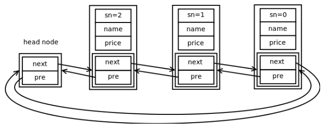

# 无处不在的container_of
linux 内核中定义了一个非常精炼的双向循环链表及它的相关操作。如下所示：

```Cpp
struct list_head {
  struct list_head* next, * prev;
};
```

ubuntu 12.04 中这个结构定义在 /usr/src/linux-headers-3.2.0-24-generic/include/linux/types.h 中，各种操作定义在 list.h 中。可以通过 grep "struct list_head {" 来查找到，也可以使用 ctags 在 include 目录下生成 tags 文件，然后在 tags 里面查找到。

这个链表只有指针域，没有数据域，所以我们不能直接拿来使用。而是需要把这个结构体嵌在我们自己定义的结构体里，可以放在任意位置，开头，中间或结尾。比如：

```Cpp
struct book {
  int sn;
  char name[NAMESIZE];
  int price;
  struct list_head node;   //内核链表结构体放在最后
};
```

我们使用内核提供的链表操作函数或宏来快速地建立一个双向链表，如下所示：

```Cpp
int main()
{
  struct book* bp;
  int i;

  LIST_HEAD(head);  //宏，建立头结点

  for(i = 0 ; i < 3; i++)
  {
    bp = (struct book*)malloc(sizeof(struct book));   
    /*if error*/

    bp->sn = i;
    snprintf(bp->name, NAMESIZE, "book%d", i);
    bp->price = rand()%60 + 20;

    /*insert*/
    list_add(&bp->node, &head);  //将该结点插入链表
  }
  /*TODO: travel*/

  return 0;
}
```

注意， `LIST_HEAD(head)` 不是函数，而是宏，所以不要对它传了一个没有定义的变量感到疑惑。这个宏的定义如下：

```Cpp
#define LIST_HEAD_INIT(name) { &(name), &(name) }

#define LIST_HEAD(name) \
    struct list_head name = LIST_HEAD_INIT(name)
```

它的作用是生成了一个变量名为 name 的头结点，并把指针域的值都初始化为指向自身。

list_add 函数实现把节点插入到以 head 为头结点的链表中。

上述一段简短的代码，快速地生成了一个可供自己使用的双向循环链表，其结构如下图所示：

<div align="center">  </div><br>

从图中可以看到，每个节点中的 next 和 pre 指针指向的都是另一个结点中的 node 成员的地址，而不是整个节点的首地址，所以，问题就来了，我们要访问节点中的其它成员怎么办？那我们就必须通过 node 成员的地址，获取它所在的节点的首地址。方法很简单，用 node 成员的地址减去它相对首地址的偏移量即可，假设某个节点的 node 成员的地址是 ptr，偏移量暂时先用 offset(node, struct book) 来表示，则公式如下：

```Cpp
(struct book*) ( (char*)ptr - offset(node, struct book) )
~~~~~~~~~~~~~~~   ~~~~~~~~~~~   ~~~~~~~~~~~~~~~~~~~~~~~~~
 类型转换        转成指向 char 的指针  node 成员在结构体中的偏移量
```

那偏移量又该如何来计算呢，假想 struct book 这个结构体的首地址为 0，那么 node 节点的地址不就是偏移量吗？因此我们可以把地址 0 先转换成指向 struct book 的指针，再从这个指针取它的成员 node 的地址，就可以计算得偏移量，公式如下：

```Cpp
((size_t)    &((struct book*)0)->node)
 ~~~~~~~~    ~ ~~~~~~~~~~~~~~~~~
转成无符号整数 取址
```

也许不少人和我一样，有一个疑惑，地址 0 转换成指针，不是 NULL 吗，用它去访问成员，不是非法的吗？我一开始也百思不得其解，后来明白了，取成员的地址，并不等于访问该成员。我们可以用下面一段程序来验证一下：

```Cpp
#include <stdio.h>

struct st
{
  int a;      //0
  char b;     //4
  int c;      //8
};

int main()
{
  printf("c addr  : %d\n", &((struct st*)0)->c);
  printf("c value : %d\n",  ((struct st*)0)->c);

  return 0;
}
```

在 ubuntu 12.04 32bit 上用 GCC 4.6.3 编译后运行的结果：

```shell
believe@ubuntu:~$ ./a.out
c addr  : 8
段错误 (核心已转储)
```

我是这么来理解的，地址 0 开始的这一段内存空间，就像是透明的充满机关的盒子，当里面放着结构体时，即使我们不打开这个盒子，从外面也可以知道里面的某个成员的位置(即地址)，但你想打开盒子取出某个成员看看它的具体的值是多少时，却是万万不可的，会中箭而亡！

通过上面的步骤，我们就取到了节点的首地址，内核它也是这么做的，把上面表达式里的 struct book 换成 TYPE/type，把 node 换成 MEMBER/member，就是内核定义的样子：

```Cpp
// 定义在 include/linux/list.h 中
#define list_entry(ptr, type, member) \
    container_of(ptr, type, member)

// 定义在 include/linux/kernel.h 中
#define container_of(ptr, type, member) ({          \
  (type*)( (char*)ptr - offsetof(type,member) );})

// 定义在 include/linux/stddef.h 中
// 巧妙之处在于将地址0强制转换为type类型的指针，从而定位到member在结构体中偏移位置。编译器认为0是一个有效的地址，从而认为0是type指针的起始地址。
#define offsetof(TYPE, MEMBER) ((size_t) &((TYPE*)0)->MEMBER)
```

上面 container_of 为了便于理解，进行了简化，实际完整的定义是这样的：

```Cpp
/**
 * container_of - cast a member of a structure out to the containing structure
 * @ptr:    the pointer to the member.
 * @type:   the type of the container struct this is embedded in.
 * @member: the name of the member within the struct.
 *
 */
#define container_of(ptr, type, member) ({          \
    const typeof( ((type *)0)->member ) * __mptr = (ptr); \
    (type *)( (char *)__mptr - offsetof(type,member) );})
```
___

container_of 宏分为两部分，

第一部分：`const typeof( ((type *)0)->member ) *__mptr = (ptr);`

通过 typeof 定义一个member指针类型的指针变量 \_\_mptr，（即 \_\_mptr 是指向 member 类型的指针），并将 \_\_mptr 赋值为 ptr。

第二部分： `(type * )( (char * )__mptr - offsetof(type,member) )` ，通过 offsetof 宏计算出 member 在 type 中的偏移，然后用 member 的实际地址 \_\_mptr 减去偏移，得到 type 的起始地址，即指向 type 类型的指针。

第一部分的目的是为了将统一转换为 member 类型指针。

它增加了一句，作用是通过 GCC 特有的类型运算符 typeof，取得 member 成员的类型，定义了一个此类型的指针 __mptr，并使它的值等于 ptr，后面就用 __mptr 替代 ptr 操作。这句话我想其实是多余的，可能是为了做最大的保护吧，可以通过下面这个例子来理解为什么要重新定义一个变量。

用 define 定义一个最简陋 MAX(a,b) 宏，像下面这样：

```Cpp
#define MAX(a,b) a > b ? a : b
```

这样的定义不堪一击，MAX(a+1, b) 的调用就会让它出错。
在 windows 下，最严谨的定义也不过如此了：

```Cpp
#define MAX(a,b) ((a)>(b)?(a):(b))
```

可是这样的定义，在面对这样的调用时，依然无能为力：MAX(++a, ++b)，大家可以实验一下，其中的较大值会被加 2。

但在 linux 下，使用 typeof 运算符，可以解决这个问题：

```Cpp
#define MAX(a,b) ({typeof(a) A=a,B=b; A > B ? A : B;})
```

不过这种在 () 里包含 {} 的定义方法并不被标准 C 支持。

对于上面的这种定义，或许还是有人会有这样的疑问，假如调用 MAX(++a, ++b)，a 还是会被加两次啊，typeof(++a) 时会加一次，A=++a 时又加一次。其实不会，因为 typeof 并不是一个运行时的函数或运算符，它和 sizeof 一样，是在编译的时候就确定了。下面这个例子可以验证：

```Cpp
int main()
{
  int a = 5;
  typeof(++a) b = 3;  //等同于 int b = 3;

  printf("a = %d, b = %d\n", a, b);

  return 0;
}

---------------
运行结果：
a = 5, b = 3
```

如果我们把内核链表结构体放在我们自己的结构体的开头，其实就不需要这两个宏了，只需要进行类型转换即可。

另外，在 windows 内核中也有类似的宏，由于 windows 没有 typeof 运算符，所以就显得简单了一些，定义如下：

```Cpp
#define CONTAININT_RECORD(address, type, field) \
  ((type*)((PCHAR)(address) - (PCHAR)(&((type*)0)->field)))
```

下面的程序将完整地展示如何使用 container_of 实现遍历。

```Cpp
int main()
{
  struct list_head *cur;
  struct book* bp;
  int i;

  LIST_HEAD(head);  //宏，建立头结点

  for(i = 0 ; i < 3; i++)
  {
    bp = (struct book*)malloc(sizeof(struct book));   
    /*if error*/

    bp->sn = i;
    snprintf(bp->name, NAMESIZE, "book%d", i);
    bp->price = rand()%60 + 20;

    /*insert*/
    list_add(&bp->node, &head);  //将该结点插入链表
  }

  /*travel*/
  __list_for_each(cur, &head)
  //这也是一个宏，展开后是这样：
  for (cur = (&head)->next; cur != &head; cur = (&head)->next)
  {
    bp = list_entry(cur, struct book, node);
    //list_entry 与 container_of 等价
    printf("sn = %d, name = %s, price = %d\n", bp->sn, bp->name, bp->price);
  }

  return 0;
}
```
