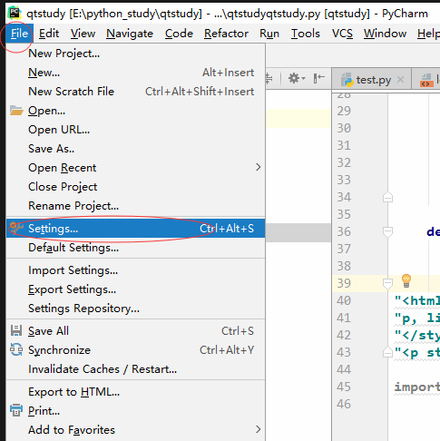
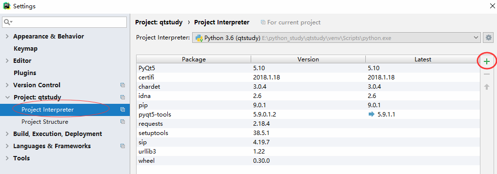
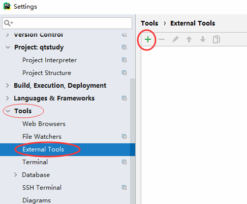
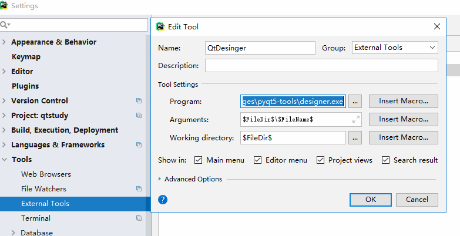
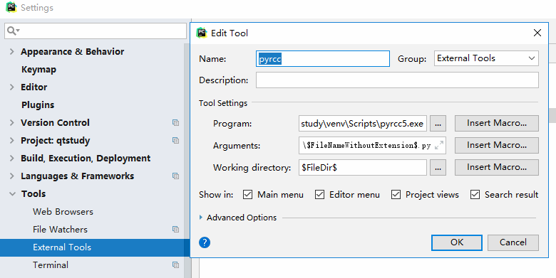

# PyQt安装和环境配置

## 首先安装Pycharm
新建一个空的 `python` 工程，找到 `setting` 安装第三方模块 `PyQT5` , 点加号，先安 `PyQT5` , 再安装 `pyqt5-tools` ，后面包含 `qtdesinger`

  
 

  
 

以上模块都安完，设置扩展工具的参数找到 `setting->tools->external tools` , 点击加号新建工具

## 配置环境

  
 

先加 `qtdesinger` 的参数，我的 `program:` 为 `/usr/lib/x86_64-linux-gnu/qt5/bin/designer`

  
 

再点加号，添加 `pyuic5` 的参数，这个是把 `qt` 的 `UI` 文件转换成 `.py` 文件的工具，我的 `program:` 为 `/usr/bin/pyuic5` ，
`arguments:` 为 `$FileName$ -o $FileNameWithoutExtension$.py` ,  后面这个可以和我一样

  
 

再点加号，添加 `pyrcc` 的参数，这个是将资源文件如图片等转成 `python` 代码能识别的文件，这个参数基本和 `pyuic5` 的是一样的，把 `pyuic5` 改成 `pyrcc5` 就可以了

  
 

到这里就全部配置好了。

由于项目中需要用到 `MySQL` ， 所以还需要安装，`pip3 install MySQLdb` ，但是安装失败，原因：

`python2` 对应的模块是 `MySQLdb` , `MySQLdb` 不支持 `python3`

`python3` 对应的模块是 `pymysql`

>`python3.7 -m pip install numpy
`
