## 使用Clion优雅的完全远程自动同步和远程调试c++

摘要：在linux上用vim写C++的时候，通常用gdb进行调试，不能随心所欲的看代码和跳转代码以及加watch（也有可能是因为我还没有get正确的使用方法）。为此我发现Clion可以做到自动同步本场代码或自己下载远程代码同步到本地，以及调试在远程机器上运行的代码，为此记录下来。

简介
>CLion 是一款专为开发 C 及 C++ 所设计的跨平台 IDE。 它是以 IntelliJ 为基础设计的，包含了许多智能功能来提高开发人员的生产力，从而提升工作效率 。

## 环境准备
* 操作系统： macOS / Windows
* IDE: CLion

## 自动同步
* 打开CLion的设置，进入到 Preferences | Build, Execution, Deployment | Deployment

* 点加号，添加一个远程配置

* 设置为 SFTP 协议，设置远程 ip、 port、 pass 然后点击 Test Connection，确认是否连接成功
<div align="center"> 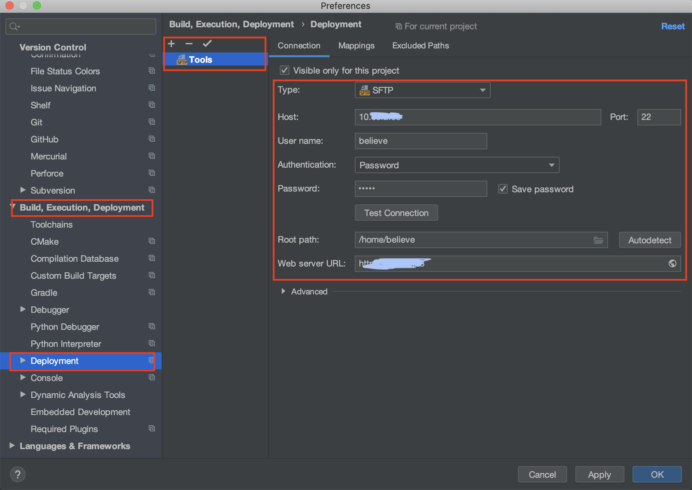 </div><br>

* 切换到 Mappings

* 设置本地的代码根目录 Local path

* 设置远程的代码根目录 Deployment path (从刚刚设置的根目录开始)

<div align="center"> 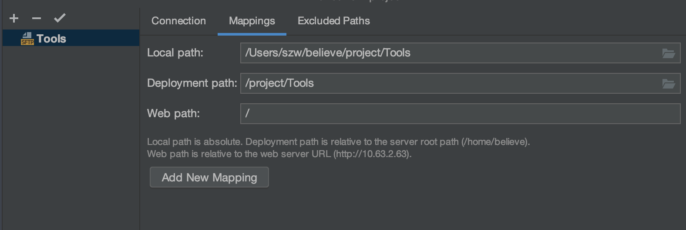 </div><br>

* 上传一个文件

* Upload 是上传，Download 是下载，本地与远程所映射的目录我们在上面设置过了

<div align="center"> 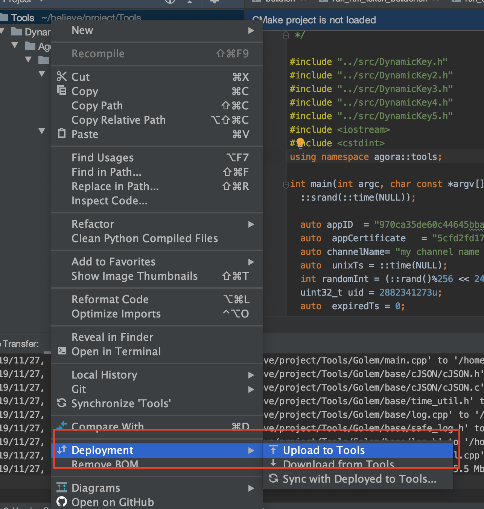 </div><br>

* 在 Tool - Deployment - Automatic Upload(always) 设置为自动同步

* 自动同步的话可以在每次在本地改动代码的时候自己同步了

* Sync with Deployed to 就是自动下载远程代码到本地

## 远程调试
**添加GDB Remote Debug**

>依赖：cmake, gcc, gdb, gdbserver

本地 CLion 配置
* 添加一个GDB远程调试的配置 GDB Remote Debug

* 设置远程访问参数（target remote args）： tcp:xx.xx.xx.xx:1234

* 设置远程路径和本地路径的映射（Path mappings）

* 远程调试连接成功后，像本地调试一样，可以设置断点，单步跟踪等

* 调试需要本地和远程的代码一致\
(远程代码位置不能填错，否则不进入断点，本地路径则会自动检查是否存在)

<div align="center"> 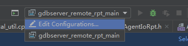 </div><br>

<div align="center"> 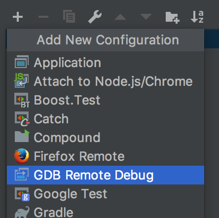 </div><br>

<div align="center"> 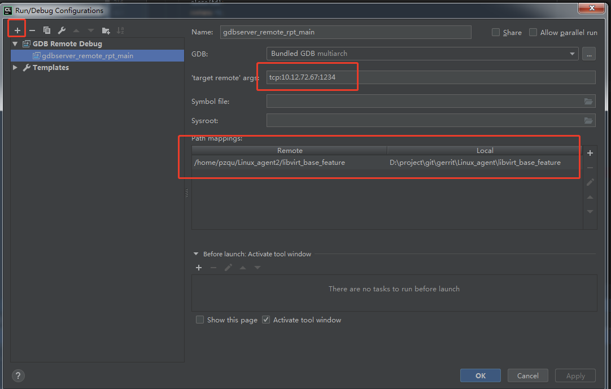 </div><br>

**两个方法设置远程配置**

* 方法一：

远程 gdbserver 的启动

远程调试依赖 gdbserver 的来支持，通过 gdbserver 的启动的程序，会先等待远程调试的连接，连接成功后再启动进程。

假设代码的根目录：`/data/pzqu/read_phy_disk_use/`, 执行以下代码以后编译

```cpp
cd /data/pzqu/read_phy_disk_use/build
cmake .. -DCMAKE_BUILD_TYPE=Debug
make
gdbserver :1234 ./read_phy_disk_use
```

注意：cmake的指定需要-DCMAKE_BUILD_TYPE=Debug来请获取调试

* 方法二

远程gdbserver的动态连接

gdbserver的还支持动态绑定到已经启动的进程

`gdbserver :1234 --attach <PID>`

**打断点开始调试**

* 点击小虫子开始调试

* 代码停止到了断点处

* Variables 是可以自己设置的watch

* 和正常调试方式一样啦

<div align="center"> 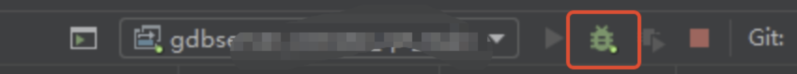 </div><br>

## 用CLion完全的在远程工作

这是一个非常非常爽的操作，以后就可以完全的用IDE来写代码了，虽然使用命令行显得比较专业，但是使用工具可以有效的提高工作效率，何乐而不为呢？

* 进入 Preferences | Build, Execution, Deployment | Toolchains

* 设置远程连接信息，CLion会自动监测CMake gcc g++ gdb的信息

<div align="center"> 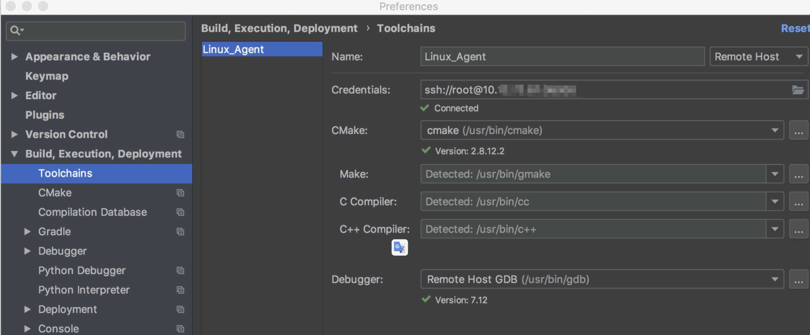 </div><br>

* 进入 Preferences | Build, Execution, Deployment | CMake

* Toolchain 选择我们刚刚设置的

* 下面的 Automatically reload CMake project on editing 的设置勾上的时候，只要代码有修改就会自动编译

<div align="center"> 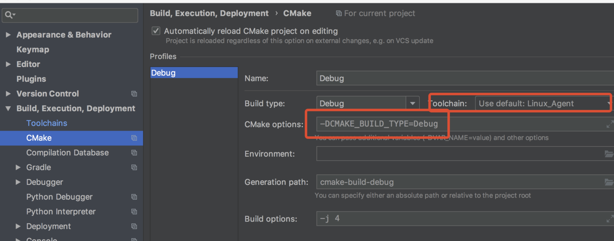 </div><br>

<div align="center"> 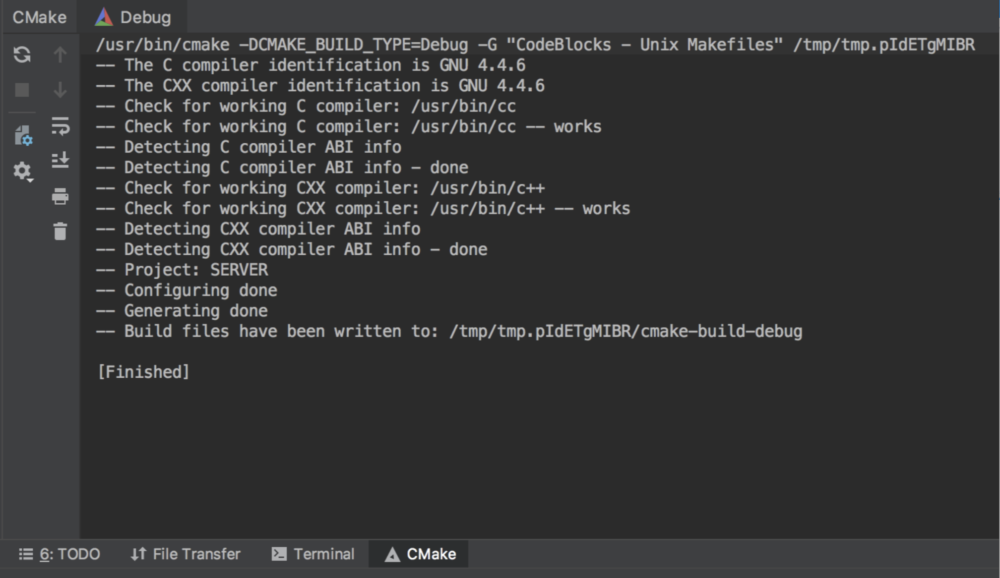 </div><br>

* 现在已经配置了远程 Toolchains 工具链并配置了相应的 CMake 配置文件

* 上图是自动编译和上传到的目录 /tmp/tmp.pIdETgMIBR，然后我们只要设置为自动同步目录就成了，如下图

<div align="center"> 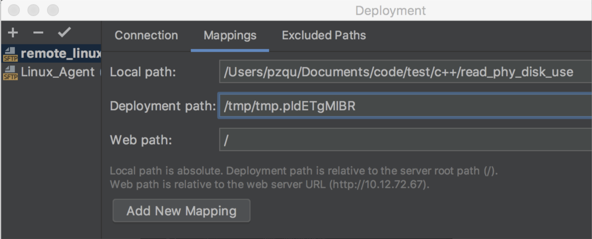 </div><br>

* 现在已经设置成了自动同步目录，只需在运行/调试配置切换器中选择正确的 CMake 配置文件，即可以完全远程的方式构建，运行和调试应用程序和测试。

<div align="center"> 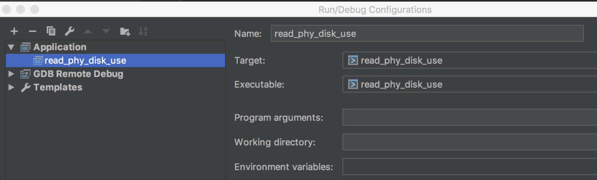 </div><br>

* 添加 Application 来跑我们的程序

<div align="center"> 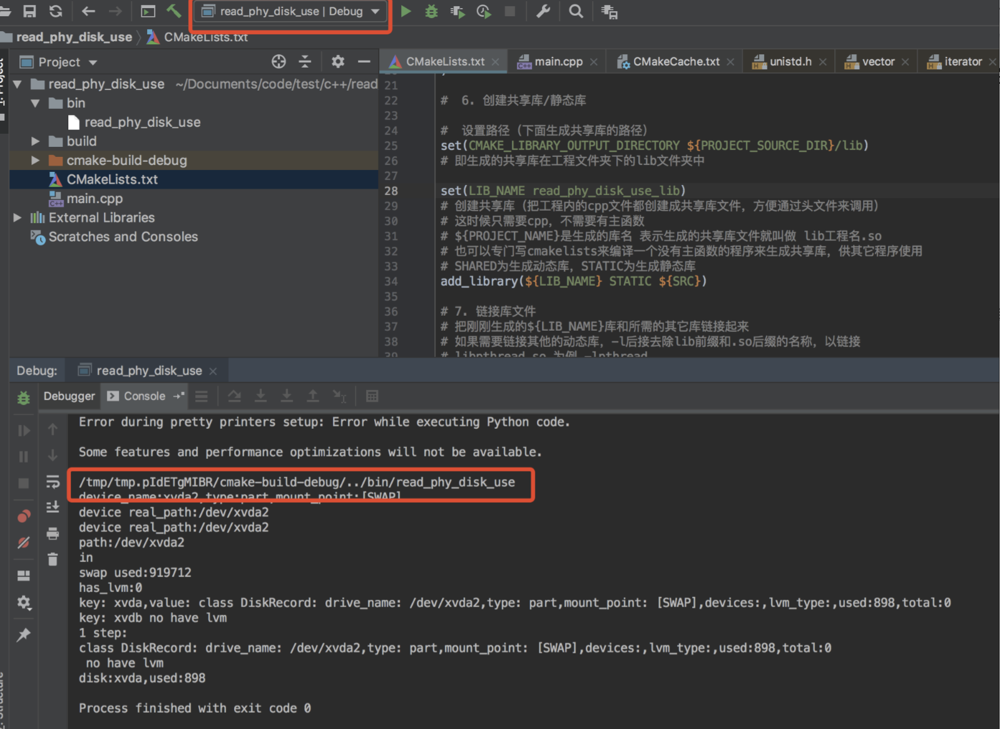 </div><br>

* 远程运行，本地输出结果(这里可以是用查看本地 ip 来检测程序是否运行在远程机器)

<div align="center"> 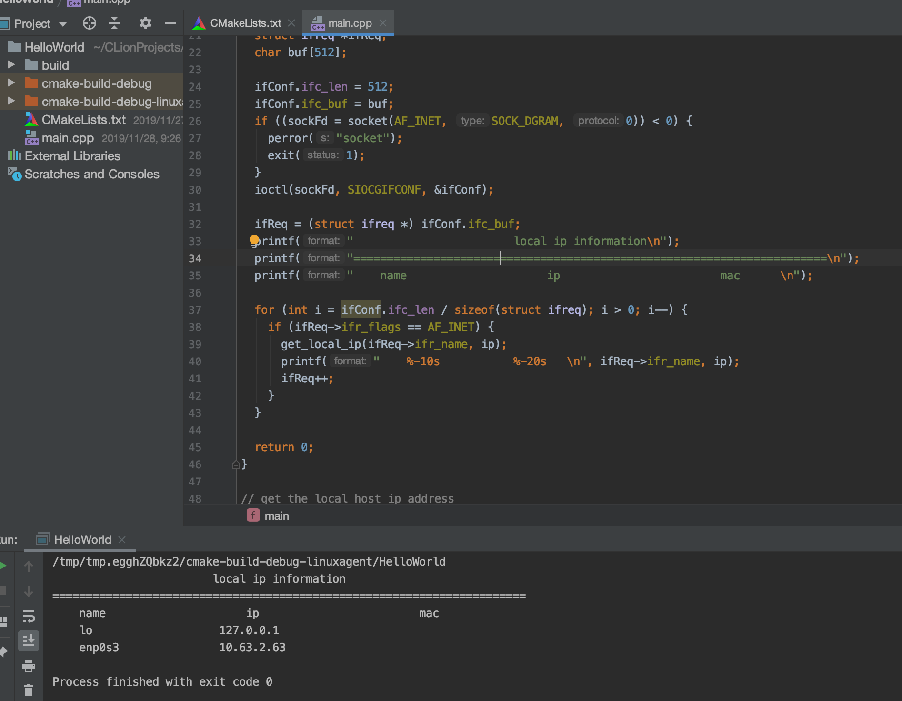 </div><br>

这里的 ip 就是我服务器的地址，成功！
* 远程运行，本地自动调试

## 总结

* 配置CLion中的同步信息：同步到哪台机器的哪个目录。

* 使用 Deployment 让本地和远程可以自动同步和自动下载，手动同步和手动下载代码

* 配置GDB remote Debug设置

* 使用gdbserver来启动程序进行调试

* 使用gdbserver attach依附已经启动的程序进行调试

* 完全在本地进行远程代码调试

## 其他

* 这种方式是不是非常的优雅，这样我们只要不断的添加工具链（Toolchains）就可以在本地应对数不清的远程环境了。

* 这种方式应该适用于JetBrain全家桶
