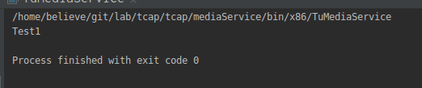
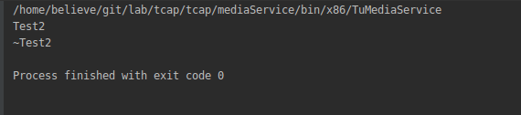

# Cpp没有调用析构函数

在项目中遇到一个问题，析构函数没有调用产生了内存泄露。

具体见[valgrind检测libevent内存泄露](https://github.com/believeszw/CS-Notes/blob/master/notes/问题记录/valgrind内存泄露.md)

我们看两个例子
* demo1
```cpp
class Test1;
void del(Test1* obj){
    delete obj;
}
class Test1{
public:
    Test1(){
        printf("Test1\r\n");
    }
    ~Test1(){
        printf("~Test1\r\n");
    }
};
int main()
{
    Test1* obj = new Test1();
    del(obj);

    return 0;
}
```

* demo2
```cpp
class Test2{
public:
    Test2(){
        printf("Test2\r\n");
    }
    ~Test2(){
        printf("~Test2\r\n");
    }
};
void del(Test2* obj){
    delete obj;
}
int main()
{
    Test2* obj = new Test2();
    del(obj);

    return 0;
}
```
<div align="center">  </div><br>
<div align="center">  </div><br>

这里是类的前置声明问题，1中函数`del()`只是知道`Test`是一个类，但是并不知道其析构函数所在的地址，所以无法调用其析构函数。
