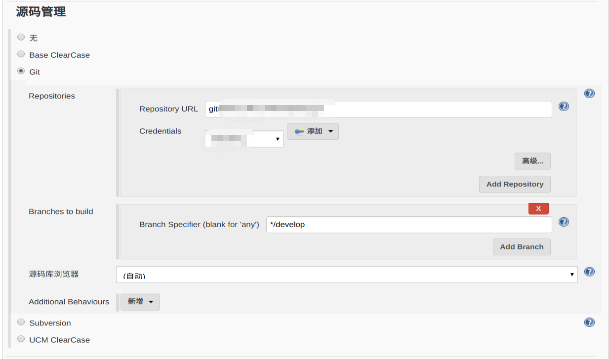
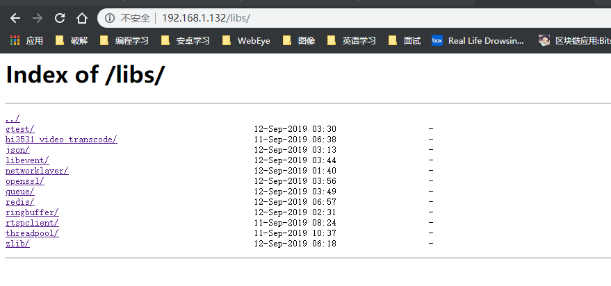

# Jenkins自动编译库并上传服务器

首先添加 `git` 地址：
<div align="center">  </div><br>

再添加定时构建，每天夜里构建一次：
<div align="center">  </div><br>

执行 `shell` 脚本进行构建
```shell
echo "build NetWorkLayer x86"
cmake -S . -B cmake-build-release -DCMAKE_BUILD_TYPE=Release  -G "CodeBlocks - Unix Makefiles" ./
cd cmake-build-release
make

echo "build NetWorkLayer hisi500"
cd ..
cmake -S . -B cmake-build-release-hisi3531 -DCMAKE_C_COMPILER=/opt/hisi-linux/x86-arm/arm-hisiv500-linux/target/bin/arm-hisiv500-linux-gcc -DCMAKE_CXX_COMPILER=/opt/hisi-linux/x86-arm/arm-hisiv500-linux/target/bin/arm-hisiv500-linux-g++ -G "CodeBlocks - Unix Makefiles"
cd cmake-build-release-hisi3531
make

echo "make dir"
if [ ! -d "/var/www/html/libs/networklayer" ]; then
  mkdir /var/www/html/libs/networklayer
fi

if [ ! -d "/var/www/html/libs/networklayer/lib" ]; then
  mkdir /var/www/html/libs/networklayer/lib
fi

if [ ! -d "/var/www/html/libs/networklayer/lib/hisi500" ]; then
  mkdir /var/www/html/libs/networklayer/lib/hisi500
fi

if [ ! -d "/var/www/html/libs/networklayer/lib/x86" ]; then
  mkdir /var/www/html/libs/networklayer/lib/x86
fi

if [ ! -d "/var/www/html/libs/networklayer/include" ]; then
  mkdir /var/www/html/libs/networklayer/include
fi

echo "clean before"
rm -rf /var/www/html/libs/networklayer/include/*
rm -rf /var/www/html/libs/networklayer/lib/hisi500/*
rm -rf /var/www/html/libs/networklayer/lib/x86/*

echo "copy"
cp -dprf ${WORKSPACE}/libs/hisi500/libNetWorkLayer.a  /var/www/html/libs/networklayer/lib/hisi500
cp -dprf ${WORKSPACE}/libs/x86/libNetWorkLayer.a  /var/www/html/libs/networklayer/lib/x86

cp -dprf ${WORKSPACE}/libs/hisi500/libNetWorkLayer.so  /var/www/html/libs/networklayer/lib/hisi500
cp -dprf ${WORKSPACE}/libs/x86/libNetWorkLayer.so  /var/www/html/libs/networklayer/lib/x86

cp -dprf ${WORKSPACE}/networklayer/src/net_work_layer.h /var/www/html/libs/networklayer/include/
cp -dprf ${WORKSPACE}/networklayer/src/net_work_common_data.h /var/www/html/libs/networklayer/include/

ls -lh /var/www/html/libs/networklayer/lib/*
ls -lh /var/www/html/libs/networklayer/include/*
```
这里成功添加到了服务器上
<div align="center">  </div><br>
