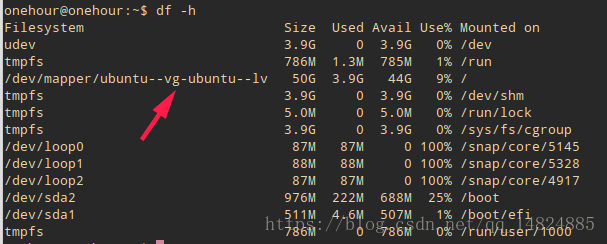
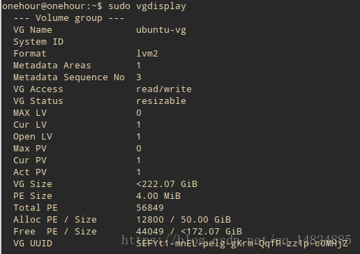
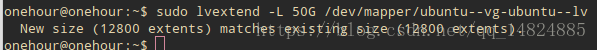
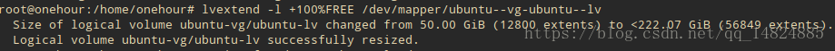
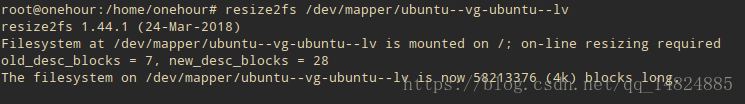
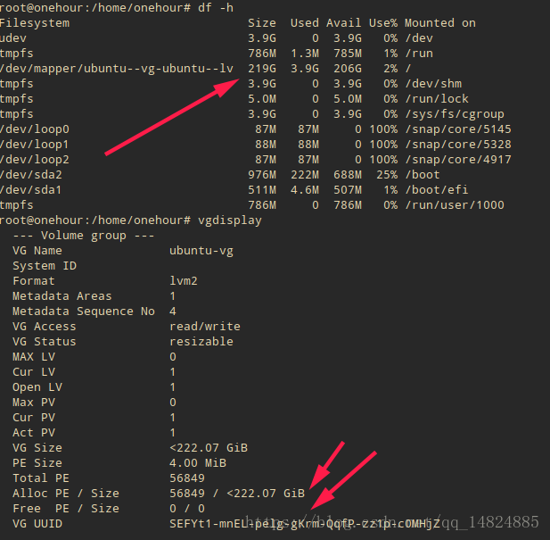

## 目录
* [根据进程名杀死进程](#根据进程名杀死进程)
* [pip安装失败缺少SOCKS依赖](#pip安装失败缺少SOCKS依赖)
* [VM中与主机共享SS](#VM中与主机共享SS)
* [Linux下安装libsodium启用ss的chacha20高级加密](#启用ss的chacha20高级加密)
* [Linux磁盘空间不够进行扩容](#Linux磁盘空间不够进行扩容)
* [修改所有者](#修改所有者)
* [linux环境变量设置方法总结](#linux环境变量设置方法总结)
* [NFS的安装与使用](#NFS的安装与使用)
* [boot空间不足的解决办法](#boot空间不足的解决办法)
* [GLIBCXX未发现](#GLIBCXX未发现)
* [Shell后台运行程序](#Shell后台运行程序)
* [wget下载目录下所有文件](#wget下载目录下所有文件)
* [虚拟机中复制粘贴失效](#虚拟机中复制粘贴失效)
* [ubuntu本地server扩容磁盘](#ubuntu本地server扩容磁盘)
* [使用ls可以查看到执行文件，执行却提示不存在](#使用ls可以查看到执行文件，执行却提示不存在)
* [将linux镜像源改为阿里云镜像源](#将linux镜像源改为阿里云镜像源)
* [PS1应用-修改linux终端命令行字体颜色](#PS1应用-修改linux终端命令行字体颜色)
* [ubuntu降级](#ubuntu降级)
* [vim粘贴乱码](#vim粘贴乱码)
* [bitbucket_clone不了](#bitbucket_clone不了)
* [查看系统版本](#查看系统版本)
* [git无法拉取chromium等仓库的代码](#git无法拉取chromium等仓库的代码)
* [ssh_copy_id后还需要密码](#ssh_copy_id后还需要密码)
* [解决python3.7无法使用ssl模块的问题](#解决python3.7无法使用ssl模块的问题)
* [安装zsh](#安装zsh)

### 根据进程名杀死进程
* ```shell
#kill -9 $(ps -ef|grep 进程名关键字|gawk '$0 !~/grep/ {print $2}' |tr -s '\n' ' ')
```
这个是利用管道和替换将 进程名对应的进程号提出来作为kill的参数。
很显然上面的方法能完成但是过于复杂，下面这种就显得简单的多了
* ```shell
#kill -9 $(pidof 进程名关键字)
```

### pip安装失败缺少SOCKS依赖
报错：`pip install doesnt work , InvalidSchema: Missing dependencies for SOCKS support`
* `export all_proxy="socks5://127.0.0.1:1080/"`
* `unset all_proxy`
* `unset ALL_PROXY`
* `pip install pysocks`
* `printenv | grep -i proxy`查看所有代理
* `export all_proxy="https://127.0.0.1:1080/"`指定代理

### VM中与主机共享SS
* `VM`选择`NAT`模式
* `SS`选择允许其他设备连入
* `Ubuntu`中选择手动代理地址为主机 `IPv4`地址，端口`1080`

### 启用ss的chacha20高级加密
* `apt-get install build-essential`
* `wget https://download.libsodium.org/libsodium/releases/LATEST.tar.gz`
* `tar xf XXXXX.tar.gz && cd libsodium-XXXXX`包名
* `./configure && make -j4 && make install`
* `ldconfig`

### Linux磁盘空间不够进行扩容
* `VM`虚拟机上进行磁盘的扩展
* `sudo apt-get install gparted`
* `sudo gparted`
* 进行扩容

### snap安装失败
* `error: snap "clion" has "install-snap" change in progress`
run:
```shell
$ snap changes
<snip>
203  Doing   2016-06-24T12:17:45Z  -  Install "nextcloud" snap
$ sudo snap abort 203
```

### 修改所有者
由于在使用`clion`时需要`root`权限，在`sudo clion`后，所有修改过的文件所有者都变成了`root`，在正常情况下无法对其修改，需要将所有者修改回来。到顶层目录，执行`sudo chown -R believe:believe .`

### linux环境变量设置方法总结
* `PATH`:  可执行程序的查找路径
查看当前环境变量:
```shell
echo $PATH
```
设置:
  * 方法一：`export PATH=PATH:/XXX` 但是退出当前终端后就失效

  * 方法二：修改 `~/.bashrc` 或 `~/.bash_profile`或系统级别的`/etc/profile`
  >1. 在其中添加例如export PATH=/opt/ActivePython/bin:$PATH
  > 2. source .bashrc  (Source命令也称为“点命令”，也就是一个点符号（.）。\
   source命令通常用于重新执行刚修改的初始化文件，使之立即生效，而不必注销并重新登录)

* `LD_LIBRARY_PATH`: 动态库的查找路径\
设置：
  * 方法一： `export  LD_LIBRARY_PATH=LD_LIBRARY_PATH:/XXX` 但是退出当前终端后就失效
  还可以把这段代码写进 `sh` 中，运行 `source xxx.sh`

  * 方法二： 修改`~/.bashrc`或`~/.bash_profile`或系统级别的`/etc/profile`
  >1. 在其中添加例如export LD_LIBRARY_PATH=/opt/ActiveP/lib:$LD_LIBRARY_PATH
  > 2. source .bashrc  (Source命令也称为“点命令”，也就是一个点符号（.）。source命令通常用于重新执行刚修改的初始化文件，使之立即生效，而不必注销并重新登录)

  * 方法三：这个没有修改`LD_LIBRARY_PATH`但是效果是一样的实现动态库的查找，
  >1. /etc/ld.so.conf下面加一行/usr/local/mysql/lib
  > 2. 保存后执行 ldconfig  生效\
    ( ldconfig 命令的用途,主要是在默认搜寻目录(/lib和/usr/lib)以及动态库配置文件/etc/ld.so.conf内所列的目录下,搜索出可共享的动态链接库(格式如前介绍,lib*.so*),进而创建出动态装入程序(ld.so)所需的连接和缓存文件.缓存文件默认为/etc/ld.so.cache,此文件保存已排好序的动态链接库名字列表.）\

    方法三设置稍微麻烦，好处是比较不受用户的限制。

    `ld.so.conf` 里面配置之后，添加的路径为最优先路径；

    `[root@host ~]# cat /etc/ld.so.conf`\
    `include ld.so.conf.d/*.conf`\
    `/usr/local/fan/lib`\
    `/usr/local/fan/lib64`

[回到顶部](#readme)

### NFS的安装与使用
一、服务器端：
* 安装NFS服务：
```shell
# 执行以下命令安装NFS服务器，
# apt会自动安装nfs-common、rpcbind等13个软件包
sudo apt install nfs-kernel-server
```
* 编写配置文件：
```shell
# 编辑/etc/exports 文件：
sudo vi /etc/exports
# /etc/exports文件的内容如下：
/tmp *(rw,sync,no_subtree_check,no_root_squash)
/data *(rw,sync,no_subtree_check,no_root_squash)
/logs *(rw,sync,no_subtree_check,no_root_squash)
```
* 创建共享目录
```shell
# 在服务器端创建/tmp /data和/logs共享目录
sudo mkdir -p /tmp
sudo mkdir -p /data
sudo mkdir -p /logs
```
* 重启nfs服务：
```shell
sudo service nfs-kernel-server restart
```
* 常用命令工具：
```shell
# 在安装NFS服务器时，已包含常用的命令行工具，无需额外安装。
# 显示已经mount到本机nfs目录的客户端机器。
sudo showmount -e localhost
```
* 将配置文件中的目录全部重新export一次！无需重启服务。
```shell
sudo exportfs -rv
```
* 查看NFS的运行状态
```shell
sudo nfsstat
```
* 查看rpc执行信息，可以用于检测rpc运行情况
```shell
sudo rpcinfo
```
* 查看网络端口，NFS默认是使用111端口。
```shell
sudo netstat -tu -4
```

* Mac 下设置配置文件
```Shell
sudo vi /etc/exports
/Users/my-name/Documents/Projects -alldirs -rw -maproot=my-name:staff -network 192.168.0.0 -mask 255.255.255.0
```

* Mac 下控制服务
```Shell
sudo nfsd enable
sudo nfsd disable
sudo nfsd
sudo nfsd stop
sudo nfsd restart
sudo nfsd status
```

* Mac 查看共享状态
```Shell
showmount -e
showmount -e 192.168.99.1
```

二、客户端：
* 安装客户端工具：
```shell
# 在需要连接到NFS服务器的客户端机器上，
# 需要执行以下命令，安装nfs-common软件包。
# apt会自动安装nfs-common、rpcbind等12个软件包
sudo apt install nfs-common
```
* 查看NFS服务器上的共享目录
```shell
# 显示指定的（192.168.3.167）NFS服务器上export出来的目录
sudo showmount -e 192.168.3.167
```
* 创建本地挂载目录
```shell
sudo mkdir -p /mnt/data
sudo mkdir -p /mnt/logs
```
* 挂载共享目录
```shell
# 将NFS服务器192.168.3.167上的目录，挂载到本地的/mnt/目录下
mount -t nfs 192.168.1.87:/data /mnt/data
# 解除锁定
mount -t nfs -o nolock  192.168.1.87:/home/believe/git/lab/tcap/ /home/believe
```
[超全面的NFS详解](http://server.51cto.com/sManage-150923.htm)\
[回到顶部](#readme)

### boot空间不足的解决办法
在安装ubuntu的时候，根据网上教程给其分配了单独的物理分区，大小为200M。然而每当系统升级的时候，旧的内核版本并不会被清理，升级几次就提示boot内存不足了。思路就是卸载旧的版本内核，腾出空间，记录下自己尝试过的命令。
* 查看系统已经安装的内核版本
```shell
dpkg --get-selections |grep linux-image
```
<div align="center">  </div><br>

* 查看系统当前使用的内核版本(我的是4.15.0-60-generic)
```shell
uname -a
```
<div align="center">  </div><br>

* 删除旧的内核版本(分别针对不同标识)
  * `install` 说明：系统已经安装了相应的内核，使用purge命令删除相应的内核
  ```shell
  sudo apt purge linux-image-4.15.0-58-generic
  ```
  <div align="center">  </div><br>

  * `deinstall` 说明：系统没有安装此内核，但是在配置文件中还残留它的信息（有可能是以前卸载的时候不彻底）
  ```shell
  sudo dpkg -P linux-image-extra-4.4.0-31-generic
  ```

* 最后看下效果

<div align="center">  </div><br>

[回到顶部](#readme)

### GLIBCXX未发现
项目中遇到`libstdc++.so.6: version GLIBCXX3.4.22’ not found`

这是因为当前版本的`libstdc++.so.6`缺少`GLIBCXX_3.4.22`查看当前版本的`GLIBCXX`命令为,
```shell
strings /usr/lib/x86_64-linux-gnu/libstdc++.so.6 | grep GLIBCXX
```
<div align="center">  </div><br>
解决方法:

安装`libstec++`

```shell
sudo apt-get install libstdc++6
```
如果还未解决,则可以终端运行如下命令:
```shell
sudo add-apt-repository ppa:ubuntu-toolchain-r/test
sudo apt-get update
sudo apt-get upgrade
sudo apt-get dist-upgrade
```
这时再运行命令
```shell
strings /usr/lib/x86_64-linux-gnu/libstdc++.so.6 | grep GLIBCXX
```
可以发现当前版本一包含GLIBCXX_3.4.22\
[回到顶部](#readme)

### Shell后台运行程序
在脚本中将程序名替换即可\
脚本名为`shell.sh`,启动命令为：`./shell.sh start`，再次运行如果提示正在运行则表示正常，否则代表程序挂掉。终止命令为：`./shell.sh stop`。控制台运行`./shell.sh console`。或者直接在运行程序命令后加` &`。重启为`restart`,查看状态为`status`。

**注意点 ：** 如果程序中是通过`getchar()`阻塞的，这里程序可以正常启动，但是会立马挂掉，需要把`getchar()`换成`while()`，除非你通过`console`启动
```shell
#!/bin/sh
# chkconfig: 2345 80 20
# description: mediaserver
waittime=0
waitExit(){
   while true;do
   if [ ! -d "/proc/$1" ]; then
       echo "process is finished"
       break
    else
      waittime=$(($waittime+1))
      sleep 1s
      echo "process is alive " $waittime
    fi
    if [ "$waittime" -eq 10 ]; then
      kill -9 $1
      break

    fi
   done
}
running(){
if [ -f $PID_PATH_NAME ]; then
    PID=$(cat $PID_PATH_NAME)
    if [ -d "/proc/$PID" ]; then
      return 1
    else
      return 0
    fi
  else
   return 0
  fi
}
printRed(){
 echo -e "\033[31m$1\033[0m"
}
printGreen(){
 echo -e "\033[32m$1\033[0m"
}
SERVICE_NAME=mediaserver
PID_PATH_NAME=~/run/mediaserver-pid
case $1 in
    start)
        echo "Starting $SERVICE_NAME ..."
 running
        if [ ! $? -eq 1 ]; then
            nohup /link/apps/bin/mediaService/bin/hisi500/TuMediaService /tmp 2>> /dev/null >> /dev/null &
                        echo $! > $PID_PATH_NAME
            printGreen "$SERVICE_NAME started ..."
        else
            printRed "$SERVICE_NAME is already running ..."
        fi
    ;;
    console)
       /link/apps/bin/mediaService/bin/hisi500/TuMediaService
    ;;
    status)
      running
      if [ $? -eq 1 ]; then
        printGreen "running "
      else
        printRed "not running"
      fi
    ;;
    stop)
 running
        if [ $? -eq 1 ]; then
            PID=$(cat $PID_PATH_NAME);
            echo "$SERVICE_NAME stoping ..."
            kill  $PID;
     waitExit $PID;
            printRed "$SERVICE_NAME stopped ..."
            rm $PID_PATH_NAME
        else
            printRed "$SERVICE_NAME is not running ..."
        fi
    ;;
    restart)
 running
        if [ $? -eq 1 ]; then
            PID=$(cat $PID_PATH_NAME);
            echo "$SERVICE_NAME stopping ...";
            kill  $PID;
     waitExit $PID;
            echo "$SERVICE_NAME stopped ...";
            rm $PID_PATH_NAME
            echo "$SERVICE_NAME starting ..."
            nohup /link/apps/bin/mediaService/bin/hisi500/TuMediaService /tmp 2>> /dev/null >> /dev/null &
                        echo $! > $PID_PATH_NAME
            printGreen "$SERVICE_NAME started ..."
        else
            echo "$SERVICE_NAME starting ..."
            nohup /link/apps/bin/mediaService/bin/hisi500/TuMediaService /tmp 2>> /dev/null >> /dev/null &
                        echo $! > $PID_PATH_NAME
            printGreen "$SERVICE_NAME started ..."
        fi
    ;;
esac
```
[回到顶部](#readme)

### wget下载目录下所有文件
```shell
wget http://192.168.1.132/libs/hi3531_video_transcode/lib/ -r -c -np -nH -E -R html --cut-dirs 3
```
参数说明
* -r 递归下载子目录
* -c 断点续传
* -np 不下载父目录
* -nH 不创建主机名目录
* --cut-dirs  剪掉主机名后面的相对目录数，避免创建N多层目录
* --restrict-file-names=nocontrol 下载后文件名正常保存，文件名为中文时可以避免乱码
* --level=5 默认只下5层子目录，需要更深的修改这个目录

存在问题是会保存 `index.html?C=D;O=A` 等页面文件

方法一： 下载完后删除
```shell
find -name "index.html*" | xargs rm
```

方法二：用 `-E -R html` 参数删除

* -E 将所有text/html文档以.html扩展名保存

* -R html 不保存html文件

这种方法适用于下载目录里没有 `text/html` 的文档

### 虚拟机中复制粘贴失效
* 选中虚拟机，右击设置
* 切换到选项页面
* 第一个常规中将增强型键盘改为非禁用即可

[回到顶部](#readme)

### ubuntu本地server扩容磁盘

本地磁盘出现磁盘满了的情况，所以进行lvm的扩容（截图的都是扩容后的 所以忽略容量）

* 查看磁盘情况
```Shell
df -h
```

<div align="center">  </div><br>

原本发现 `/dev/mapper/ubuntu–vg-ubuntu–lv` 这个磁盘满了
所以要进行扩容的就是这个了

* 显示存在的卷组

```Shell
sudo vgdisplay
````

<div align="center">  </div><br>

可以看出

Alloc PE / Size 12800 / 50.00 GiB\
Free PE / Size 44049 / <172.07 GiB\
这两个 第一个就是我的 /dev/mapper/ubuntu–vg-ubuntu–lv 这个磁盘\
第二个是 这个磁盘可以扩容的大小 也就是剩余可以扩容多少

* 扩容开始

```Shell
sudo lvextend -L 50G /dev/mapper/ubuntu--vg-ubuntu--lv
# 扩容50G给这个盘 如果出现 New size (12800 extents) matches existing size (12800 extents).
```

这里我扩容多50G 给他

这里是报错！！！

<div align="center">  </div><br>

如果出现以上问题 则

```Shell
# 则用以下方式 全部空间都给这个盘
sudo lvextend -l +100%FREE /dev/mapper/ubuntu--vg-ubuntu--lv
```

<div align="center">  </div><br>

这个才是正确的提示

* 重新计算磁盘大小

```Shell
sudo resize2fs /dev/mapper/ubuntu--vg-ubuntu--lv
```

<div align="center">  </div><br>

* 重新查看磁盘情况

```Shell
df -h
sudo vgdisplay
```

<div align="center">  </div><br>

大功告成！！！

[回到顶部](#readme)

### 使用ls可以查看到执行文件，执行却提示不存在
原因：Ubuntu系统是 64 位的，而可执行程序是 32 位的，需要支持32位的运行库 lib32ncurses5 lib32z1，

解决：sudo apt-get install lib32ncurses5 lib32z1

[回到顶部](#readme)

### 将linux镜像源改为阿里云镜像源

```Shell
sudo cp /etc/apt/sources.list /etc/apt/sources.list.bak
vim /etc/apt/sources.list
```

把sources.list文件内容替换成如下
```Shell
# 阿里云源：14.04<->trusty 16.04<->xenial 18.04<->bionic 20.04<->focal
deb https://mirrors.aliyun.com/ubuntu/ trusty main restricted universe multiverse
deb-src https://mirrors.aliyun.com/ubuntu/ trusty main restricted universe multiverse
deb https://mirrors.aliyun.com/ubuntu/ trusty-security main restricted universe multiverse
deb-src https://mirrors.aliyun.com/ubuntu/ trusty-security main restricted universe multiverse

deb https://mirrors.aliyun.com/ubuntu/ trusty-updates main restricted universe 20.04<->multiversefocal
deb-src https://mirrors.aliyun.com/ubuntu/ trusty-updates main restricted universe multiverse

deb https://mirrors.aliyun.com/ubuntu/ trusty-backports main restricted universe multiverse
deb-src https://mirrors.aliyun.com/ubuntu/ trusty-backports main restricted universe multiverse

## Not recommended
# deb https://mirrors.aliyun.com/ubuntu/ trusty-proposed main restricted universe multiverse
# deb-src https://mirrors.aliyun.com/ubuntu/ trusty-proposed main restricted universe multiverse
```
```Shell
# 清华源：
deb https://mirrors.tuna.tsinghua.edu.cn/ubuntu/ bionic main restricted universe multiverse
deb-src https://mirrors.tuna.tsinghua.edu.cn/ubuntu/ bionic main restricted universe multiverse
deb https://mirrors.tuna.tsinghua.edu.cn/ubuntu/ bionic-updates main restricted universe multiverse
deb-src https://mirrors.tuna.tsinghua.edu.cn/ubuntu/ bionic-updates main restricted universe multiverse
deb https://mirrors.tuna.tsinghua.edu.cn/ubuntu/ bionic-backports main restricted universe multiverse
deb-src https://mirrors.tuna.tsinghua.edu.cn/ubuntu/ bionic-backports main restricted universe multiverse
deb https://mirrors.tuna.tsinghua.edu.cn/ubuntu/ bionic-security main restricted universe multiverse
deb-src https://mirrors.tuna.tsinghua.edu.cn/ubuntu/ bionic-security main restricted universe multiverse
deb https://mirrors.tuna.tsinghua.edu.cn/ubuntu/ bionic-proposed main restricted universe multiverse
deb-src https://mirrors.tuna.tsinghua.edu.cn/ubuntu/ bionic-proposed main restricted universe multiverse
```
```Shell
# 中科大源：
deb https://mirrors.ustc.edu.cn/ubuntu/ bionic main restricted universe multiverse
deb-src https://mirrors.ustc.edu.cn/ubuntu/ bionic main restricted universe multiverse
deb https://mirrors.ustc.edu.cn/ubuntu/ bionic-updates main restricted universe multiverse
deb-src https://mirrors.ustc.edu.cn/ubuntu/ bionic-updates main restricted universe multiverse
deb https://mirrors.ustc.edu.cn/ubuntu/ bionic-backports main restricted universe multiverse
deb-src https://mirrors.ustc.edu.cn/ubuntu/ bionic-backports main restricted universe multiverse
deb https://mirrors.ustc.edu.cn/ubuntu/ bionic-security main restricted universe multiverse
deb-src https://mirrors.ustc.edu.cn/ubuntu/ bionic-security main restricted universe multiverse
deb https://mirrors.ustc.edu.cn/ubuntu/ bionic-proposed main restricted universe multiverse
deb-src https://mirrors.ustc.edu.cn/ubuntu/ bionic-proposed main restricted universe multiverse
```

```Shell
# 163源：
deb http://mirrors.163.com/ubuntu/ bionic main restricted universe multiverse
deb http://mirrors.163.com/ubuntu/ bionic-security main restricted universe multiverse
deb http://mirrors.163.com/ubuntu/ bionic-updates main restricted universe multiverse
deb http://mirrors.163.com/ubuntu/ bionic-proposed main restricted universe multiverse
deb http://mirrors.163.com/ubuntu/ bionic-backports main restricted universe multiverse
deb-src http://mirrors.163.com/ubuntu/ bionic main restricted universe multiverse
deb-src http://mirrors.163.com/ubuntu/ bionic-security main restricted universe multiverse
deb-src http://mirrors.163.com/ubuntu/ bionic-updates main restricted universe multiverse
deb-src http://mirrors.163.com/ubuntu/ bionic-proposed main restricted universe multiverse
deb-src http://mirrors.163.com/ubuntu/ bionic-backports main restricted universe multiverse
```
```Shell
sudo apt-get update
sudo apt-get upgrade
sudo apt-get install build-essential
```

[回到顶部](#readme)

### PS1应用-修改linux终端命令行字体颜色

PS1的常用参数以及含义:
* \d ：代表日期，格式为weekday month date，例如："Mon Aug 1"

* \H ：完整的主机名称

* \h ：仅取主机名中的第一个名字
* \t ：显示时间为24小时格式，如：HH：MM：SS
* \T ：显示时间为12小时格式
* \A ：显示时间为24小时格式：HH：MM
* \u ：当前用户的账号名称
* \v ：BASH的版本信息
* \w ：完整的工作目录名称
* \W ：利用basename取得工作目录名称，只显示最后一个目录名
* `#` ：下达的第几个命令
* $ ：提示字符，如果是root用户，提示符为 # ，普通用户则为 $

所以linux默认的命令行提示信息的格式　　 PS1='[\u@\h \W]$ ' 的意思就是：[当前用户的账号名称@主机名的第一个名字 工作目录的最后一层目录名]#

颜色设置参数

在PS1中设置字符颜色的格式为：[\e[F;Bm]，其中“F“为字体颜色，编号为30-37，“B”为背景颜色，编号为40-47。

颜色对照表：
* F B
* 30 40 黑色
* 31 41 红色
* 32 42 绿色
* 33 43 黄色
* 34 44 蓝色
* 35 45 紫红色
* 36 46 青蓝色
* 37 47 白色

只需将对应数字套入设置格式中即可。比如要设置命令行的格式为绿字黑底([\e[32;40m])，显示当前用户的账号名称(\u)、主机的第一个名字(\h)、完整的当前工作目录名称(\w)、24小时格式时间(\t)，可以直接在命令行键入如下命令：
```Shell
PS1='[\[\e[32;40m\]\u@\h \w \t]$ '
```

我的格式：
```Shell
vim ~/.bashrc

PS1="\[\e[37;40m\]\[\e[33;1m\]\u@\h \[\e[33;1m\]\W\[\e[0m\] \\$\n"

source ~/.bashrc
```

[回到顶部](#readme)

### ubuntu降级
```Shell
1）找到两个系统的代号：saucy(13.10)｜trusty（14.04）
2) 修改/etc/apt/sources.list文件，只放入两行（注意着色一样的字体内容一致）
deb http://archive.ubuntu.com/ubuntu saucy main restricted universe multiverse
deb http://archive.ubuntu.com/ubuntu trusty main restricted universe multiverse
3）修改或增加文件/etc/apt/preferences，只填入以下内容：
Package: *
Pin: release a=saucy
Pin-Priority: 1001
Package: *
Pin: release a=trusty
Pin-Priority: 60
4）sudo apt-get update && sudo apt-get dist-upgrade

Create /etc/apt/preferences with the contents:

Package: *
Pin: release a=stable
Pin-Priority: 1001

Package: *
Pin: release a=testing
Pin-Priority: 60

Package: *
Pin: release a=unstable
Pin-Priority: 50
```

[回到顶部](#readme)

### vim粘贴乱码
```Shell
vim ~/.vimrc
set encoding=utf-8
set fileencoding=utf-8
```

[回到顶部](#readme)

### bitbucket_clone不了
```Shell
deb http://security.ubuntu.com/ubuntu trusty-security main
deb http://cz.archive.ubuntu.com/ubuntu trusty main universe
```

[回到顶部](#readme)

### 查看系统版本
* cat /etc/lsb-release 查看版本

[回到顶部](#readme)

## git无法拉取chromium等仓库的代码

需要设置 shadowsocks 以及设置 git 代理
```Shell
vim ~/.gitconfig
[http]
        proxy = socks5://127.0.0.1:1080
```

[回到顶部](#readme)


### ssh_copy_id后还需要密码

～/.ssh 目录下文件权限查看

[回到顶部](#readme)

### 解决python3.7无法使用ssl模块的问题

```Shell
# 1.下载最新版openssl
wget https://www.openssl.org/source/openssl-1.1.1-pre8.tar.gz
# 2.编译安装
cd openssl-1.1.1-pre8
./config --prefix=/usr/local/openssl
make
make install
# 3.备份原配置
mv /usr/bin/openssl /usr/bin/openssl.bak
mv /usr/include/openssl/ /usr/include/openssl.bak
# 4.新版配置
#将安装好的openssl 的openssl命令软连到/usr/bin/openssl
ln -s /usr/local/openssl/include/openssl /usr/include/openssl
#软链到升级后的libssl.so
mv /usr/lib/x86_64-linux-gnu/libssl.so /usr/lib/x86_64-linux-gnu/libssl.so.bak
ln -s /usr/local/openssl/lib/libssl.so.1.1 /usr/lib/x86_64-linux-gnu/libssl.so
#将安装好的openssl命令软连到/usr/bin/openssl
ln -s /usr/local/openssl/bin/openssl /usr/bin/openssl
# 5.修改系统配置
#写入openssl库文件的搜索路径
echo "/usr/local/openssl/lib" >> /etc/ld.so.conf
#使修改后的/etc/ld.so.conf生效
ldconfig -v
# 6.查看openssl版本
openssl version
OpenSSL 1.1.1-pre8 (beta) 20 Jun 2018
# 7.重新安装python
./configure --prefix=/usr/local/python37 --with-openssl=/usr/local/openssl
make
make install
# 8. 或者使用 pyenv 安装
pyenv install 3.7.0
```

[回到顶部](#readme)

### 安装zsh

```Shell
# 查看系统当前使用的shell
echo $SHELL
# 查看系统自带哪些shell
cat /etc/shells
# 安装 zsh
apt install zsh -y
# 将 zsh 设置为系统默认 shell
sudo chsh -s /bin/zsh
# 自动安装，如果你没安装 git 需要先安装 git
sh -c "$(wget https://raw.githubusercontent.com/robbyrussell/oh-my-zsh/master/tools/install.sh -O -)"
# 或者也可以选择手动安装
git clone git://github.com/robbyrussell/oh-my-zsh.git ~/.oh-my-zsh
cp ~/.oh-my-zsh/templates/zshrc.zsh-template ~/.zshrc
# 安装插件
git clone https://github.com/zsh-users/zsh-autosuggestions ${ZSH_CUSTOM:-~/.oh-my-zsh/custom}/plugins/zsh-autosuggestions
git clone https://github.com/zsh-users/zsh-syntax-highlighting.git ${ZSH_CUSTOM:-~/.oh-my-zsh/custom}/plugins/zsh-syntax-highlighting
# 配置 zshrc
plugins=(
    autojump
    git
    extract
    vi-mode
    vscode
    z
    zsh-navigation-tools
    zsh-autosuggestions
    zsh-syntax-highlighting
    python
    docker
    docker-compose
    osx
    brew
    github
    colorize
    colored-man-pages
)
HIST_STAMPS="mm/dd/yyyy"
zsh /home/shadowsocks/run.sh
/etc/init.d/polipo restart
export all_proxy="http://127.0.0.1:8123"
#export https_proxy="http://127.0.0.1:8123"
```

[回到顶部](#readme)
