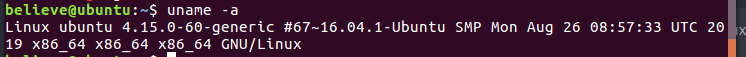
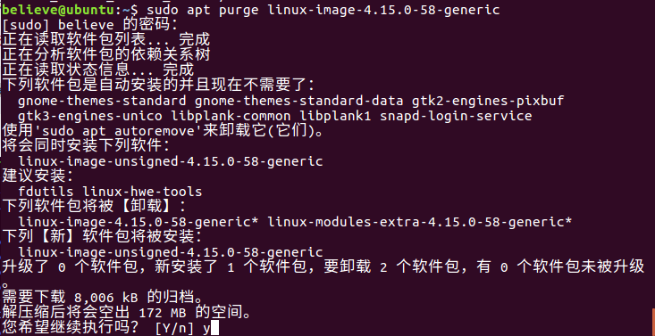
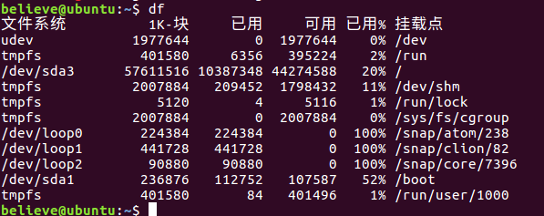
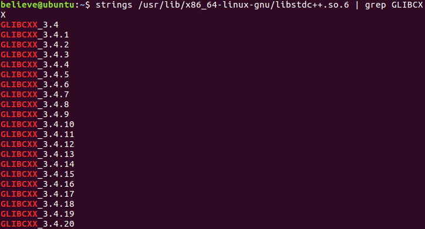

## 目录
* [根据进程名杀死进程](#根据进程名杀死进程)
* [pip安装失败缺少SOCKS依赖](#pip安装失败缺少SOCKS依赖)
* [VM中与主机共享SS](#VM中与主机共享SS)
* [Linux下安装libsodium启用ss的chacha20高级加密](#启用ss的chacha20高级加密)
* [Linux磁盘空间不够进行扩容](#Linux磁盘空间不够进行扩容)
* [修改所有者](#修改所有者)
* [linux环境变量设置方法总结](#linux环境变量设置方法总结)
* [NFS的安装与使用](#NFS的安装与使用)
* [boot空间不足的解决办法](#boot空间不足的解决办法)
* [GLIBCXX未发现](#GLIBCXX未发现)
* [Shell后台运行程序](#Shell后台运行程序)

### 根据进程名杀死进程
* ```shell
#kill -9 $(ps -ef|grep 进程名关键字|gawk '$0 !~/grep/ {print $2}' |tr -s '\n' ' ')
```
这个是利用管道和替换将 进程名对应的进程号提出来作为kill的参数。
很显然上面的方法能完成但是过于复杂，下面这种就显得简单的多了
* ```shell
#kill -9 $(pidof 进程名关键字)
```

### pip安装失败缺少SOCKS依赖
报错：`pip install doesnt work , InvalidSchema: Missing dependencies for SOCKS support`
* `export all_proxy="socks5://127.0.0.1:1080/"`
* `unset all_proxy`
* `unset ALL_PROXY`
* `pip install pysocks`
* `printenv | grep -i proxy`查看所有代理
* `export all_proxy="https://127.0.0.1:1080/"`指定代理

### VM中与主机共享SS
* `VM`选择`NAT`模式
* `SS`选择允许其他设备连入
* `Ubuntu`中选择手动代理地址为主机 `IPv4`地址，端口`1080`

### 启用ss的chacha20高级加密
* `apt-get install build-essential`
* `wget https://download.libsodium.org/libsodium/releases/LATEST.tar.gz`
* `tar xf XXXXX.tar.gz && cd libsodium-XXXXX`包名
* `./configure && make -j4 && make install`
* `ldconfig`

### Linux磁盘空间不够进行扩容
* `VM`虚拟机上进行磁盘的扩展
* `sudo apt-get install gparted`
* `sudo gparted`
* 进行扩容

### snap安装失败
* `error: snap "clion" has "install-snap" change in progress`
run:
```shell
$ snap changes
<snip>
203  Doing   2016-06-24T12:17:45Z  -  Install "nextcloud" snap
$ sudo snap abort 203
```

### 修改所有者
由于在使用`clion`时需要`root`权限，在`sudo clion`后，所有修改过的文件所有者都变成了`root`，在正常情况下无法对其修改，需要将所有者修改回来。到顶层目录，执行`sudo chown -R believe:believe .`

### linux环境变量设置方法总结
* `PATH`:  可执行程序的查找路径
查看当前环境变量:
```shell
echo $PATH
```
设置:
  * 方法一：`export PATH=PATH:/XXX` 但是退出当前终端后就失效

  * 方法二：修改 `~/.bashrc` 或 `~/.bash_profile`或系统级别的`/etc/profile`
  >1. 在其中添加例如export PATH=/opt/ActivePython/bin:$PATH
  > 2. source .bashrc  (Source命令也称为“点命令”，也就是一个点符号（.）。\
   source命令通常用于重新执行刚修改的初始化文件，使之立即生效，而不必注销并重新登录)

* `LD_LIBRARY_PATH`: 动态库的查找路径\
设置：
  * 方法一： `export  LD_LIBRARY_PATH=LD_LIBRARY_PATH:/XXX` 但是退出当前终端后就失效

  * 方法二： 修改`~/.bashrc`或`~/.bash_profile`或系统级别的`/etc/profile`
  >1. 在其中添加例如export LD_LIBRARY_PATH=/opt/ActiveP/lib:$LD_LIBRARY_PATH
  > 2. source .bashrc  (Source命令也称为“点命令”，也就是一个点符号（.）。source命令通常用于重新执行刚修改的初始化文件，使之立即生效，而不必注销并重新登录)

  * 方法三：这个没有修改`LD_LIBRARY_PATH`但是效果是一样的实现动态库的查找，
  >1. /etc/ld.so.conf下面加一行/usr/local/mysql/lib
  > 2. 保存后执行 ldconfig  生效\
    ( ldconfig 命令的用途,主要是在默认搜寻目录(/lib和/usr/lib)以及动态库配置文件/etc/ld.so.conf内所列的目录下,搜索出可共享的动态链接库(格式如前介绍,lib*.so*),进而创建出动态装入程序(ld.so)所需的连接和缓存文件.缓存文件默认为/etc/ld.so.cache,此文件保存已排好序的动态链接库名字列表.）\

    方法三设置稍微麻烦，好处是比较不受用户的限制。

    `ld.so.conf` 里面配置之后，添加的路径为最优先路径；

    `[root@host ~]# cat /etc/ld.so.conf`\
    `include ld.so.conf.d/*.conf`\
    `/usr/local/fan/lib`\
    `/usr/local/fan/lib64`

[回到顶部](#readme)

### NFS的安装与使用
一、服务器端：
* 安装NFS服务：
```shell
# 执行以下命令安装NFS服务器，
# apt会自动安装nfs-common、rpcbind等13个软件包
sudo apt install nfs-kernel-server
```
* 编写配置文件：
```shell
# 编辑/etc/exports 文件：
sudo vi /etc/exports
# /etc/exports文件的内容如下：
/tmp *(rw,sync,no_subtree_check,no_root_squash)
/data *(rw,sync,no_subtree_check,no_root_squash)
/logs *(rw,sync,no_subtree_check,no_root_squash)
```
* 创建共享目录
```shell
# 在服务器端创建/tmp /data和/logs共享目录
sudo mkdir -p /tmp
sudo mkdir -p /data
sudo mkdir -p /logs
```
* 重启nfs服务：
```shell
sudo service nfs-kernel-server restart
```
* 常用命令工具：
```shell
# 在安装NFS服务器时，已包含常用的命令行工具，无需额外安装。
# 显示已经mount到本机nfs目录的客户端机器。
sudo showmount -e localhost
```
* 将配置文件中的目录全部重新export一次！无需重启服务。
```shell
sudo exportfs -rv
```
* 查看NFS的运行状态
```shell
sudo nfsstat
```
* 查看rpc执行信息，可以用于检测rpc运行情况
```shell
sudo rpcinfo
```
* 查看网络端口，NFS默认是使用111端口。
```shell
sudo netstat -tu -4
```

二、客户端：
* 安装客户端工具：
```shell
# 在需要连接到NFS服务器的客户端机器上，
# 需要执行以下命令，安装nfs-common软件包。
# apt会自动安装nfs-common、rpcbind等12个软件包
sudo apt install nfs-common
```
* 查看NFS服务器上的共享目录
```shell
# 显示指定的（192.168.3.167）NFS服务器上export出来的目录
sudo showmount -e 192.168.3.167
```
* 创建本地挂载目录
```shell
sudo mkdir -p /mnt/data
sudo mkdir -p /mnt/logs
```
* 挂载共享目录
```shell
# 将NFS服务器192.168.3.167上的目录，挂载到本地的/mnt/目录下
sudo mount -t nfs 192.168.3.167:/data /mnt/data
# 解除锁定
sudo mount -t -o nolock nfs 192.168.3.167:/logs /mnt/logs
```
[超全面的NFS详解](http://server.51cto.com/sManage-150923.htm)\
[回到顶部](#readme)

### boot空间不足的解决办法
在安装ubuntu的时候，根据网上教程给其分配了单独的物理分区，大小为200M。然而每当系统升级的时候，旧的内核版本并不会被清理，升级几次就提示boot内存不足了。思路就是卸载旧的版本内核，腾出空间，记录下自己尝试过的命令。
* 查看系统已经安装的内核版本
```shell
dpkg --get-selections |grep linux-image
```
<div align="center">  </div><br>

* 查看系统当前使用的内核版本(我的是4.15.0-60-generic)
```shell
uname -a
```
<div align="center">  </div><br>

* 删除旧的内核版本(分别针对不同标识)
  * `install` 说明：系统已经安装了相应的内核，使用purge命令删除相应的内核
  ```shell
  sudo apt purge linux-image-4.15.0-58-generic
  ```
  <div align="center">  </div><br>

  * `deinstall` 说明：系统没有安装此内核，但是在配置文件中还残留它的信息（有可能是以前卸载的时候不彻底）
  ```shell
  sudo dpkg -P linux-image-extra-4.4.0-31-generic
  ```

* 最后看下效果

<div align="center">  </div><br>

[回到顶部](#readme)

### GLIBCXX未发现
项目中遇到`libstdc++.so.6: version GLIBCXX3.4.22’ not found`

这是因为当前版本的`libstdc++.so.6`缺少`GLIBCXX_3.4.22`查看当前版本的`GLIBCXX`命令为,
```shell
strings /usr/lib/x86_64-linux-gnu/libstdc++.so.6 | grep GLIBCXX
```
<div align="center">  </div><br>
解决方法:

安装`libstec++`

```shell
sudo apt-get install libstdc++6
```
如果还未解决,则可以终端运行如下命令:
```shell
sudo add-apt-repository ppa:ubuntu-toolchain-r/test
sudo apt-get update
sudo apt-get upgrade
sudo apt-get dist-upgrade
```
这时再运行命令
```shell
strings /usr/lib/x86_64-linux-gnu/libstdc++.so.6 | grep GLIBCXX
```
可以发现当前版本一包含GLIBCXX_3.4.22\
[回到顶部](#readme)

### Shell后台运行程序
在脚本中将程序名替换即可\
脚本名为`shell.sh`,启动命令为：`./shell.sh start`，再次运行如果提示正在运行则表示正常，否则代表程序挂掉。终止命令为：`./shell.sh stop`。控制台运行`./shell.sh console`。或者直接在运行程序命令后加` &`。重启为`restart`,查看状态为`status`。

**注意点 ：** 如果程序中是通过`getchar()`阻塞的，这里程序可以正常启动，但是会立马挂掉，需要把`getchar()`换成`while()`，除非你通过`console`启动
```shell
#!/bin/sh
# chkconfig: 2345 80 20
# description: mediaserver
waittime=0
waitExit(){
   while true;do
   if [ ! -d "/proc/$1" ]; then
       echo "process is finished"
       break
    else
      waittime=$(($waittime+1))
      sleep 1s
      echo "process is alive " $waittime
    fi
    if [ "$waittime" -eq 10 ]; then
      kill -9 $1
      break

    fi
   done
}
running(){
if [ -f $PID_PATH_NAME ]; then
    PID=$(cat $PID_PATH_NAME)
    if [ -d "/proc/$PID" ]; then
      return 1
    else
      return 0
    fi
  else
   return 0
  fi
}
printRed(){
 echo -e "\033[31m$1\033[0m"
}
printGreen(){
 echo -e "\033[32m$1\033[0m"
}
SERVICE_NAME=mediaserver
PID_PATH_NAME=~/run/mediaserver-pid
case $1 in
    start)
        echo "Starting $SERVICE_NAME ..."
 running
        if [ ! $? -eq 1 ]; then
            nohup /home/believe/tcap/mediaService/bin/hisi500/TuMediaService /tmp 2>> /dev/null >> /dev/null &
                        echo $! > $PID_PATH_NAME
            printGreen "$SERVICE_NAME started ..."
        else
            printRed "$SERVICE_NAME is already running ..."
        fi
    ;;
    console)
       /home/believe/tcap/mediaService/bin/hisi500/TuMediaService
    ;;
    status)
      running
      if [ $? -eq 1 ]; then
        printGreen "running "
      else
        printRed "not running"
      fi
    ;;
    stop)
 running
        if [ $? -eq 1 ]; then
            PID=$(cat $PID_PATH_NAME);
            echo "$SERVICE_NAME stoping ..."
            kill  $PID;
     waitExit $PID;
            printRed "$SERVICE_NAME stopped ..."
            rm $PID_PATH_NAME
        else
            printRed "$SERVICE_NAME is not running ..."
        fi
    ;;
    restart)
 running
        if [ $? -eq 1 ]; then
            PID=$(cat $PID_PATH_NAME);
            echo "$SERVICE_NAME stopping ...";
            kill  $PID;
     waitExit $PID;
            echo "$SERVICE_NAME stopped ...";
            rm $PID_PATH_NAME
            echo "$SERVICE_NAME starting ..."
            nohup /home/believe/tcap/mediaService/bin/hisi500/TuMediaService /tmp 2>> /dev/null >> /dev/null &
                        echo $! > $PID_PATH_NAME
            printGreen "$SERVICE_NAME started ..."
        else
            echo "$SERVICE_NAME starting ..."
            nohup /home/believe/tcap/mediaService/bin/hisi500/TuMediaService /tmp 2>> /dev/null >> /dev/null &
                        echo $! > $PID_PATH_NAME
            printGreen "$SERVICE_NAME started ..."
        fi
    ;;
esac
```
[回到顶部](#readme)
