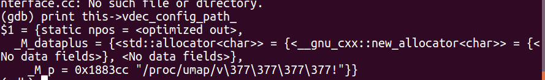
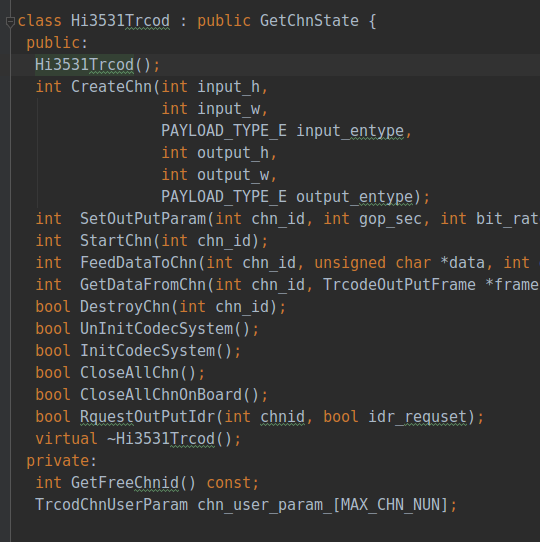

# gdb 调试 TuMediaService

[起因](https://github.com/believeszw/CS-Notes/blob/master/notes/问题记录/其他问题.md)
* 首先需要有 `armgdb` 环境
* 运行 `./armgdb ./TuMediaService` 进入 `gdb` 模式
* `b hi3531_trcod_interface.cc:98` 打断点
* `r` 运行程序
* `print this->vdec_config_path_` 打印关键值

  
 

在这里我们关注的值已经被修改，由于程序中没有刻意对这一块内存进行修改，所以一开始怀疑是不是其他线程改写的，当把其他线程都禁掉，在单线程的情况下跑，还是存在这个问题.由于这边是基类的最后一个变量，分析基类和派生类的代码后，大致定位在这里：

  
 

问题可能出现在最后一行的数组，当索引为负数才可能出现向前面内存写入的情况，而且多处地方给数组内部赋值为 -1 ，和错误相符合，但是在所有地方都加了判断和保护，打印出来也没有异常，而且

  
 

进一步定位是在这里的 `for` 循环出了问题，执行完 `for` 循环，值发生了变化，刚开始以为是最后一次产生了问题，但是单步调试下，在 124 次，关注值发生了改变。查看了这个数组中的值是一个结构体，会不会问题出现在这个结构体，**最后发现原来是有人更新了这个结构体却没有上传导致，数据结构发生了变化，这个问题还是值得谨记的。以后要避免这类问题，库和头文件的上传和下载尽量使用脚本，不要手动拷贝。**
