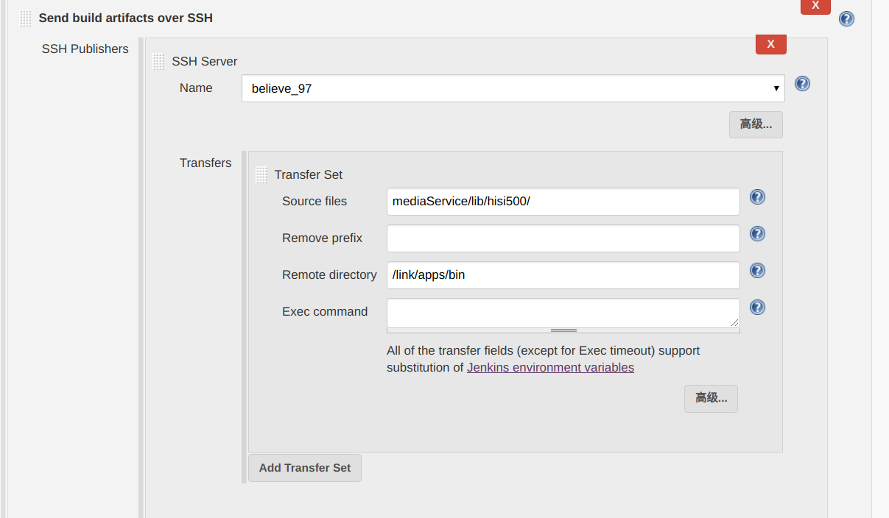
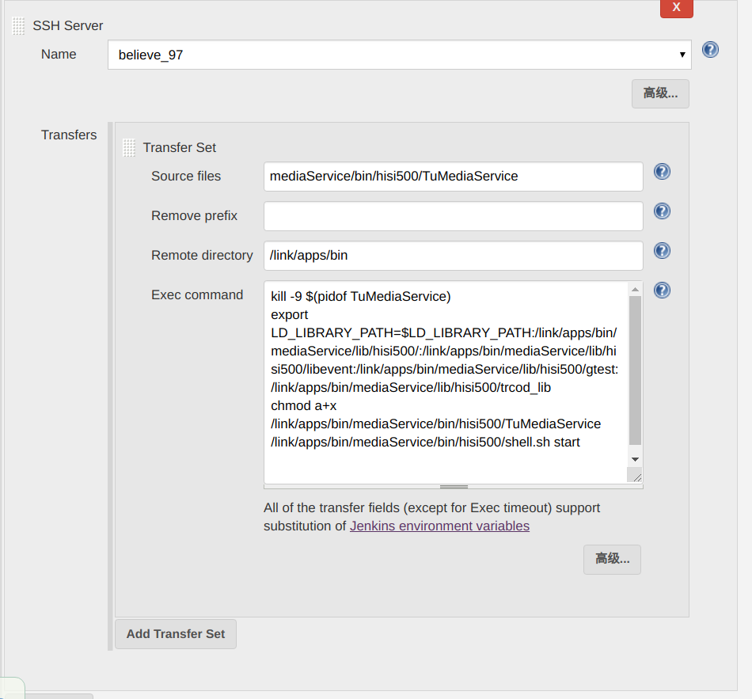
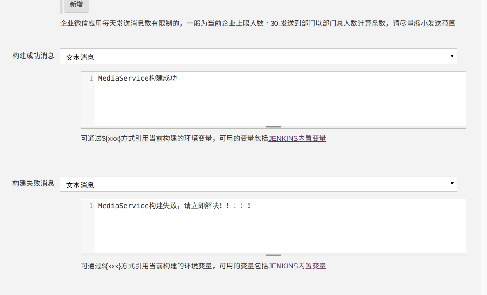

# jenkins自动化部署
首先设置源码地址，`jenkins`会从仓库中拉取最新代码
<div align="center">  </div><br>

拉取代码后运行`shell`脚本自动进行编译
```shell
cd mediaService
cmake -S . -B cmake-build-release-hisi3531 -DCMAKE_C_COMPILER=/opt/hisi-linux/x86-arm/arm-hisiv500-linux/target/bin/arm-hisiv500-linux-gcc -DCMAKE_CXX_COMPILER=/opt/hisi-linux/x86-arm/arm-hisiv500-linux/target/bin/arm-hisiv500-linux-g++ -G "CodeBlocks - Unix Makefiles"
cd cmake-build-release-hisi3531
make
```
构建后将编译好的文件通过`ssh`推送到`arm`上

先是库文件
<div align="center">  </div><br>

然后是可执行程序
<div align="center">  </div><br>

这里第一步是先将正在运行的服务杀死，第二步是设置动态库的查找路径，第三部是给程序赋予可执行权限，最后一步是执行程序后台运行的`shell`脚本。方便我们之后通过`jenkins`测试程序运行稳定性。

最后通过企业微信发送通知。
<div align="center">  </div><br>

# jenkins自动化测试
然后我们添加一个定时任务，15分钟执行一次
<div align="center">  </div><br>

通过`curl`发送`post`请求
<div align="center">  </div><br>
