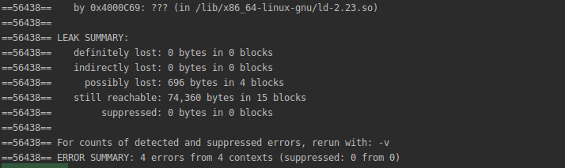
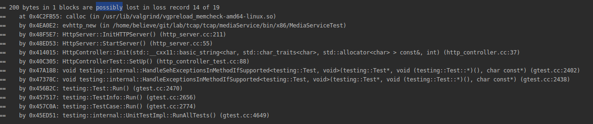
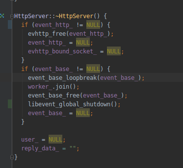
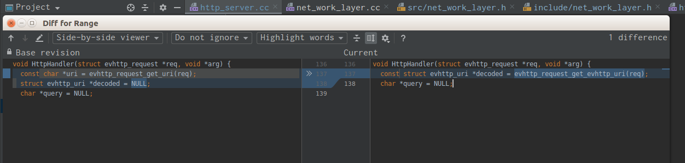
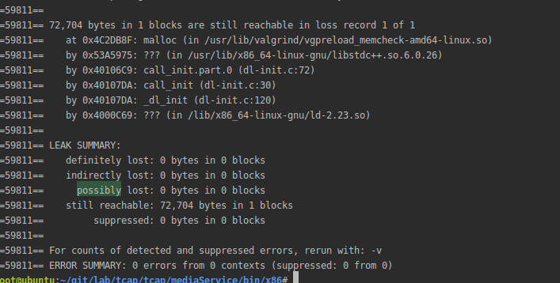
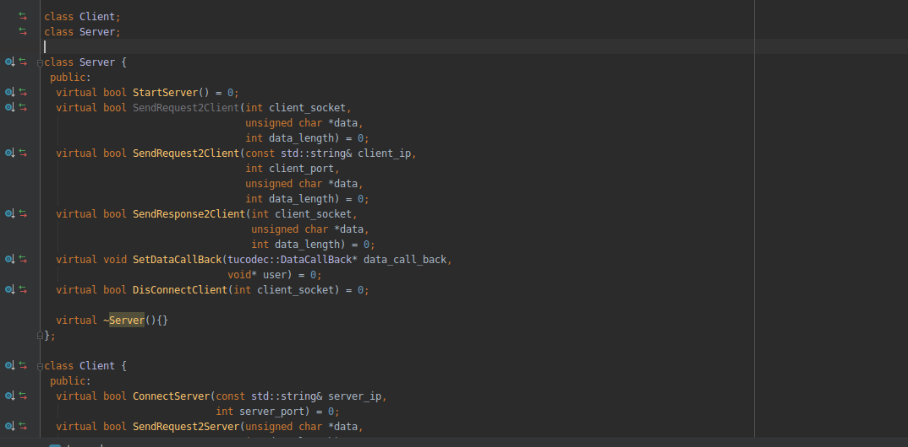

# valgrind检测libevent内存泄露

在使用封装好的`http`库时，遇到了如下的内存泄露，一开始在`definitely`处还存在泄露，这里就不贴图了，已经被淹没了。

  
 

根据提示定位出错代码位置，如下图：

  
 

这里提示`evhttp_new`这里出现了泄露，我们先到`http`库中解决已经存在的内存泄露，在析构函数里已经对这一块做了处理如下图：

  
 

这里有一个注意点，因为这里是单独起的线程运行的`event_base_dispatch(event_base_);`，所以我们在`event_base_loopbreak`后，需要等线程执行完毕后，在释放`event_base_free(event_base_);`，这里还需要执行`libevent_global_shutdown();`，否则`still reachable:`部分还会存在泄露。还有一处地方存在泄露，在昨天用同样的方法定位到的，这里记录一下：

  
 

左边是之前出现泄露的情况，右边是修改后的代码。改完这些后，我们在`http`库下运行测试程序，发现：

  
 
已经没有泄露了，剩下来的`72704`是和`gcc`版本有关，在`gcc 7.40`上是没有这个问题的。库的内存泄露解决了，下面我们到生产环境中去，发现还是存在泄露，明明我们在析构中已经做了处理，我在库代码中加入了日志信息，发现并没有进入析构函数，也就没有执行挥手的代码，出现了内存泄露。定位到原因在这里：

  
 

我们需要把这里的类声明去掉，具体原因见我另一篇文章。最终将所有存在内存泄露都给解决了。
