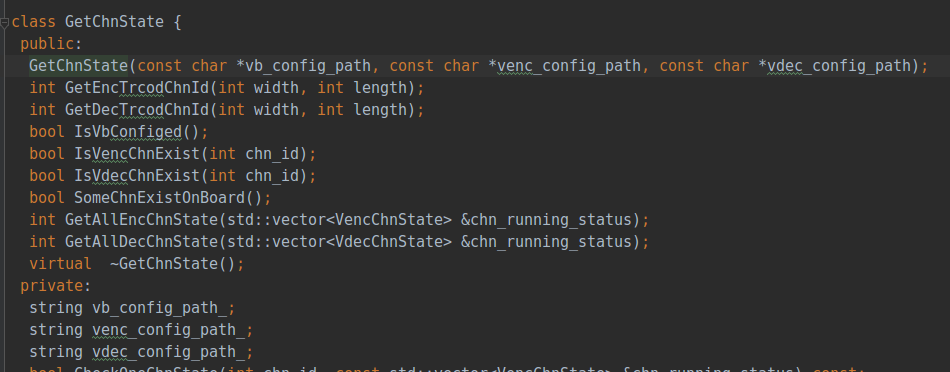
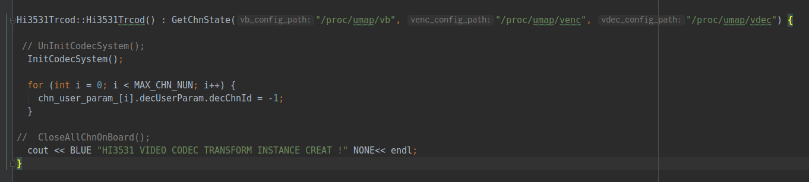

# 其余问题汇总

## 问题1

问题描述： 在项目中遇到一个非常奇怪的问题，加载文件时，文件名出现乱码，但是这个部分又没有人修改。

  
 

出现异常的变量是 `string vdec_config_path_;`, 第一次赋值是在这里：

  
 

后面就没有操作这个变量，于是又 `armgdb` 在板子上进行调试。[传送门](https://github.com/believeszw/CS-Notes/blob/master/notes/问题记录/gdb调试TuMediaService.md)
